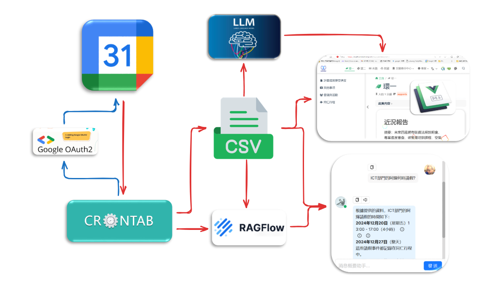

{: .fs-6 .fw-300 }

# Calendars

## Table of contents

{: .no_toc .text-delta }

1. TOC
{:toc}

---

## 背景

- 日曆的讀取、彙總、以及RAG等程序，有定期的需求。除了摘要之外，也另外開設聊天機器人，來展開事件表的查詢。
- 在展現上的需求包括：帳密登入、文字框與解讀渲染js、以及聊天機器人的嵌入，以保持靜態網頁的穩定性。

