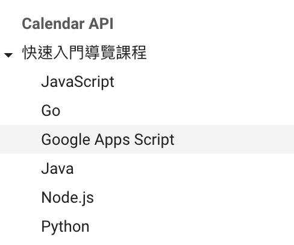

# Google Calendar API

{: .no_toc }

  

    Table of contents
  

  {: .text-delta }
- TOC
{:toc}

---

## 背景

- 這個主題雖有很多的技術文件支援，但因為Google也進步的很快，很多功能日新月異，GPT's來不及更新，反而會提供舊的、錯的訊息，就連官網的說明也不見得是最新，還是找到github上的原始碼、經過測試驗證比較可靠。
- 新版的API似乎不再支援`cRUL`、原因不明，
  - 可能因為需要指定的條件太多，還有`ACCESS_TOKEN`的取得也是層層關卡，到底是GET還是POST搞不清楚，乾脆用程式語言來做比較直接。
  - 但實際作業過程，還是產出或引用到許多json檔案的訊息，只是是用比較完整的語言工具來操作。

||
|:-:|
|[官網快速入門的語言選項](https://developers.google.com/calendar/api/guides/overview?hl=zh-tw)|

- 除了語言的選項之外，OAuth2的說明也是偏向Workspace開放者。對一般使用者而言只能一面揣摩、一面慢慢前進。
  - 最明顯的議題就是內/外部使用者和`redirect_uris`的匹配。充滿許多邏輯上的問題。
  - 明明是外部使用者，內部uris也可以接受？
  - workspace使用者也是只有少數代表號？
  - 所謂內部使用者要使用google calendar，沒有gmail可以嗎？似乎也是不可能。
  - 