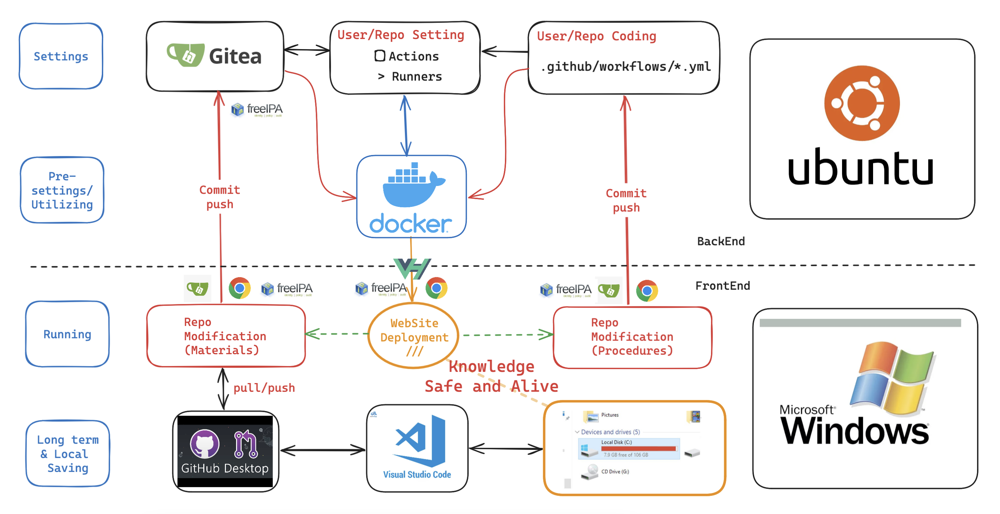

{: .fs-6 .fw-300 }

# Gitea - 程式及文件版本管理

## Table of contents

{: .no_toc .text-delta }

1. TOC
{:toc}

---

- 長期以來，地端知識庫有著存取與活化的問題，除了以搜尋引擎與樹枝狀的目錄系統外，似乎沒有好的方案，可以將歷史的技術文件與日常的作業連結在一起。
- 這裡提出的方案雖然看起來有些複雜，卻是近年來技術文件的應用常態，一個版本控制的儲存庫，是整體系統的中心，以純粹自營運的地端方案而言，Gitea是最佳的選項，將會成為活化地端文件系統的核心引擎。整體作業架構如下圖所示。

## Linux負責維運的後端伺服器群組設定(Settings/Utilizing)

### 設定及運轉重點

- 此處以ubuntu為作業系統，以降低軟體與核心之間的整合屏障。
- [Gitea的安裝與運轉]()
  - 此處以命令列啟動，以方便核心功能的([app.ini]())調整。
- 使用者層級[actions與runner的設定]、包括倉儲內[工作流程]()的設定及控制
  - 因為會大量使用到系統的計算資源，考量到個別倉儲內容的差異性，要實施自動整合發布的倉儲並不是很多，Gitea將自動化開啟與否的權力，下放到使用者的每個倉儲進行差異化設定。
  - 經嘗試錯誤與功能調整之後，形成倉儲模版，可供使用者快速建立自己的工作流程以及自動化設定。使用者可以就自己倉儲的特性增減所需的設定及功能。
- [act_runners]()的設定及維運
  - 為避免倉儲之間的干擾，此處以`docker-compose`來執行使用者指派的工作流程。
  - `docker`可以達成服務最多使用者、降低技術門檻、簡化流程、自動清理暫存檔、代理輸出等等好處。
  - `docker`輸出結果，將配合ubuntu網頁伺服器的設定，將編譯好的靜態網頁內容，推送到內部網站上，以公開給指定群組瀏覽、回應。

### 伺服器組織

使用到5部主機

- Gitea主機
  - gitea(內部雲倉儲系統)
  - runners（執行自動編譯與發布流程）
- LDAP(Kerberos、FreeIPA、負責帳密與權限管理)
- Apache(websites)
- DNS伺服器
- NAS(儲存靜態網頁內容)

### 特色

- 多工、多使用者同時運作，提升資訊服務使用率
- 權責劃分清楚：Gitea與瀏覽網頁有著相同的帳密權限管理（[LDAP]()），提供充分的公開與隱密性。
- 便於維護：大多數維護工作由使用者自行負擔。
- 穩定、不易出錯

## 微軟視窗環境服務的前端作業平台

### 瀏覽器平台之執行作業(Running)

- 使用者可以經由任一種瀏覽器程式(Chrome/Edge/Firefox/Safari等等)，來進行下列作業
  - Gitea服務：登入Gitea程式進行檔案編修、驅動自動工作流程、預覽成果或下載技術文件。
  - 靜態網頁瀏覽操作：切換、連結、搜尋、留言、瀏覽數、小幫手等等。
- 使用者登入帳密、將透過LDAP於Apache伺服器決定其瀏覽範圍
  - 責任中心層級
  - 部門層級
  - 技術組層級
  - 計劃小組
  - 跨部門分組
- [網頁與倉儲之間的切換]()：網頁如果有內容待修正，可以
  - 留言請求修正
  - 權責人員點選”編輯此頁“直接進行修正、重新發布。

### 軟體系統的檔案管理(Saving and Note-Keeping)

除了以瀏覽器進行輕量的編修與管理之外，還可以藉由github與microsoft提供的免費程式系統，來實現完整的筆記系統架構。以下是重要的功能。

- 連結靜態網頁與長期儲存備份空間
- 樹枝狀檔案管理與倉儲搜尋
- 編輯和即時預覽
- 參考系統：連結、參考文獻、圖表、公式、
- 時間線
- 標籤系統
- 開放插件市集提供多樣功能
- 版本與作者管理