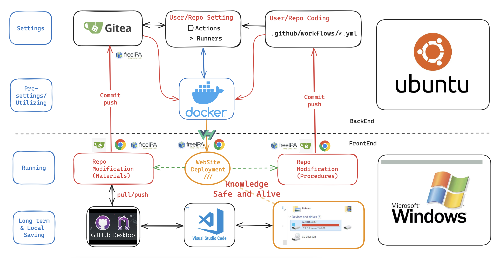

#  Gitea的Actions

{: .no_toc }

  

    Table of contents
  

  {: .text-delta }
- TOC
{:toc}

---

## 背景

- Gitea的Actions功能與自動連續整合發布有密切的關係。也是活化地端文件系統的核心引擎。整體作業架構如下圖所示。

- 此處著重說明Gitea內部的設定與管理。

### Actions vs Runners

- Actions指的是Github/Gitea等等倉儲內的一系列行動
  - 行動由某一個runner docker負責執行
  - 行動內容按照倉儲內指定目錄的工作流程（`.yml`）檔案指派其細節，包括程序、軟體版本、指令選項細節、以及最後系統的輸出與暫存檔案清除。
  - Actions的執行進度、是否順利完成、使用者上載標籤等等，會在Github/Gitea個別倉儲的`Actions`分頁內展示、取消、或重啟。
- Runners指的是每個倉儲指定使用的`docker image(s)`
  - 由使用者上載動作所驅動
  - 工作流程發生錯誤、或使用者又上載其他檔案或工作流程指令，runner會被迫停下、或重啟。
  - 如果組織內不同使用者同時上載檔案，即使只有一個runner，而Gitea設定capacity>1、或倉儲連線到不同的runner，系統將會同時進行Actions。
  - 