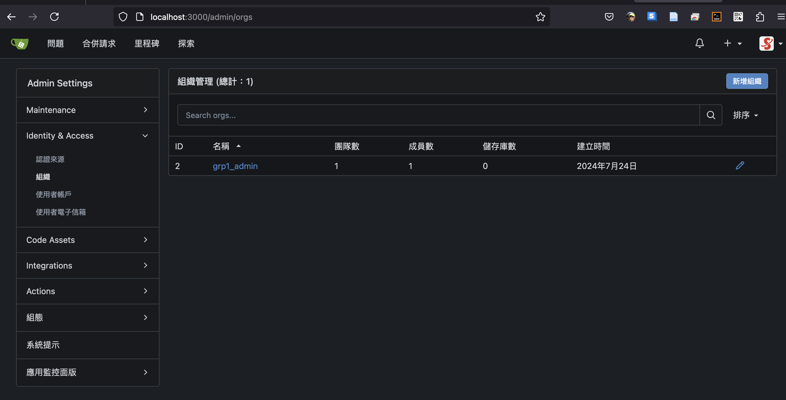

#  Gitea的api

{: .no_toc }

<details open markdown="block">
  <summary>
    Table of contents
  </summary>
  {: .text-delta }
- TOC
{:toc}
</details>

---

## 背景

## 以API來創建

### 組織

屬性|功能|路徑|注意事項
:-:|:-|:-|:-:
組織|Create an organization|/orgs
倉儲|Create a repository in an organization|/org/{org}/repos|
密鑰|Create/Update a secret in an organization|/orgs/{org}/actions/secrets/{secretname}
變數|Create an org-level variable|/orgs/{org}/actions/variables/{variablename}
掛鉤|Create a hook|/orgs/{org}/hooks
標示|Create a label for an organization|/orgs/{org}/labels

### 團隊

屬性|功能|路徑|注意事項
:-:|:-|:-|:-:
組織內新增團隊|Create a team|/orgs/{org}/teams
新增成員|Add a team member|/teams/{id}/members/{username}
新增倉儲|Add a repository to a team|/teams/{id}/repos/{org}/{repo}|

### 使用者

屬性|功能|路徑|注意事項
:-:|:-|:-|:-:
密鑰|Create/Update a secretin a user scope|/user/actions/secrets/{secretname}|
變數|Create a user-level variable|/user/actions/variables/{variablename}|
oauth2|creates a new OAuth2 application|/user/applications/oauth2|
簽章|Create a GPG key|/user/gpg_keys|
掛鉤|Create a hook|/user/hooks|
公鑰|Create a public key|/user/keys|
倉儲|Create a repository|/user/repos|
令牌|Create an access token|/users/{username}/tokens|

### 倉儲

屬性|功能|路徑|注意事項
:-:|:-|:-|:-:
創建倉儲|Create a repository|/user/repos|
模版|Create a repository using a template|/repos/{template_owner}/{template_repo}/generate
密值|Create or Update a secret value in a repository|/repos/{owner}/{repo}/actions/secrets/{secretname}|
密鑰|Add a key to a repository|/repos/{owner}/{repo}/keys|
變數|Create a repo-level variable|/repos/{owner}/{repo}/actions/variables/{variablename}|
分支保護|Create a branch protections for a repository|/repos/{owner}/{repo}/branch_protections|
創建分支|Create a branch|/repos/{owner}/{repo}/branches|
檔案|Update/Create a file in a repository|/repos/{owner}/{repo}/branches|
掛鉤|Create a hook|/repos/{owner}/{repo}/hooks|
拉取|Create a pull request|/repos/{owner}/{repo}/pulls|從遠端主線角度
拉取|create review requests for a pull request|/repos/{owner}/{repo}/pulls/{index}/requested_reviewers|
版本|Create a release|/repos/{owner}/{repo}/releases|
資產|Create a release attachment|/repos/{owner}/{repo}/releases/{id}/assets|
提交|Create a commit status|/repos/{owner}/{repo}/statuses/{sha}||
推送鏡像|add a push mirror to the repository|/repos/{owner}/{repo}/push_mirrors|
標籤|Create a new git tag in a repository|/repos/{owner}/{repo}/tags|
維基|Create a wiki page|/repos/{owner}/{repo}/wiki/new|
主題|Add a topic to a repository|/repos/{owner}/{repo}/topics/{topic}|
協作|Add a collaborator to a repository|/repos/{owner}/{repo}/collaborators/{collaborator}|
團隊|Add a team to a repository|/repos/{owner}/{repo}/teams/{team}|

### 管理

屬性|功能|路徑|注意事項
:-:|:-|:-|:-:
開創倉儲|Create a repository on behalf of a user|/admin/users/{username}/repos|
徽章|Add a badge to a user|/admin/users/{username}/badges|
掛鉤|Create a hook|/admin/hooks|
使用者|Create a user|/admin/users|
組織|Create an organization|/admin/users/{username}/orgs|
公鑰|Add a public key on behalf of a user|/admin/users/{username}/keys


## API token

- 有很多登入方式

### Personal Access Token 

- 在設定頁面中，找到並點擊 "Applications"（應用程式）。在該頁面，您可以看到 "Generate New Token"（產生新令牌）的選項。點擊它。
- 設定令牌名稱和權限：
  - 在產生令牌頁面，您可以為令牌設定一個名稱，以資識別。
  - 選擇所需的權限。根據作業需求、選擇合適的權限，
  - 然後點擊 "Generate Token"（產生令牌）。
- 複製令牌
  - 產生的令牌將顯示在頁面上。請務必將令牌複製並儲存到安全的地方，因為之後任何人都將無法再次查看該令牌。
- 注意
  - `token and access_token API authentication is deprecated and will be removed in gitea 1.23.`
  - `Please use AuthorizationHeaderToken instead. Existing queries will continue to work but without authorization. `

## create organization

### model

- 創建者的`username`是必要項目（*）。名稱不能跟現有的其他名稱相同。
  - 雖然變數名稱是`username`，但其效果卻為“**組織名稱**”。

  ```java
  CreateOrgOption{
  description:	CreateOrgOption options for creating an organization
  description	[...]
  email	[...]
  full_name	[...]
  location	[...]
  repo_admin_change_team_access	[...]
  username*	[...]
  visibility	[...]
  website	[...]
  }
  ```

### 範例

- json檔案內容

  ```json
  {
    "description": "org1",
    "email": "sinotec2@gmail.com",
    "full_name": "organization number one",
    "location": "same as company",
    "repo_admin_change_team_access": true,
    "username": "grp1_admin",
    "visibility": "public",
    "website": "https://sinotech-eng.com"
  }
  ```

- curl指令

  ```bash
  curl -X 'POST' \
  'http://localhost:3000/api/v1/orgs?access_token=***' \
  -H 'accept: application/json' \
  -H 'Content-Type: application/json' \
  -d '{
  ...
  }
  ```

- 執行結果

  

## public_members

- 指定組織的擁有者
- token要與使用者搭配

  ```bash
  curl -X 'PUT' \
  'http://localhost:3000/api/v1/orgs/grp1_admin/public_members/sinotec2?access_token=***' \
  -H 'accept: application/json'
  ```

## create a team under a organization

```bash
```

## map_group_to_team

- Gitea的**組織**是剛性的組織架構、類似公司的部門、有著嚴格的分際，**團隊**則類似職級、著重在角色分工的差別權限、如編輯群、管理群組、讀者群。一個**成員**可以參與不同的**團隊**，一個**團隊**卻不能參與不同的**組織**。
- Gitea提供了與LDAP的對口銜接，除了接受LDAP的**成員**之外，也提供有`map_group_to_team`正面表列功能。（相對也有負面表列`map_group_to_team_removal`[詳下](#map_group_to_team_removal)）
- 說明與範例詳見[管理樣版](https://github.com/go-gitea/gitea/blob/main/templates/admin/auth/source/ldap.tmpl)

  ```html
  <textarea 
    name="group_team_map" 
    rows="5" 
    placeholder='{
        "cn=my-group,cn=groups,dc=example,dc=org": {
          "MyGiteaOrganization": ["MyGiteaTeam1", "MyGiteaTeam2"]
          }}'
  >
    {{.group_team_map}}
  </textarea>
  ```

- 範例中
  - LDAP的群組：`my-group`
  - 對照Gitea
    - 組織：`MyGiteaOrganization`
    - 該組織下的團隊：`["MyGiteaTeam1", "MyGiteaTeam2"]`

- auths.map_group_to_team=對應 LDAP 群組到組織團隊 (欄位留空以跳過)
- auths.map_group_to_team_removal=如果使用者不屬於相對應的 LDAP 群組，將使用者從已同步的團隊移除。

## map_group_to_team_removal

- 這項功能是防止非LDAP成員另外加入團隊

  ```html
  <div class="ui checkbox">
    <label>{{ctx.Locale.Tr "admin.auths.map_group_to_team_removal"}}</label>
    <input 
        name="group_team_map_removal" 
        type="checkbox" 
          {{if .group_team_map_removal}}checked{{end}}
    >
  </div>
  ```

## TODO's

### 新創組織

### 指定各組織對應的LDAP群組（成員團隊）

### VPH模版 

- README(BBS)畫面
  - 名稱
  - 訊息（名稱、短文、完整連結）
  - 重要連結
  - 討論區域
- 將VPH_Clean複製到各個組織之下

### 設定群組下的編輯團隊

