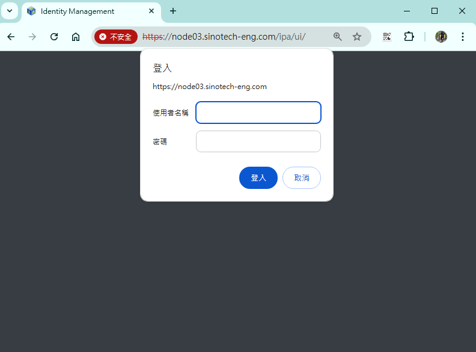
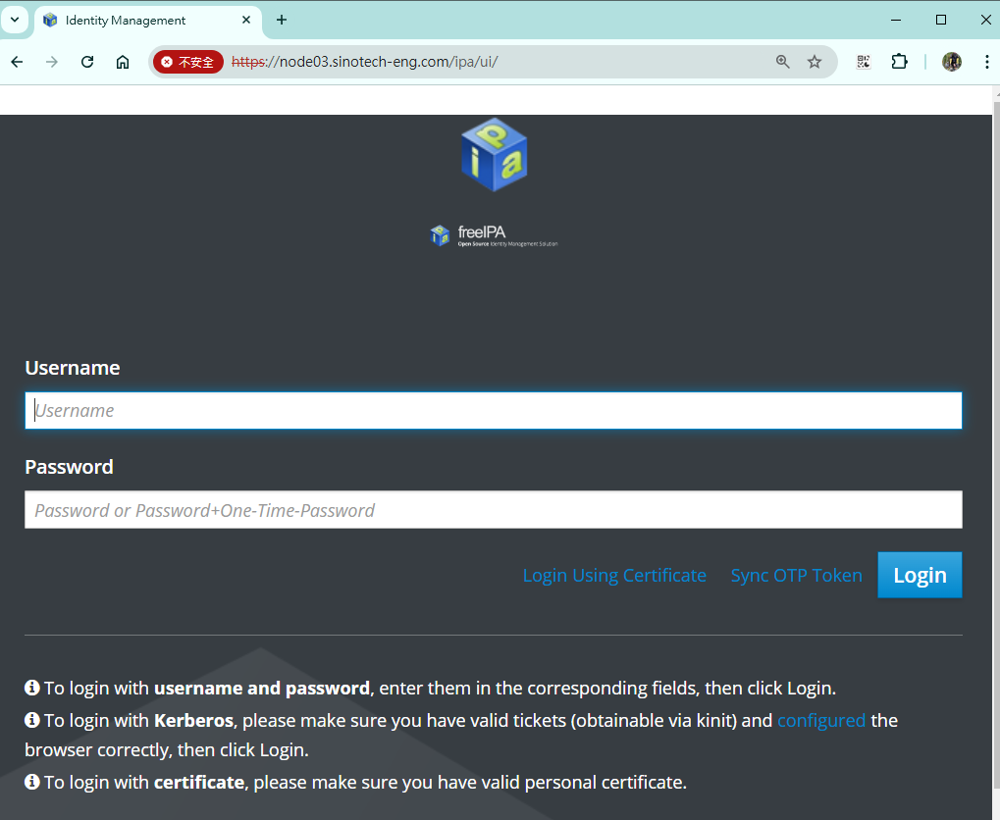
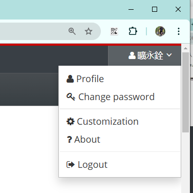
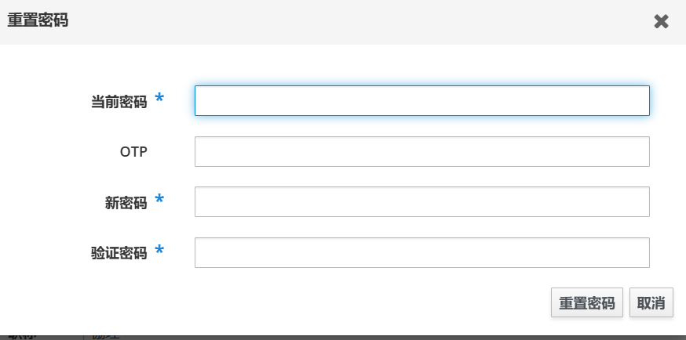
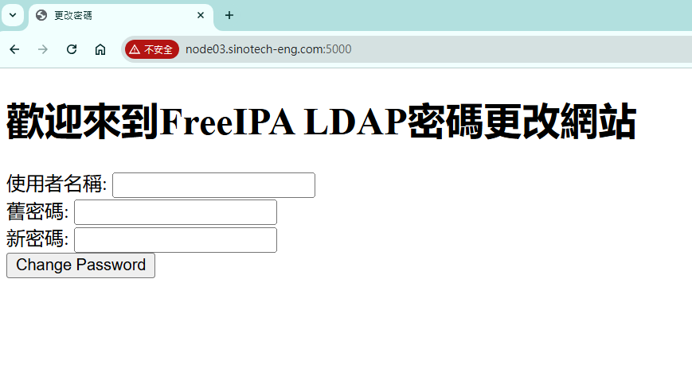

{: .fs-6 .fw-300 }

# 修改LDAP密碼

{: .no_toc }

  

    Table of contents
  

  {: .text-delta }
- TOC
{:toc}

---

## 背景

- LDAP登入過程有票證的管理，這裡我們使用FreeIPA(自由的身分政策稽核)系統來進行代管，因此需要到FreeIPA介面去修改帳密。

## 登入

### 跳過https帳密檢核

- 前往公司內網伺服器[node03](https://node03.sinotech-eng.com/ipa/ui/)，因為是安全網站，會詢問帳密。這裡**不必理會**，直接按下`取消`跳過(可能會要按2次)。

- 輸入帳號、密碼(員編2次)、**不必理會**One-Time-Password

- 如果從來沒有登入過、或許久沒有登入，系統會要求確認。

### 修改密碼

- 在頁面的右上角會出現姓名，下拉選單中有`change password`

- 輸入原來密碼、給訂新的密碼、**不必理會**OTP (One-Time-Password)
- 按下`重置密碼`馬上就會生效!

## 不登入修改密碼

- 如果不想修改其他LDAP資訊，也可以直接在[這裡](http://node03.sinotech-eng.com:5000)修改密碼。

## 忘記密碼

- 只能找研資部同仁登入系統修改
