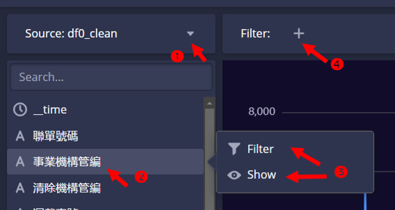

# Druid explore數據探索
{: .no_toc }

  

    Table of contents
  

  {: .text-delta }
- TOC
{:toc}

---

## 背景

- Will Xu (AUG 11, 2023) [Introducing Apache Druid 27.0.0](https://imply.io/blog/introducing-apache-druid-27-0-0/)：文中介紹了很多27版的特色，其中第一項就是**Explore**，可以將簡單的查詢轉成視覺化的彩色圖表。
- 入口：在上方最右邊的`...`，下拉選單中選擇指北針Explore(experimental)

## Explore的使用介紹

### 來源資料表及欄位篩選、顯示

- 進入頁面，左方sidebar是來源(Source)
  - 選擇資料表後，會出現欄位名稱，跟Query很類似，
  - 點選欄位名稱後可以篩選(Filter)或顯示(Show)。
  - 顯示(Show)：會在結果看板中呈現出圖形。
  - 篩選(Filter)：會出現勾選方格，勾選後會在圖面上方出現勾選項目。
  - 也可直接在結果看板上方Filter右邊`+`符號，新增篩選條件。

### 圖表種類、堆疊及欄位數據之設定

- Explore的右側是控制圖面的類別、堆疊及數據種類等地設定區域
- 圖表類型
  - 內設是時序分析(Time Chart)、折線區塊圖。其他還有4種。
  - 柱狀圖(Bar Chart)，適合X軸是類別、文字或整數欄位
  - 表格：Table，將前述Query分頁顯示的結果，統整在一個表內。
  - 