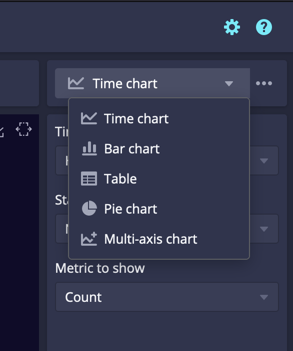
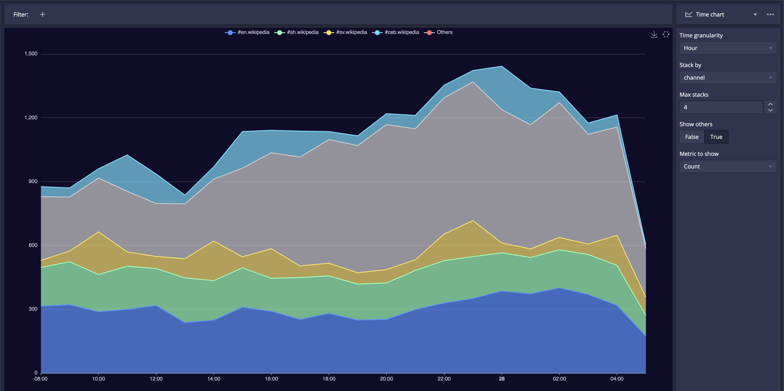
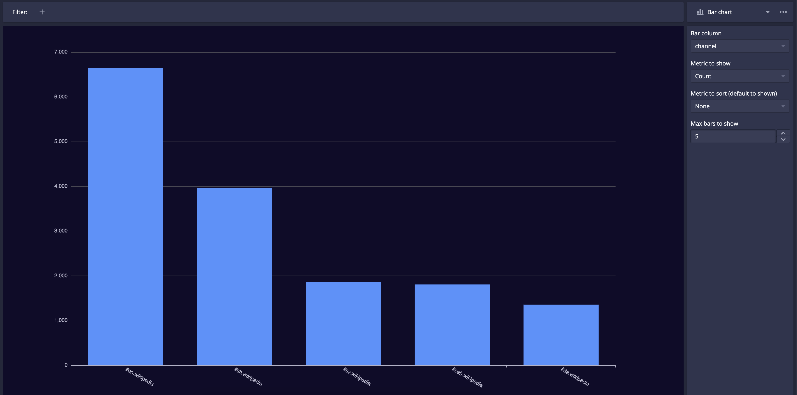
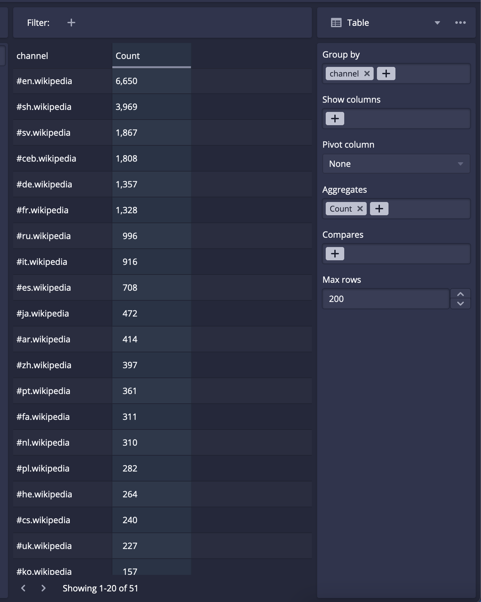
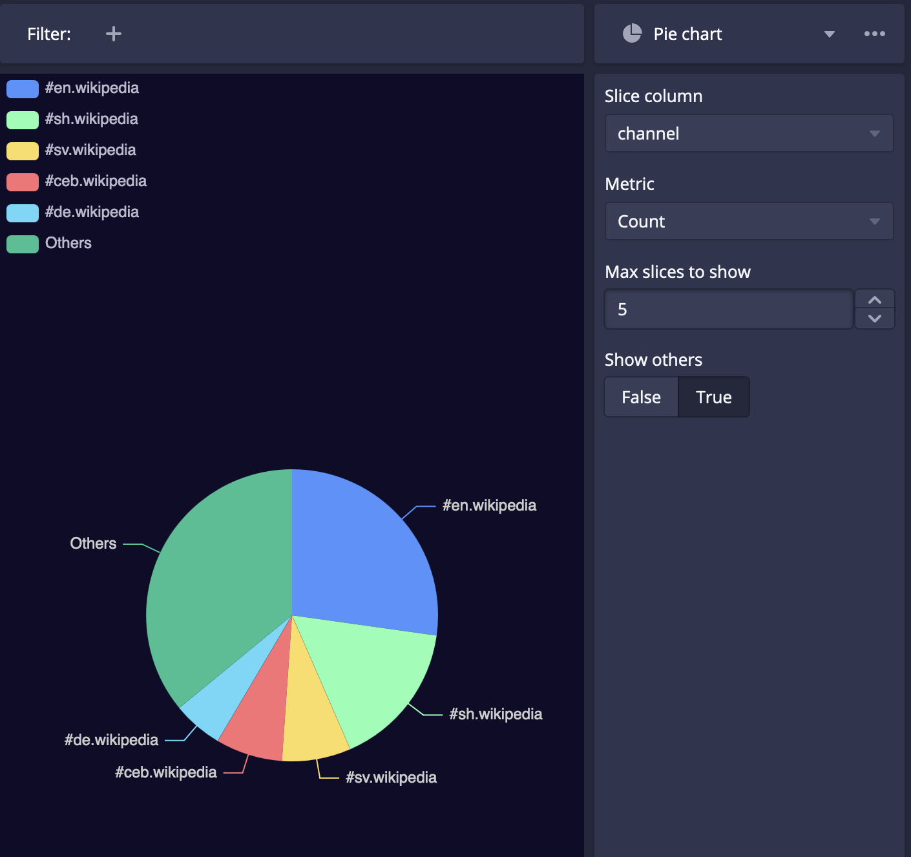
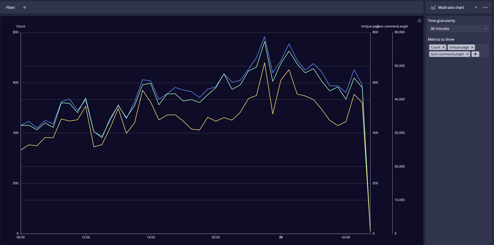
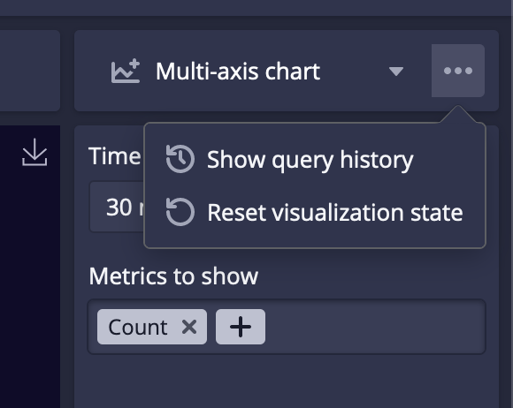

# Druid explore數據探索
{: .no_toc }

  

    Table of contents
  

  {: .text-delta }
- TOC
{:toc}

---

## 背景

- Will Xu (AUG 11, 2023) [Introducing Apache Druid 27.0.0](https://imply.io/blog/introducing-apache-druid-27-0-0/)：文中介紹了很多27版的特色，其中第一項就是**Explore**，可以將簡單的查詢轉成視覺化的彩色圖表。
- 入口：在上方最右邊的`...`，下拉選單中選擇指北針Explore(experimental)

## Explore的使用介紹

### 來源資料表及欄位篩選、顯示

- 進入頁面，左方sidebar是來源(Source)
  - 選擇資料表後，會出現欄位名稱，跟Query很類似，
  - 點選欄位名稱後可以篩選(Filter)或顯示(Show)。
  - 顯示(Show)：會在結果看板中呈現出圖形。
  - 篩選(Filter)：會出現勾選方格，勾選後會在圖面上方出現勾選項目。
  - 也可直接在結果看板上方Filter右邊`+`符號，新增篩選條件。

### 圖表種類之設定

- Explore的右側是控制圖面的類別、堆疊及數據種類等地設定區域
- 圖表類型
  - 內設是時序圖(Time Chart)：折線區塊圖，可做堆疊。其他還有4種。
  - 柱狀圖(Bar Chart)：適合X軸是類別、文字或整數欄位
  - 表格(Table)：將前述Query SQL程式語言的功能，以下拉選單等方式來達成樞紐分析。
  - 圓餅圖(Pie chart)：適合類別的個數或數量聚合結果
  - 多軸圖(Multi-axis chart)：時序折線圖，Y1、Y2可以有不同單位

### 時序圖(Time Chart)

- 時間粒度(Time Granularity)：Druid資料庫最強的功能就是有非常靈活的時間處理能力，可以針對各種時間範圍進行聚合，視資料提供的詳細程度而異，包括1分鐘、5分鐘、30分鐘、小時、日、月等等。如範例圖像就是小時的計數結果（24小時變化趨勢）。
- 堆疊(Stack by)：可以選擇與資料欄位相同、或其他變數，來進行同一時間標籤總數的拆解，圖示範例就是channel中最大的前4項拆解的堆疊圖。
- 可以設定堆疊層數(Max stacks)、與是否區別**其他**(show others)

### 儲存檔案

- 按下圖面右上方的向下箭頭(Save as Image)，druid會將圖檔下載到本地的`Downloads/echart.png`。
- 檔名為固定、要注意檔案需要重新命名。

### 柱狀圖(Bar Chart)

- druid會將聚合結果前幾大，反向排序依序畫出。前幾大的類別名稱，會顯示在X軸。
- 除了前述內設型態之外，欄位別(Bar column)、聚合方式(Metric to show)、排序方式(Metric to sort可選其他的欄位變數)、是前幾大(Max bars to show)等等都可以設定。

### 樞紐分析控制與結果表

- 與Query使用SQL語言進行樞紐分析很類似，explore使用下拉選單來進行計算與列表。
- 除了結果看板上方的條件篩選(Filter)之外、右側下拉選單也提供了
  - 群組(Group by)、
  - 新增欄位(Show Column)、
  - 樞紐欄位(Pivot column)、
  - 聚合方式(Aggregates)、
  - 比較結果(Compares)、與
  - 最大列數限制(Max rows)等等功能。

### 圓餅圖(Pie chart)

- 圓餅圖相對其他圖算是單純，就只有一欄數字與一欄類別。但是druid還是提供了簡單的控制介面
  - 切片欄位(Slice column)
  - 數量(Metric)
  - 顯示最大切片數(Max slices to show)
  - 是否顯示**其他**(Show others)

### 多軸圖(Multi-axis chart)

- 與前面的時序圖很類似，多軸圖是設計用來比較2種單位不同的變數，而且是單純的折線，沒有堆疊。選項相對也較少，只有：
  - 時間粒度(Time Granularity)：與時序圖一樣的用法
  - 同時顯示的變數(Metrics to show)
  - 同樣也可以儲存圖檔。

### 留存分析過程與清空

- explore可以將繪圖過程中執行的SQL程式指令儲存下來，以便日後可以追溯。
- 要清除複雜的設定、回復內設狀況，按下reset鍵即可。

