# Druid查詢範例
{: .no_toc }

<details open markdown="block">
  <summary>
    Table of contents
  </summary>
  {: .text-delta }
- TOC
{:toc}
</details>

---

## 背景

- Apache Druid伺服器是個高算力、適合大型資料庫的線上樞紐分析伺服器，已有成熟穩定的介面、使用簡單的SQL語言，操作容易。
- 伺服器本身同時具有資料庫伺服器、API伺服器、權限伺服器等等功能，適合作為發展平台。
- 伺服器可以使用到工作站80%的記憶體(240G among 300G)、47個核心(among 99)。
- 目前範例資料庫一年約有1百30萬筆記錄，未來還會增加中。
- 瀏覽器界面的詳細說明，詳見[Web console](https://druid.apache.org/docs/latest/operations/web-console)

## 快速啟動

### apache druid伺服器

- 打開Druid伺服器介面
- 目前尚未設定帳密系統。注意不要更動到資料庫(僅執行查詢功能)。

> http://200.200.32.195:8888/

- 如何在url命令列輸入帳號密碼
  - 先輸入帳號(範例中的user0)
  - 間隔以冒號隔開(半形):
  - 密碼
  - 歸屬碼:@
  - IP或domain name
  - 端口：`:8888`


- 按下查詢(Query)

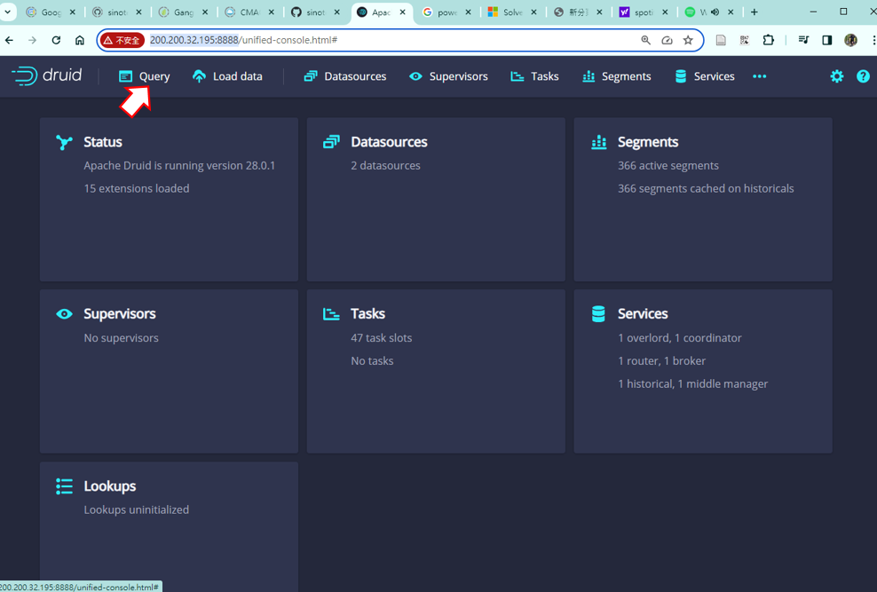

- 左方出現**資料表**(如`df0_clean`及`wikipedia`)、與資料表的各個欄位。有3種前綴：
1. **A** 為文字屬性
2. **123** 為整數
3. **1.0** 為實數

- 點擊欄位後，可進行簡易樞紐分析(會與**程式碼輸入板**連動)
1. 顯示(Show)：如無其他條件，則為計數(count)。 如有其他條件，則會增添至被選項目 
2. 篩選(Filter)：文字、整數、實數(all)
3. 群組(Group by)：文字、整數
4. 聚合(Aggregate)：計數(文字)、大小、加總、平均、近似分位數(整、實數)、最新(all)
5. 複製(Copy)：複製欄位名稱到剪貼簿，以便在**程式碼輸入板**內編輯使用


- 中間上方為**程式碼輸入板**
   1. 按下`+`開啟新的tab，
   2. 貼上SQL程式碼、或執行欄位右鍵選項
   3. 按下`Run`即可跑出結果。

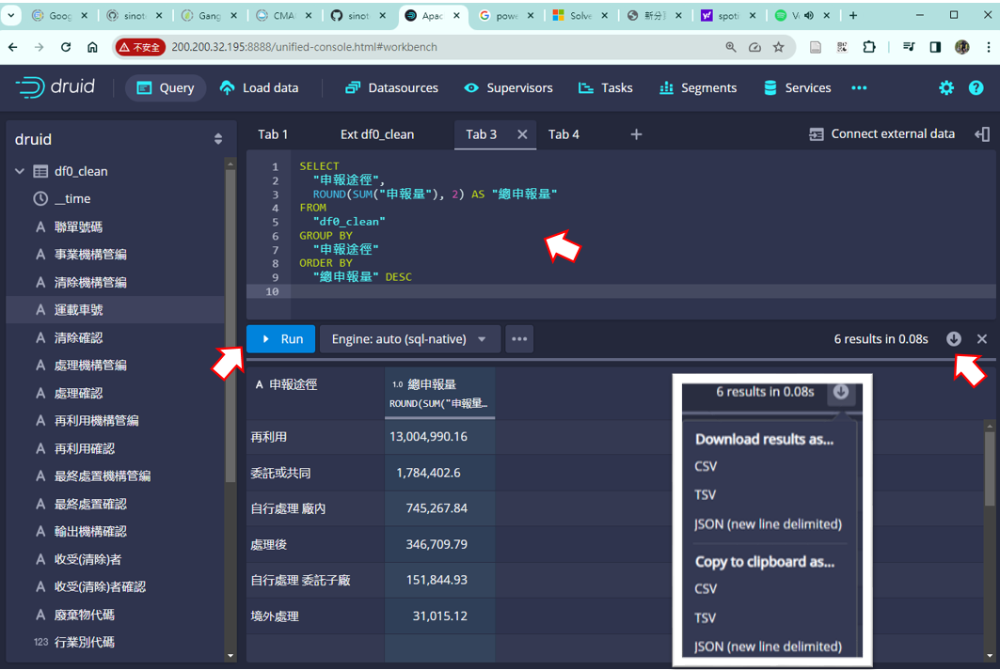

- 可以用自然語言在GPT上詢問
- 按下右方下載按鍵，將結果另存新檔。

### 計數

1. 在**程式碼輸入板**上方點擊`+`，出現空白輸入板、等候輸入查詢程式指令
2. 點擊`事業機構管編`欄位名稱，出現選項
3. 點擊顯示(Show)：會在**程式碼輸入板**出現程式碼
4. 程式碼中的 `1`、`2`即為`SELECT`被選項目之順位、以1起算。

```sql
SELECT
  "事業機構管編",
  COUNT(*) AS "Count"
FROM "df0_clean"
GROUP BY 1
ORDER BY 2 DESC
```

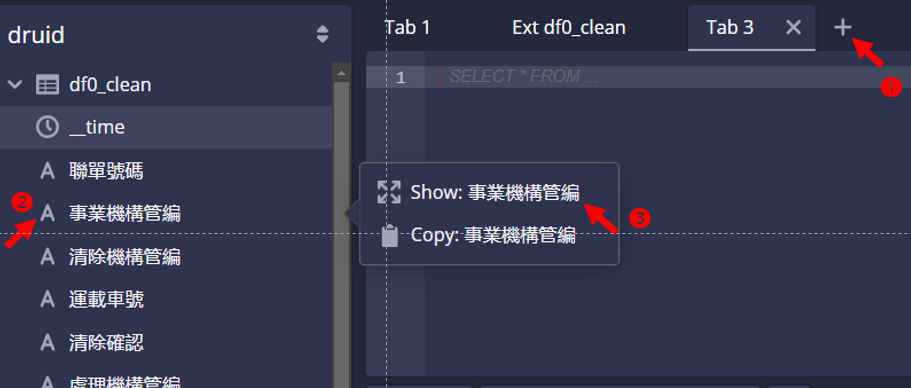

- 檢視程式碼、孰悉其意義、以利自然語言對話。
- 點擊`Run`，即在下方結果看板出現**事業機構管編**群組的計數
- 按看板下方的`< >`鍵，可翻看結果

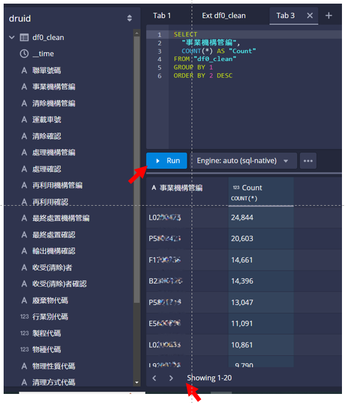

## 查詢範例

### 群組加總

> 加總資料表df0_clean中"申報途徑"各種樣態的"申報量"，加總結果取到小數點以下2位，按照加總結果大小反向排序

```sql
SELECT
  "申報途徑",
  ROUND(SUM("申報量"), 2) AS "總申報量"
FROM
  "df0_clean"
GROUP BY
  "申報途徑"
ORDER BY
  "總申報量" DESC
```

- 注意：druid不接受一般SQL語言之結尾標示(分號`;`)。

### 過濾、群組、加總

> 我想了解資料表df0_clean中、"事業機構管編"為'L02**473'、各項"廢棄物代碼"的"申報量"加總結果，加總結果取到小數點以下2位，按照加總結果大小反向排序

```sql
SELECT
  廢棄物代碼,
  SUM(申報量) AS sum_申報量
FROM df0_clean
WHERE 事業機構管編 = 'L02**473'
GROUP BY 廢棄物代碼
ORDER BY sum_申報量 DESC
```

- druid沒有外卡(wild card `*`之設定)
- 從選單中來進行
  - 先選要分區(group)的變數，一般是類別、字串足以分類之變數。
  - 再選擇需統計(聚合)的變數。需選擇極大小、總和、平均等等。

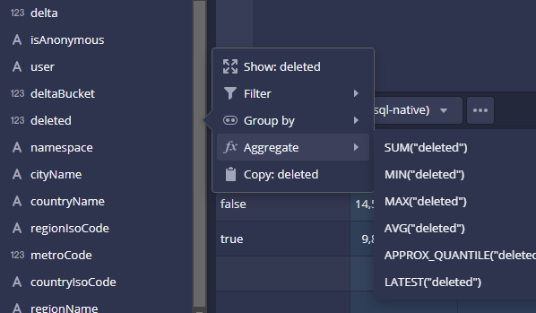

### 3個維度的樞紐分析

- `SELECT`項目
  1. `事業機構管編`：維度1
  2. `申報途徑`：維度2
  3. `sum_申報量`：維度3

```sql
SELECT
  "事業機構管編", "申報途徑",
  round(SUM("申報量"),2) AS "sum_申報量"
FROM "df0_clean"
GROUP BY 1,2
ORDER BY 3 DESC
```

- 注意：不指定排序方式即為正向排序，如`ORDER BY 1`。

## 連結新的資料表

### 檔案管理

- 果要加(連結)資料，要先copy到/nas1或/nas2，window上的檔案系統工作站是看不懂得。
  - 會需要設定SAMBA(洽linux管理員群組)
  - 設定目錄與檔案的群組為：`SESAir`
- 可接受檔案格式
  - JSON Lines(gz壓縮亦可)
  - CSV(逗號或分號)
  - TSV(tab、`\t`分隔)
  - Parquet(from Apache Spark、Apache Hive高效壓縮)
  - ORC(Optimized Row Columnar)，Apache Hive倉儲
  - Avro(Apache Avro 二進位檔)
  - Any line format that can be parsed with a custom regular expression (regex)

### 連結外部檔案

- Apache Druid可以接受多種資料的連結，包括雲端及本地、在線或離線，此處集中在以事後分析為主的需求，即**批次式**、**本地磁碟機**為連結對象。
- 連結可以直接在查詢(Query)**程式碼輸入板**的右方(下圖)、或本地檔案(Local Data)畫面進行。檔案格式及連結方式都是一樣。

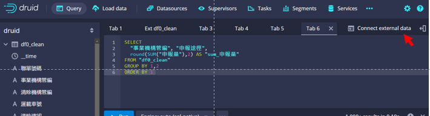

- 自本地檔案(Local Data)畫面進入檔案連結
  - 下拉選單點選Batch SQL以SQL程式批次進行連結
  - 點選本地磁碟機來源(Local disk)：指得是工作站連結得到的網路磁碟機(/nas1、/nas2等)。

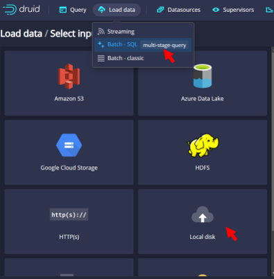

- 輸入目錄及檔名
  - 必須輸入絕對目錄。(相對目錄只接受管理者之家目錄)
  - 直接輸入檔名，或由右側下拉選單選擇檔案格式進行篩選、
  - 找到檔名後，按下Connect data，進行數據上載。

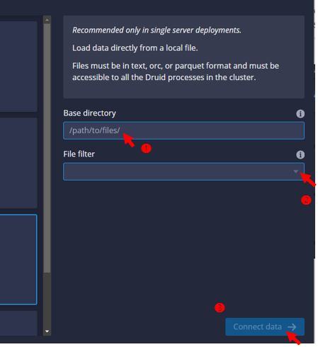

- 解讀檔案格式
  - 如果是太單純的csv檔案，系統會需要使用者確認格式。
  - 內設是正則文字檔(`regex`)，可以右邊的下拉選單選擇`csv`
  - 選擇`csv`後，其他既設選項都會隨之改變
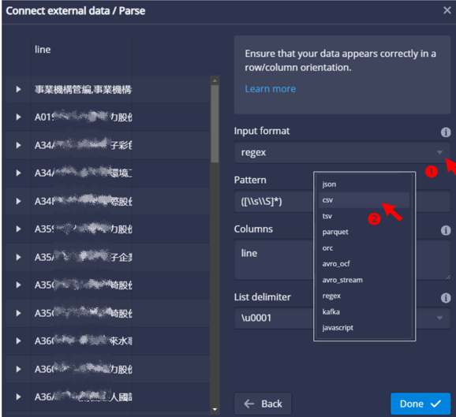

- csv檔案設定
  - 表頭：系統會自動跳開表頭，如果要多跳行，需要設定1行以上。
  - 是否由表頭對應到欄位名稱：選擇True。(druid可接受中文欄位名稱)
  - 跳脫指令： Unicode 字符，0為尾端跳脫，1為開頭跳脫。(似乎不會影響結果)
  - 預覽(Preview)：檢視如果解讀正確，即可點選Done

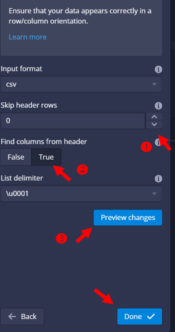

- 檢查載入程式碼
  - 系統會讀取資料表的欄位名稱，提供程式碼在**程式碼輸入板**
  - 除了確認欄位是否都要載入，也要確認是否每一欄都要能做區分(PARTITIONED、可分群組)。
  - 如果不需要，直接刪除就不會執行載入，可減省記憶體。

```SQL
REPLACE INTO "BusinessOrganization" OVERWRITE ALL
WITH "ext" AS (
  SELECT *
  FROM TABLE(
    EXTERN(
      '{"type":"local","baseDir":"/nas2/sespub/epa_IWRMS","filter":"BusinessOrganization.csv"}',
      '{"type":"csv","findColumnsFromHeader":true}'
    )
  ) EXTEND ("事業機構管編" VARCHAR, "事業機構名稱" VARCHAR)
)
SELECT
  "事業機構管編",
  "事業機構名稱"
FROM "ext"
PARTITIONED BY ALL
```

- 確認使用計算資源(Max tasks)
  - 如果沒有指定，系統會自行規畫最大上限。以devp工作站而言，會規畫一半的核心給這個資料表。這將會造成使用容量的限制及競爭。
  - 如果表格不大、使用人數不多，規劃小量的算力即可。
- 預覽(Preview)
- 執行(Run)

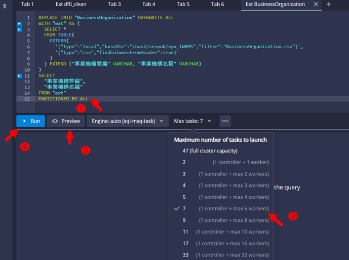

- 執行成功
  - 檢查結果看板：會報告資料表的長度、花費時間、程式碼建議等等
  - 也會在左側增加新的一個資料表、可展開個別欄位名稱，也可以正常查詢。

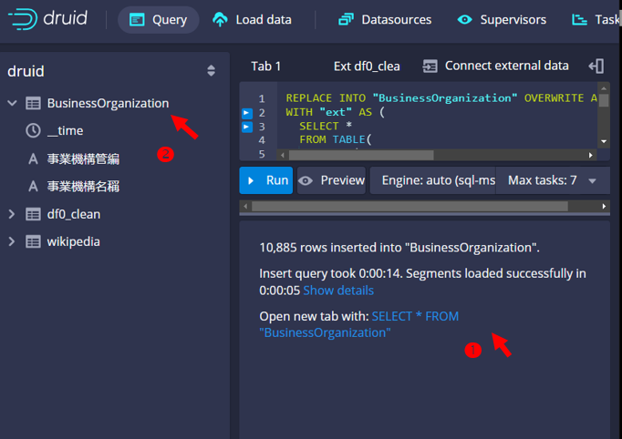