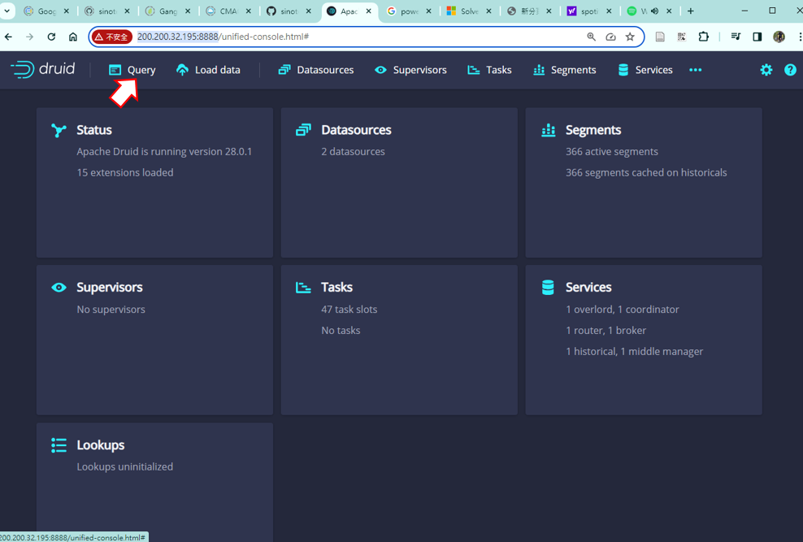
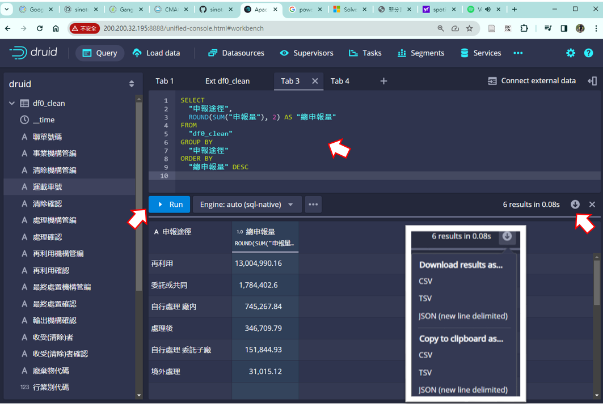
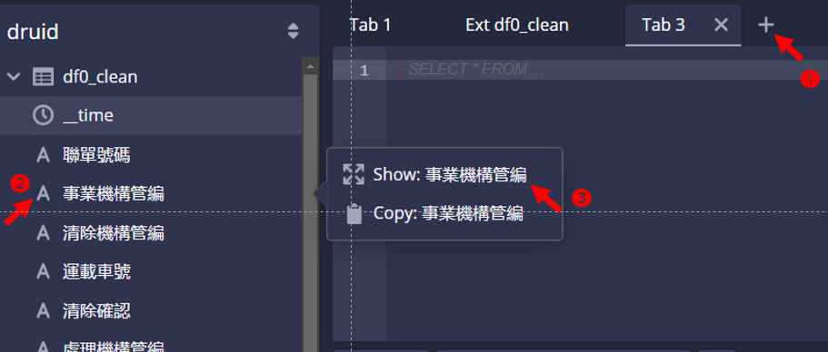
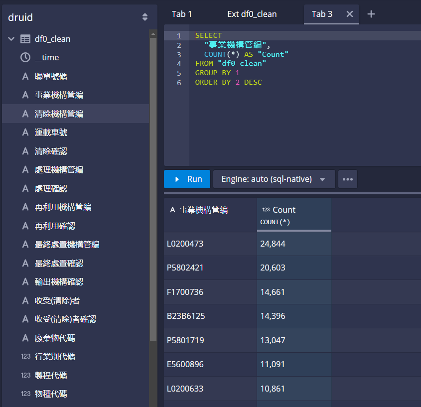

# Druid查詢範例
{: .no_toc }

<details open markdown="block">
  <summary>
    Table of contents
  </summary>
  {: .text-delta }
- TOC
{:toc}
</details>

---

## 快速啟動

### apache druid伺服器

1. 打開Druid伺服器介面
2. 目前尚未設定帳密系統。注意不要更動到資料庫(僅執行查詢功能)。

> http://200.200.32.195:8888/

3. 按下查詢(Query)



4. 左方出現**資料表**(如`df0_clean`及`wikipedia`)、與資料表的各個欄位。有3種前綴：
   1. **A** 為文字屬性
   2. **123** 為整數
   3. **1.0** 為實數

5. 點擊欄位後，可進行簡易樞紐分析(會與**程式碼輸入板**連動)
   1. 顯示(show)：如無其他條件，則為計數(count)。 如有其他條件，則會增添至被選項目
   2. 群組：文字、整數
   3. 可篩選：文字、整數、實數(all)
   4. 聚合法：計數(文字)、大小、加總、平均、近似分位數(整、實數)、最新(all)


6. 中間上方為**程式碼輸入板**
   1. 按下`+`開啟新的tab，
   2. 貼上SQL程式碼、或執行欄位右鍵選項
   3. 按下`Run`即可跑出結果。



7. 可以用自然語言在GPT上詢問
   1. 一般提示：我會給你一段自然語言，請給我SQL程式碼。
   2. 寫下你需要的作業，GPT會給你程式碼，再仔細調整即可。
8. 按下右方下載按鍵，將結果另存新檔。

### 計數

1. 在**程式碼輸入板**上方點擊`+`，出現空白輸入板、等候輸入查詢程式指令
2. 點擊`事業機構管編`欄位名稱，出現選項
3. 點擊顯示(Show)：會在**程式碼輸入板**出現程式碼



- 檢視程式碼、孰悉其意義、以利自然語言對話。
- 點擊`Run`，即在下方結果看板出現**事業機構管編**群組的計數



## 查詢範例

### 群組加總

> 加總資料表df0_clean中"申報途徑"各種樣態的"申報量"，加總結果取到小數點以下2位，按照加總結果大小反向排序

```sql
SELECT
  "申報途徑",
  ROUND(SUM("申報量"), 2) AS "總申報量"
FROM
  "df0_clean"
GROUP BY
  "申報途徑"
ORDER BY
  "總申報量" DESC;
```

### 過濾、群組、加總

> 我想了解資料表df0_clean中、"事業機構管編"為'L0200473'、各項"廢棄物代碼"的"申報量"加總結果，加總結果取到小數點以下2位，按照加總結果大小反向排序

```sql
SELECT
  廢棄物代碼,
  SUM(申報量) AS sum_申報量
FROM df0_clean
WHERE 事業機構管編 = 'L0200473'
GROUP BY 廢棄物代碼
ORDER BY sum_申報量 DESC
```
