# 報修系統登入及管理

{: .no_toc }

  

    Table of contents
  

  {: .text-delta }
- TOC
{:toc}

---

## 背景

- Odoo是功能強大的企業資源計畫(ERP)系統平台，此次引用其保修系模組(maintenance)進行客製化，作為公司內部資訊設備報修系統的更新方案。往後還會在此平台持續開發好用的系統軟體、諸如程式學習平台、行動APP功能等等。

### 報修系統主要新增功能

- 個案進度查詢、管控
- 溝通紀錄
- 維護時間統計

### 需同仁配合事項

- 以LDAP帳號登入、鍵入問題，並且協調預期開始維修的時間。
- 修理完成後確認`完成`

## 登入系統

- 目前`odoo`沒有與AD帳號整合，而是LDAP帳密系統。

### 先修改密碼

- 使用者需先在[`FreeIPA`系統](https://node03.sinotech-eng.com/ipa/ui/)修改密碼或[免登入修改密碼](http://node03.sinotech-eng.com:5000)。先由**電子郵件名稱**（@左邊英數字串、不含伺服器網域）及**員編2次**作為密碼登入。（詳[修改LDAP密碼](https://sinotec2.github.io/Utilities/DB_servers/LDAP/FeeeIPAHandling/mod_pw/)）

- 以**電子郵件名稱**與新密碼登入系統
  - 不能出現`@mail.sinotech-eng.com`
  - 完整的電子郵件反而**無法登入**

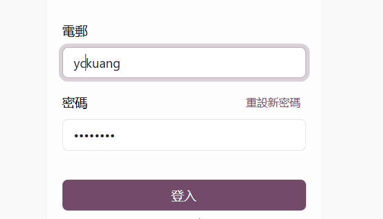

### 不要點選旁支功能

- 此處修改密碼只限於`odoo`系統內有效，別處的LDAP應用沒有作用。
- 不要點選[還沒有帳戶]()，手動新增的帳戶**不會**自動帶入LDAP資訊：部門、員編、電子郵件、分機、職稱...，而且限制必須以**電子郵件**登入（含網域）。
- `超級使用者`指得不是`Admin`，而是`Odoo bot`。
- 管理資料庫：會需要12碼亂碼密碼與8碼`Admin`密碼。

## 新增維護請求

### 進入模組

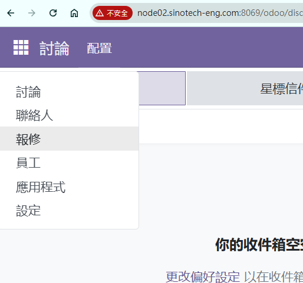

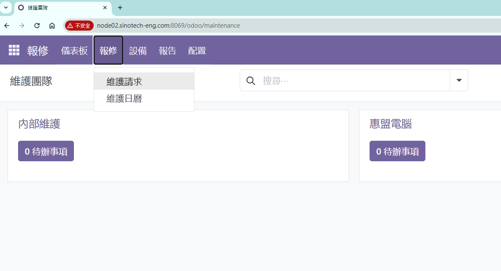

### 新增維護請求的內容

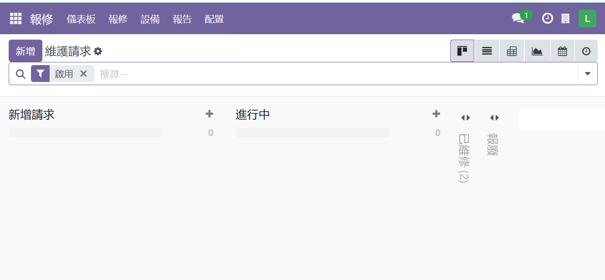

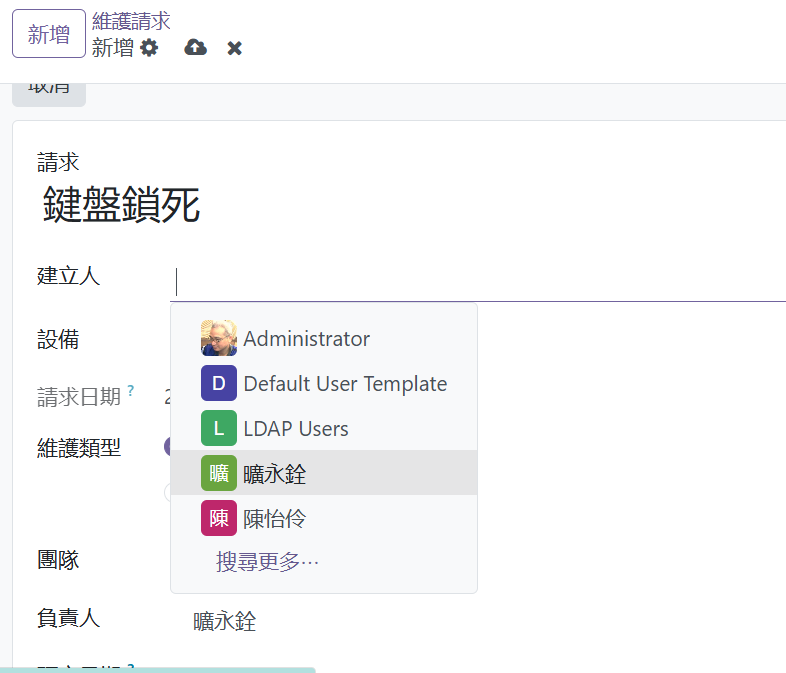

### 請求預定日期時間

- 使用者可以填寫預定日期時間

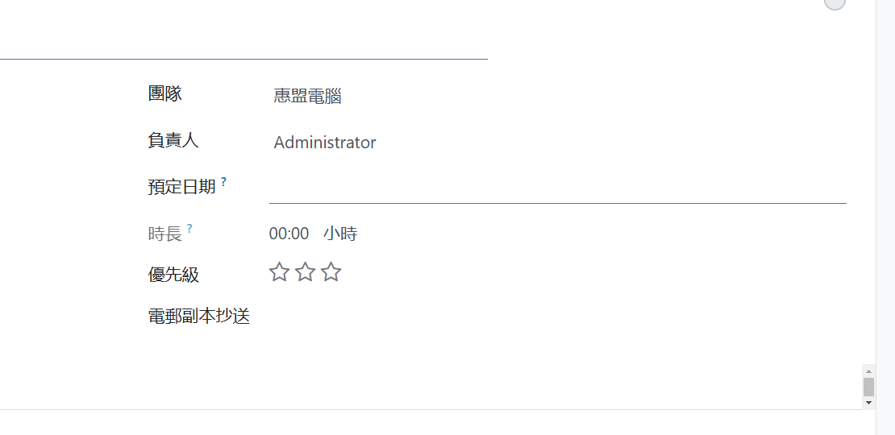

- 填入後會出現在`報修`&rightarrow;`維護日曆`中，如果發現與其他使用者衝突，可先自行調整適合時間。

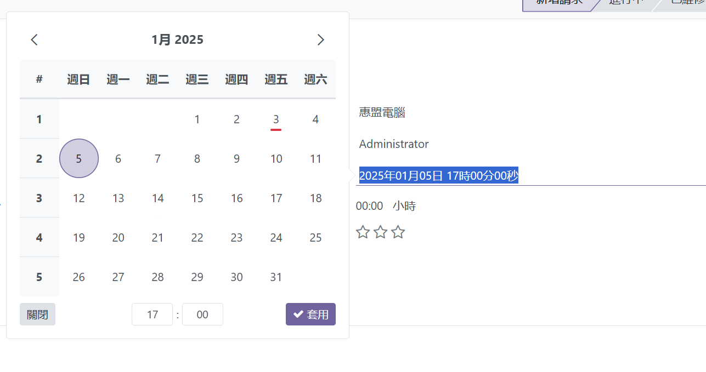

### 維護日曆之檢查

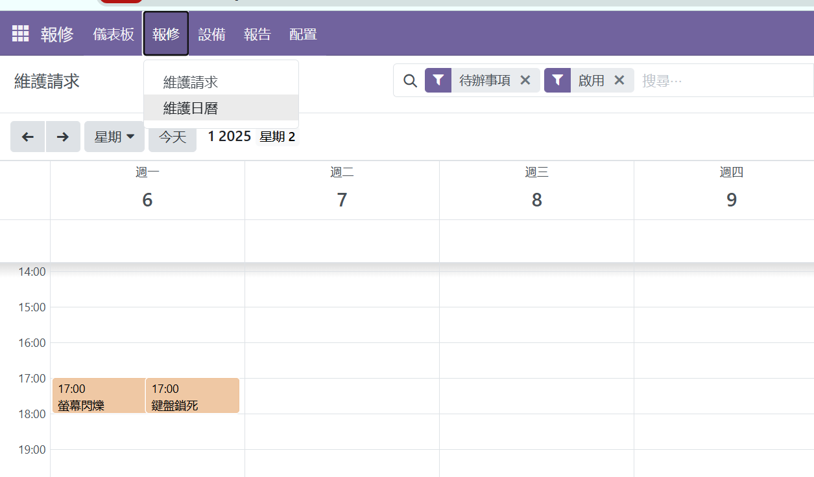

- 系統允許同一時間可以有2個以上的維修單
- 負責人需協調，以釐清每個維修單開始的分鐘數，精確計算個別的`時長`。

### 存檔或取消

- 存檔：上傳符號
- 取消：X
- 複製或刪除：齒輪符號

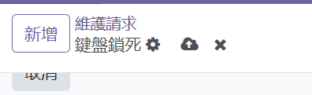

### 訊息發送、接收、回覆

- 維修單的下方有`發送訊息`、`備註`、`活動`(安排開會)等等：有甚麼備註或注意事項，可以在此留言。

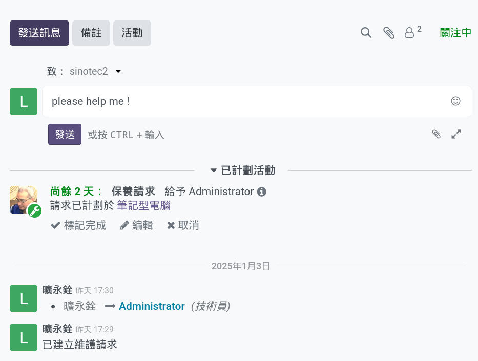

- 負責人會接受報修的通知

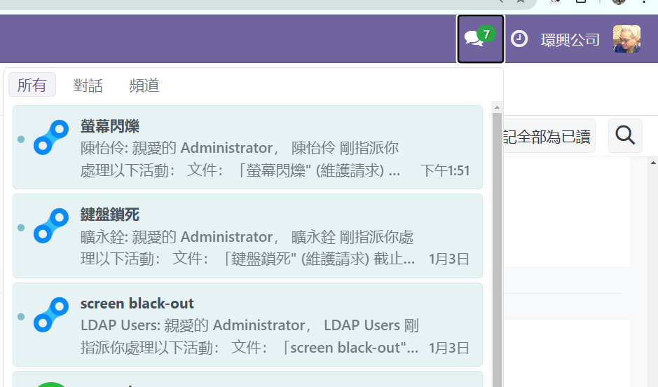

- 如果負責人完成了，除了會將維修單移到`已維修`，也可以點選`標記完成`，來通知使用者。

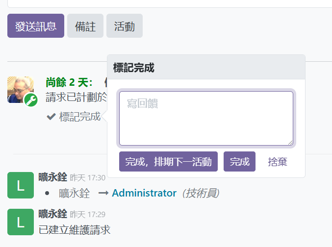
