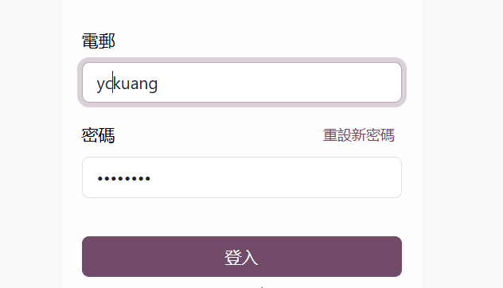
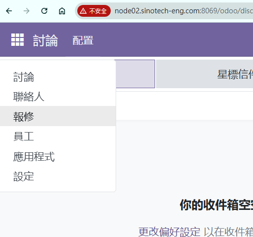
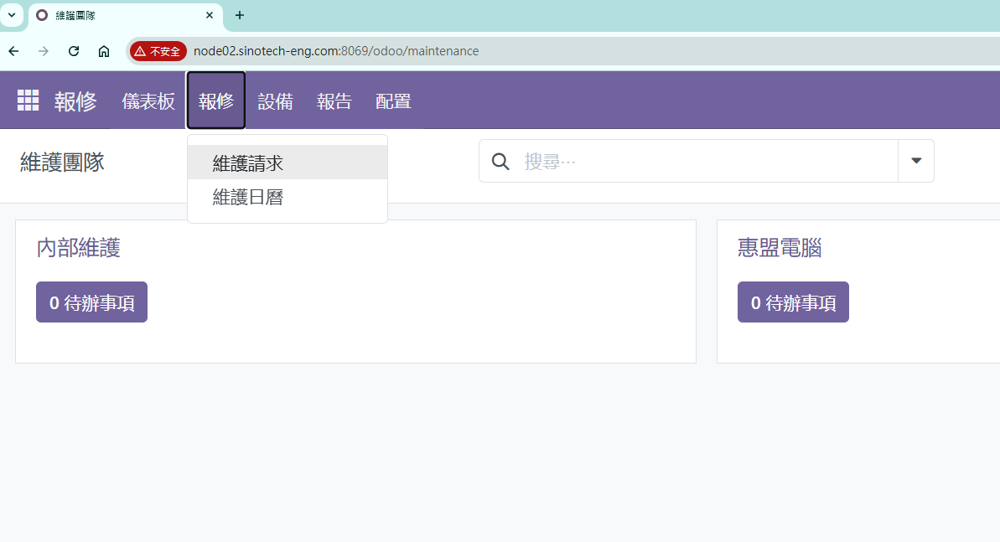
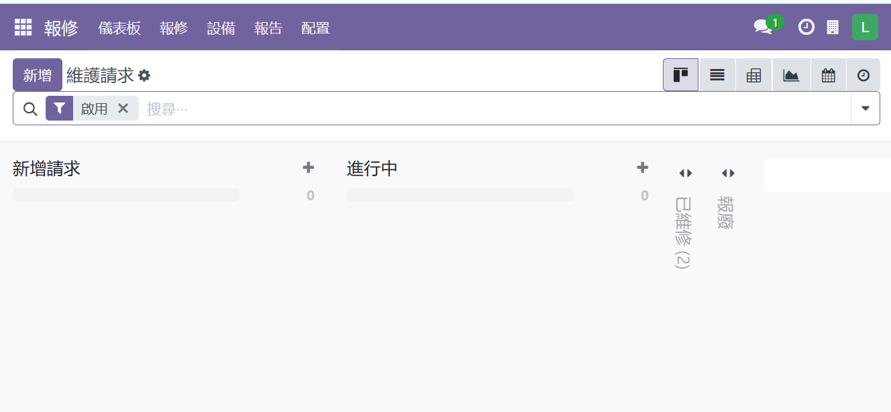
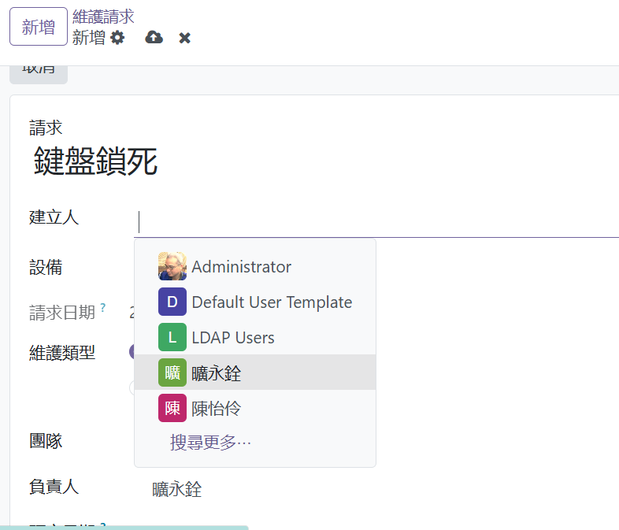
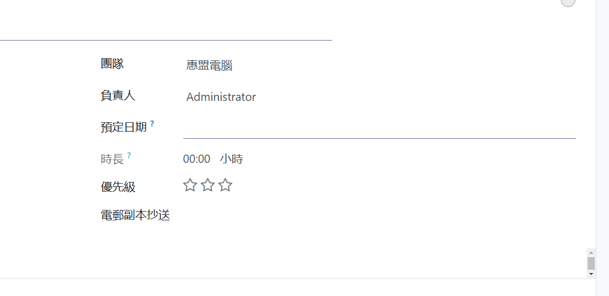
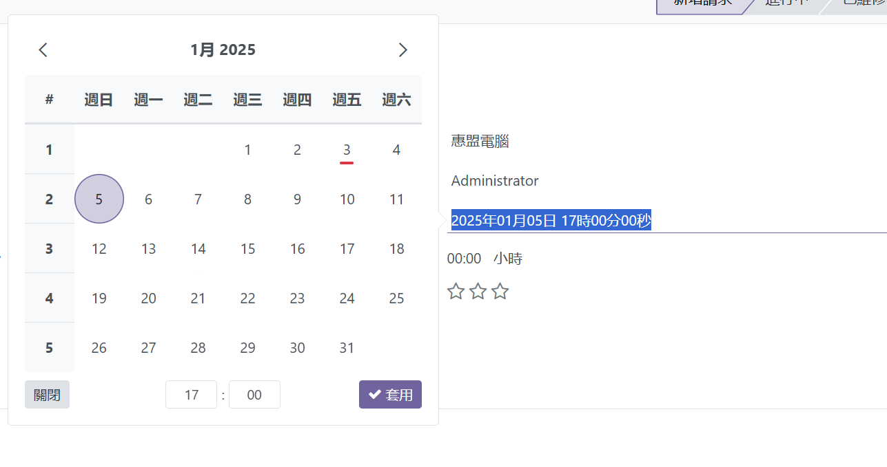

# 報修系統登入及管理

{: .no_toc }

  

    Table of contents
  

  {: .text-delta }
- TOC
{:toc}

---

## 背景

- Odoo是功能強大的企業資源計畫(ERP)系統平台，此次引用其保修系模組(maintenance)進行客製化，作為公司內部資訊設備報修系統的更新方案。往後還會在此平台持續開發好用的系統軟體、諸如程式學習平台、行動APP功能等等。

### 報修系統主要新增功能

- 個案進度查詢、管控
- 溝通紀錄
- 維護時間統計

### 需同仁配合事項

- 以LDAP帳號登入、鍵入問題，並且協調預期開始維修的時間。
- 修理完成後確認`完成`

## 登入系統

- 目前`odoo`沒有與AD帳號整合，而是LDAP帳密系統。
- 使用者需先在[`FreeIPA`系統](https://node03.sinotech-eng.com/ipa/ui/)修改密碼或[免登入修改密碼](http://node03.sinotech-eng.com:5000)。先由電子郵件名稱及員編2次作為密碼登入。（詳）
- 

## 新增維護請求

