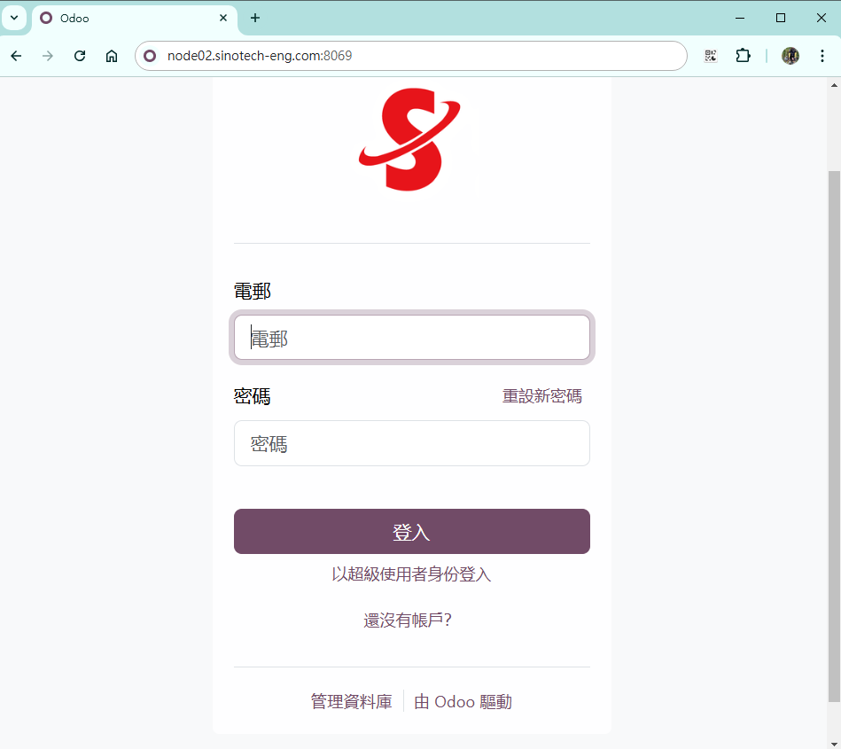

# 報修系統登入及管理

{: .no_toc }

  

    Table of contents
  

  {: .text-delta }
- TOC
{:toc}

---

## 背景

- Odoo是功能強大的企業資源計畫(ERP)系統平台，此次引用其保修系統進行客製化，作為公司內部資訊設備報修系統的更新方案。往後還會在此平台持續開發好用的系統軟體、諸如程式學習平台、行動APP功能等等。

### 報修系統主要新增功能

- 個案進度查詢、管控
- 溝通紀錄
- 維護時間統計

### 需同仁配合事項

## 登入系統

## 新增維護請求

