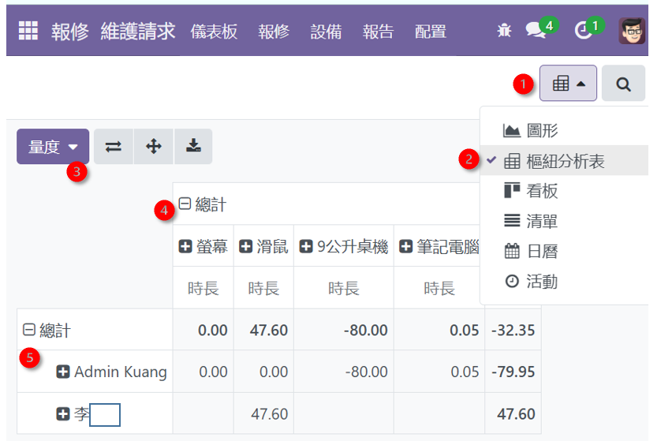
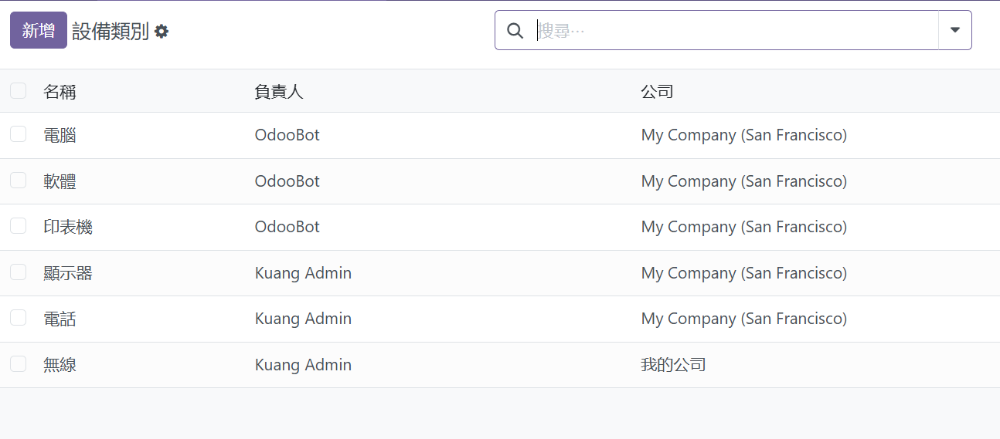
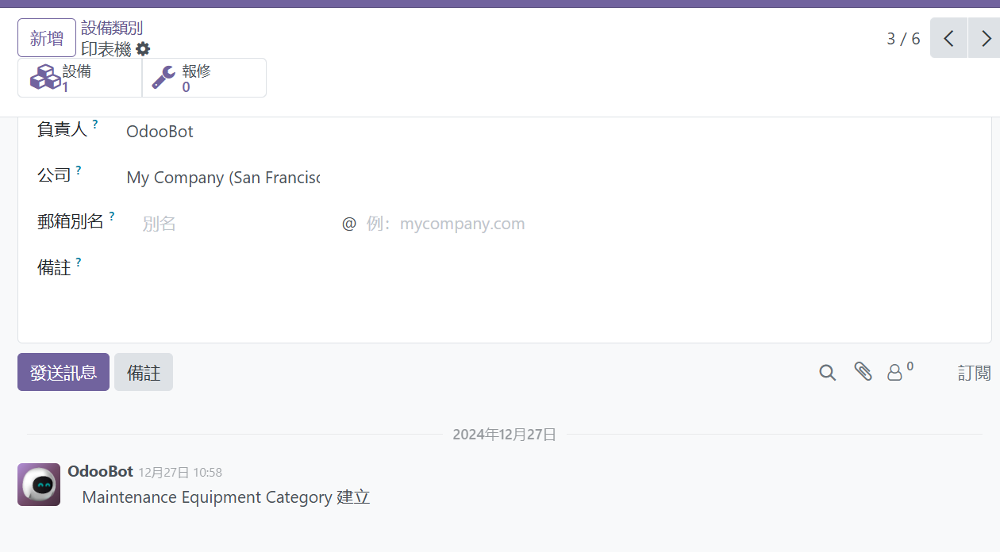

# maintenance
{: .no_toc }

  

    Table of contents
  

  {: .text-delta }
- TOC
{:toc}

---

## 背景

## 報告-維護請求

- 大多數的圖表都是在區分工程師個別做了多少件維修案件，在樞紐表中可以針對案件的其他內容項目進行加總。

1. 下拉選單或直接點選樞紐分析表
2. 除了圖形、樞紐分析、清單、日曆這些總表之外，也能就個別使用者列出代辦事項，按照時間、設備類別等等，列出待修的品項。
3. 量度：要分析的數量。有件數、時長(duration)
4. 上方總計：可以按照維度予以拆解
5. 左側總計：可以按照其他維度顯示分項值

## 設置

管理者在此設定

- 維護團隊：公司內負責維護的部門(IT、行政等等支援部門)、公司外包單位等等，這些與時間及責任有關
- 設備類別
  - 因為是總管理處的架構，不同公司可能會有一樣的類別。
  - 點入後還可以設定設備的細節。
  - 這類別下還可以有細部的品項
  - 設備電郵：可能某個設備是某個人負責採購營運，會想知道後續維護的情況。

- 維護階段：新增、進行中、已維護、報廢。還可以新增，如備料中(可以不受schedule_date的管制)、是否在維修管道中(需要分工並檢討進度)
- 活動類型
  - 維護家族的內部活動，主要用在通知的標題及圖示。