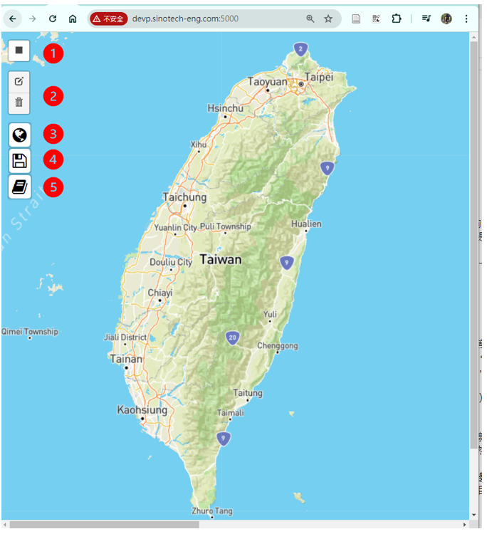

# 前端網頁的設計
{: .no_toc }

<details open markdown="block">
  <summary>
    Table of contents
  </summary>
  {: .text-delta }
- TOC
{:toc}
</details>

---
## 背景

- 整個專案的靈魂在於這個地圖介面，高品質、高效率的介面將會是成敗的關鍵。
- 圖框的選取不是難事，API回應結果該如何命名？是讓使用者另存、還是直接下載？還需要仔細琢磨一下。
- 專案的整體架構可以參考[這裡](https://sinotec2.github.io/Utilities/GIS/DTM/app/#整體流程)

### 目的

這個前端網頁的功能基本上是個地圖篩選器，藉由矩形圖框界定選取範圍、點選儲存icon來觸發[Flask](https://flask.palletsprojects.com/en/3.0.x/) API[程式](./app.md)，將圖檔返回儲存到使用者的下載區。

html圖面如下，內容詳[index.html](./index.html)，實例請造訪[devp.sinotech-eng.com:5000](http://devp.sinotech-eng.com:5000)。



### 大略說明

這段 HTML 和 JavaScript 代碼創建了一個基於 Leaflet 的地圖應用，並且提供了五項交互功能，包括繪製矩形切割範圍、保存範圍內的數據作為 PNG 或 DXF 文件，以及打開作業手冊。以下是每個部分的簡要說明：

1. **HTML 基本結構**：
   - `<!DOCTYPE html>` 宣告文件類型。
   - `<html>` 和 `<head>` 包含標題和基本樣式設置。
   - 使用 `<meta>` 標籤設置兼容模式。
   - 引入 Leaflet、Leaflet Draw 和 Font Awesome 的樣式和腳本。

2. **樣式設置**：
   - 設置基本的樣式，包括 `.style1` 和 `.with-background`。

3. **地圖初始化**：
   - 使用 Leaflet 創建一個地圖，並設置初始視圖和圖層。

4. **繪圖控制**：
   - 初始化一個 `FeatureGroup` 來保存繪製的圖形。
   - 創建一個 `DrawControl` 來啟用繪製矩形的工具。

5. **自定義控制按鈕**：
   - 創建三個自定義按鈕，分別用於保存 PNG 文件、保存 DXF 文件和打開作業手冊。
   - 使用 `L.Control.extend` 創建自定義控制，並添加到地圖上。

6. **事件處理**：
   - 當繪製新的矩形時，清除之前的圖層，並將新的矩形添加到地圖上。
   - 當矩形繪製完成後，自動放大地圖以適應選取框範圍。

## Leaflet js設計
，
### 底圖的考量

- 很多leaflet內設圖磚連結開放政策修改，因此底圖的選用還是選用穩定性高的提供者為宜。
- 由於等高線是專案關切主題、而不是其他地面資訊，因此不考慮[內政部圖磚](https://maps.nlsc.gov.tw/T09/mapshow.action?In_type=web)、[openStreetMap](https://www.openstreetmap.org/#map=7/23.611/120.768)等，以避免等高線被文字遮蔽。
- 此處選擇[Mapbox](https://www.mapbox.com/)的圖磚，較、[openTopoMap](https://opentopomap.org)等來得清晰簡潔、遮蔽較少，有較/高的地圖品質（雖然尚未全面中文化）。
- mapbox API token
   - [登記](https://docs.mapbox.com/api/overview/)
   - [費用機制](https://docs.mapbox.com/api/overview/)：瀏覽、低量路線計算並不收費、高量路線計算才會收費。
-  改用其他圖磚
   - 更改連結及相應的token即可

### 其他地圖設定

-  中心點及初始縮放比例
- `zoomControl: false`，不顯示左上方默認的縮放控制按鈕("+ - ")。縮放功能都在滾輪上實現，使用按鈕還要移動滑鼠到左上方，又與圖框範圍選擇的功能衝突，因此將其取消。

```js
 var map = L.map('map',{ zoomControl: false }).setView([23.5, 121.],8);
```

- 特色組工具（[FeatureGroup](https://leafletjs.com/reference.html#featuregroup)
   - 這個工具將會一次定義圖層內的物件
   - 下列指令將會新增`DrawItems`群組，以備後面程式可以批次定義其內容。
```js
 var drawnItems = new L.FeatureGroup();
 map.addLayer(drawnItems);
```

- 繪圖控制([L.control](https://leafletjs.com/reference.html#control-layers))
   - 控制物件的新增、編輯與刪除。共有2各項目需定義，`edit`將連到前述特色組圖層，`draw`則規範要新增元件的顏色、圖框及填滿等特性。
   - 矩形物件是我們唯一所需要的圖形物件，其他先關閉。
   - 選取範圍之填滿、即使增加透明度，仍會造成視覺上的干擾。因此最後決定取消填滿、改以紅色實現圖框。

```js
var drawControl = new L.Control.Draw({
   edit: {
      featureGroup: drawnItems
         },
   draw: {
         polyline: false,
         polygon: false,
         circle: false,
         marker: false,
         circlemarker: false,
         rectangle: {
            shapeOptions: {
               color: 'red',
               fillOpacity: 0.0     // 填充透明度，0 表示完全透明
               }
            }
         }
});
map.addControl(drawControl);
```

## API程式之觸發

- saveButtonP/X是2個相似度很高的自訂 Leaflet 控制項，目的在儲存`png`、`dxf`2種格式的等高線圖檔，
- 因為相似度很高，此處只須說明一項即可。
- 傳送數據檔案等功能，以一個變數型態實現，這個變數也會生成圖面上的按鈕。
- 首先釐清按鈕的設定，再定義點擊之後觸發的事件(啟動API程式)

### 按鈕的位置、外觀與觸發

這段程式碼定義了一個自訂的 Leaflet 控制項，這個控制項的設計是在地圖的左上角添加一個按鈕，當按下時，會將地圖儲存為 PNG 圖像。

```js
var saveButtonP = L.Control.extend({
   options: {
         position: 'topleft'
   },
   onAdd: function(map) {
      var container = L.DomUtil.create('div', 'leaflet-bar leaflet-control leaflet-control-custom');
         container.innerHTML = '<i class="fa fa-globe fa-2x with-background" title="儲存PNG檔案"></i>';
         L.DomEvent.on(container, 'click', this._save, this);
         return container;
   },
```

以下是程式碼的分解：

1. `var saveButtonP = L.Control.extend({ ... });`:
   - 這一行定義了一個新的控制項類別 `saveButtonP`，它繼承自 Leaflet 提供的 `L.Control` 類別。
   - `extend` 方法允許您創建一個新類別，該類別繼承自父類別的屬性和方法。

2. `options: { position: 'topleft' }`:
   - 這定義了控制項的預設選項。在這種情況下，控制項將被放置在地圖的左上角。

3. `onAdd: function(map) { ... }`:
   - 當控制項被添加到地圖時，會調用這個方法。它負責創建控制項的 UI 元素。
   - `map` 參數是控制項被添加到的 Leaflet 地圖對象。

4. `var container = L.DomUtil.create('div', 'leaflet-bar leaflet-control leaflet-control-custom');`:
   - 這一行創建了一個新的 HTML `div` 元素，它將作為控制項 UI 的容器。
   - 使用 `L.DomUtil.create` 方法創建元素，並將類名 `leaflet-bar`、`leaflet-control` 和 `leaflet-control-custom` 添加到元素中以對其進行樣式設置。

5. `container.innerHTML = '<i class="fa fa-globe fa-2x with-background" title="儲存PNG檔案"></i>';`:
   - 這一行將容器的內部 HTML 設置為一個 HTML 元素，其中包括一個 Font Awesome 圖標 (fa-globe) 和一個標題，翻譯為"儲存 PNG 檔案"。

6. `L.DomEvent.on(container, 'click', this._save, this);`:
   - 這一行為容器添加了一個事件監聽器，監聽點擊事件。當容器被點擊時，將調用 `_save` 方法。
   - `this` 關鍵字指的是 `saveButtonP` 控制項對象。

7. `return container;`:
   - 這一行返回容器元素，這是將被添加到地圖的 UI 元素。

總之，這段程式碼定義了一個自訂的控制項，在 Leaflet 地圖的左上角添加一個按鈕。當按鈕被點擊時，它會將地圖儲存為 PNG 圖像。

### _save方法

```js
   _save: function(e) {
         L.DomEvent.stopPropagation(e);
         L.DomEvent.preventDefault(e);
         if (currentRectangle) {
            var bounds = currentRectangle.getBounds();
            var result = {
               northEast: bounds.getNorthEast(),
               southWest: bounds.getSouthWest()
            };
            console.log("Saved bounds:", result);
            //alert("Bounds saved! Check the console for details.");
            // 在此處添加將結果保存到後端或本地存儲的代碼

            fetch('/api/v1/get_cntr', {
               method: 'POST',
               headers: {
                     'Content-Type': 'application/json'
               },
               body: JSON.stringify({
                     sw_lat: result.southWest.lat,
                     sw_lon: result.southWest.lng,
                     ne_lat: result.northEast.lat,
                     ne_lon: result.northEast.lng
               })
         }).then(response => {
            if (!response.ok) {
               throw new Error('Network response was not ok');
            }
            var contentDisposition = response.headers.get('content-disposition');
            var filename = contentDisposition.split('filename=')[1].trim();
            return response.blob().then(blob => {
               // 创建一个链接，下载返回的文件
               var url = window.URL.createObjectURL(blob);
               var a = document.createElement('a');
               a.href = url;

               // 设置下载的文件名
               a.download = filename || 'download'; // 使用 API 返回的文件名，如果没有则使用默认值
               document.body.appendChild(a);
               a.click();
               window.URL.revokeObjectURL(url); // 释放 URL 对象
               //a.remove();
            });
         }).catch(error => console.error('Error:', error));
   }
}
```

這段程式碼定義了一個名為 `_save` 的方法，它是 `saveButtonP` 控制項的一部分。這個方法在點擊控制項按鈕時被調用，並將地圖的範圍信息儲存到後端或本地存儲中。

以下是方法的內容：

1. `L.DomEvent.stopPropagation(e);` 和 `L.DomEvent.preventDefault(e);`:
   - 這兩個方法用於防止事件冒泡和預防預設行為，以確保點擊控制項按鈕時不會觸發其他事件。

2. `if (currentRectangle) { ... }`:
   - 這個條件判斷是否已經選擇了地圖的範圍（`currentRectangle`）。如果已經選擇了範圍，則執行以下代碼。

3. `var bounds = currentRectangle.getBounds();`:
   - 這行獲取選擇的範圍的緯度和經度。

4. `var result = { ... };`:
   - 這個變數將儲存選擇的範圍的緯度和經度。

5. `fetch('/api/v1/get_cntr', { ... });`:
   - 這個方法使用 Fetch API 將範圍信息發送到後端 API `/api/v1/get_cntr`，以儲存範圍信息。

6. `response.blob().then(blob => { ... });`:
   - 這個方法將後端返回的資料轉換為 Blob 物件，然後使用這個 Blob 物件創建一個 URL 連結，讓用戶可以下載儲存的範圍信息。

7. `document.body.appendChild(a); a.click(); window.URL.revokeObjectURL(url);`:
   - 這些代碼將創建的連結添加到文檔體中，然後點擊連結以下載範圍信息，最後釋放 URL 物件。

8. `catch(error => console.error('Error:', error));`:
   - 這個 catch  block 會捕捉任何發生的錯誤，並將錯誤信息輸出到控制台。

總之，這個方法將地圖的範圍信息儲存到後端或本地存儲中，並將儲存的資料下載到用戶的電腦上。