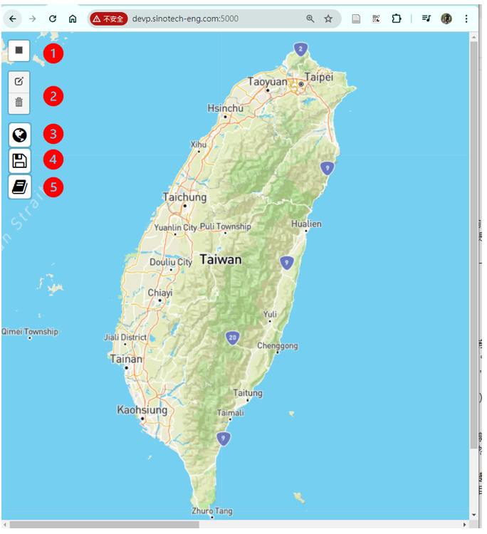

# 臺澎dtm切割介面
{: .no_toc }

  

    Table of contents
  

  {: .text-delta }
- TOC
{:toc}

---
## 背景

### 資料之選擇

- 近年來內政部20MDTM數據並沒有顯著的更新（詳[dtm檔案收集情況](./dtm_info.md)），由於2020版本DTM在苗栗地區有顯著的缺值，因此使用2018年版本。
- 解析度：雖內政部也有1m解析度的DTM，但以噪音模式動輒10～100公頃範圍，將造成計算困難。全島之總體處理與儲存也有很大的挑戰。
- 此處選擇以20m解析度尚稱合理。

### DTM的前處理

- 最花時間的步驟為直角座標系統與經緯度系統的轉換，如果每次轉換將會造成瓶頸。
- 轉換後的儲存格式：按照GPT的建議，以[記憶體映射](https://numpy.org/doc/stable/reference/generated/numpy.memmap.html)的方式儲存，詳見[Geotiff格式DTM之前處理](./img2mem.md)

### 系統架構策略考量

- 前台
  - 原生的leaflet與html搭配是最穩定、功能齊全且易於發展
  - streamlit雖然較為簡潔，但元件不多、與js、css等還是有很大的扞格。
  - 由於等高線是專案關切主題，此處選擇Mapbox的圖磚，較內政部圖磚、openTopoMap等，有較高的地圖品質（雖然缺少中文地名）。
- API伺服器
  - 此處只有傳送邊界座標(`bounds`:東北、西南經緯度座標共4個數字)、以及切割之地形圖(`.png`或`.dxf`)，算是單純，不考慮複雜且功能完整的API伺服器。
  - GPT建議以Flask來撰寫最簡潔穩定，且最受歡迎
  - Flask伺服器可以同時營運html及多個API，程式架構單純。
- 資料庫
  - 因為是格柵資料，具有很高的系統性，不需要建立關聯或非關聯資料庫
  - 直接以格柵檔案進行存取最有效率
  - 更換DTM來源所需的轉換作業最單純。

## 前台畫面與應用

### 服務網址

- [devp.sinotech-eng.com:5000](http://devp.sinotech-eng.com:5000)

### 進入畫面與滑鼠內設功能

- 進入伺服器後，滑鼠默認自動進入矩形圖框切割功能、選取縮放(`fitBounds`)之後，後清除前次選取圖框、並再次進入切割功能。
  - 可接受滾輪放大縮小、但不能接受移動(pan)
  - 如果要移動地圖，需要按`esc`鍵、或點選垃圾桶`clear all`
- 畫面如下，說明如後。

### 功能鍵說明

1. 矩形圖框切割功能：滑鼠雖然內設具有矩形圖框切割功能，但經取消(按`esc`鍵)後，如要繼續選取，可以點選黑色白底四方形鍵
2. 編輯圖框與清除選取
3. 將選取結果送交等高線繪製API程式，圖檔可直接與地圖等高線定性比較。
   - 點選此鍵前需先按`esc`鍵取消繼續切割。
   - 點選後系統將會在主機上產生等高線圖檔，同時也在客戶端下載目錄儲存一份。檔名為`terr_隨機碼.png`。
   - 高度值：選取範圍內最低到最高共9個間隔。
4. 功能與3.幾乎一樣，但為每公尺的等高線`dxf`檔
   - 檔名為`terr_隨機碼.dxf`
   - 可以用線上dxf viewer來檢視，如[sharecad.org](https://sharecad.org/)
5. 使用手冊
   - 公司內[vuepress]()
   - 公司外[github page]()

## 案例比較

- mapbox切割範圍

  

- matplotlib等高線圖

- dxf檔案

