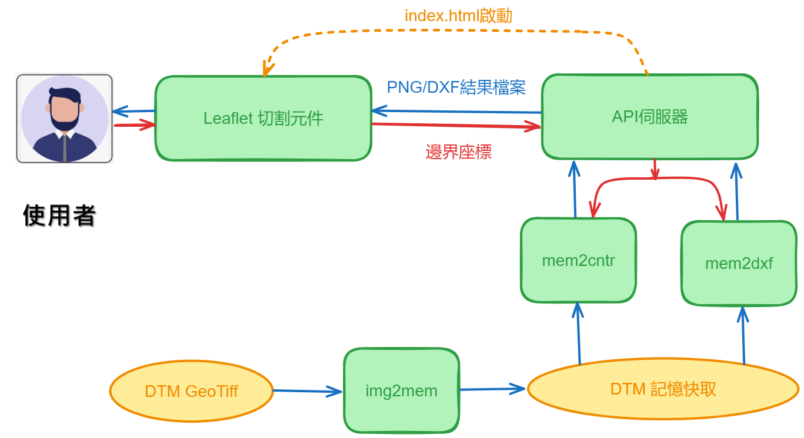

# API伺服器的設計
{: .no_toc }

<details open markdown="block">
  <summary>
    Table of contents
  </summary>
  {: .text-delta }
- TOC
{:toc}
</details>

---
## 背景

### 整體流程

- 前台[leaflet](https://leafletjs.com/)、API伺服器、製圖函式([cntr](./mem2cntr.md)及[dxf](./mem2dxf.md))、[資料檔](./dtm_info.md)與[前處理](./img2mem.md)等作業方式，如圖所示。



- 這支程式([app.py](./app.py))接收前端html leaflet元件的呼叫、傳入`bounds`座標值，引用[cntr](./mem2cntr.md)、[dxf](./mem2dxf.md)2支函式進行檔案切割、製圖，最後將結果檔回傳給前端，儲存在使用者本機的`下載`目錄。

### API選擇策略

- GPT、perplexity各大AI都建議使用[Flask][flask]，不過此處還是補充一下決策的背景。
- node.js：在格隔柵資料處理過程過於繁瑣、不予考慮。
- streamlet
  - python家族之一
  - 有2個模組可以做伺服器，Gunicorn：`st.run(app, host="0.0.0.0", port=8080)`，獨立伺服器：`st.streamlit(app, run_url="streamlit")`
  - 維運html，則使用`st.markdown()`或`st.write()`，列印鑲嵌在程式碼內的html內容。不適用太過複雜的html。
- [Flask][flask]、Django、Streamlit三者比較如下

框架|特性與能力|優勢|劣勢
-|-|-|-
[Flask][flask]|輕量、靈活、微框架|易學易用，非常適合中小型應用|只有基本功能，還需要額外的庫和工具
[Django](https://www.django-rest-framework.org/)|進階、全端框架|快速開發、健壯、可擴展的架構，非常適合大型、複雜的應用|陡峭的學習曲線，靈活性不如 [Flask][flask]
[Streamlit](https://docs.streamlit.io/develop/api-reference)|用於建立資料應用程式的開源框架|即時資料視覺化，非常適合創建顯示和操作資料的應用程式|不是專門為建立API而設計的

其他方案也詳列如下

框架|特性與能力|優勢|劣勢
-|-|-|-
[FastAPI](https://fastapi.tiangolo.com/)|現代、高效能Web框架|效能快、記憶體佔用小、基於Python類型提示|仍然比較新，不像[Flask][flask]和Django那樣廣泛使用
[Falcon](https://falcon.readthedocs.io/en/stable/)|輕量級高效能Web框架|快速、有效率、易於使用，非常適合建立RESTful API|微框架，需要額外的程式庫和工具
[Pyramid](https://help.pyramidanalytics.com/Content/Root/developer/reference/APIs/API%20Overview.htm)|靈活的開源Web框架|應用廣泛，基於WSGI標準|全端框架，陡峭的學習曲線
[Tornado](https://www.tornadoweb.org/en/stable/)|可擴充、非阻塞的網路框架|處理大量並發連接，非常適合高效能API|微框架，需要額外的函式庫和工具

### 兩個圖檔並存服務的考量

- `matplotlib.pyplot.contour`是產生dxf圖檔必經(最有效率)的過程，輸出檔案只是附加產品
- 原本序列的關係，因地形數據處理的效率提高了，似乎也沒有必要維持序列，獨立運作也並無不可。

## 程式說明

這段程式碼建立了一個使用 [Flask][flask] 框架的 API 服務，其中包含兩個端點 `/api/v1/get_dxf` 和 `/api/v1/get_cntr`。這兩個端點分別用於生成 DXF 文件和 PNG 圖像，並將其返回給客戶端。具體的工作流程如下：

### 導入必要的庫

- `Flask` 用於創建 web 應用。
- `BytesIO` 用於處理內存中的文件。
- `cntr` 和 `dxf` 分別從 `mem2cntr` 和 `mem2dxf` 模組中導入，用於生成 PNG 圖像和 DXF 文件。

### 創建 Flask 應用

- `app = Flask(__name__)` 初始化 [Flask][flask] 應用。

### 靜態文件的端點

- `serve_html` 函數返回 `index.html` 文件。
- html文件內容詳見[index.html的設計](./)

### 生成 DXF 文件的端點

- `get_dxf` 函數接收 POST 請求中的 JSON 數據，提取西南和東北角的經緯度，
- 並調用 `dxf` 函數生成 DXF 文件（詳[mem2dxf.py](./mem2dxf.md)）。
- 生成的文件以`BytesIO()`附件形式返回。

### 生成 PNG 圖像的端點

- `get_cntr` 函數接收 POST 請求中的 JSON 數據，提取西南和東北角的經緯度，
- 調用 `cntr` 函數生成 PNG 圖像。
- 生成的圖像也以`BytesIO()`附件形式返回。

### 主程序入口

- 當程序以腳本形式運行時，啟動 [Flask][flask] 服務。
- ip及端口在此設定
- 啟動偵錯模型

## 呼叫方式

- API程式可以直接使用curl指令從後端主機呼叫，可以不需要前端程式，在測試階段可以用`curl`來得到api程式的結果。
- 如以下呼叫`cntr`程式的指令

```bash
url=http://devp.sinotech-eng.com:5000/api/v1/get_file
curl -X POST $url -H "Content-Type: application/json" -d '{"sw_lat": 22.507545744146224, "sw_lon": 120.61295698396863, "ne_lat": 22.535073497331727, "ne_lon": 120.64468000957278}' --output a.png
```

- 為串連前端程式，一般使用js指令`fetch`來連接API伺服器，詳見[前端網頁的設計#_save方法](./App_index.md#_save方法)

## 代碼說明

以下是完整的代碼：

```python
from flask import Flask, request, jsonify, send_file, send_from_directory
import pandas as pd
from io import BytesIO
from mem2cntr import cntr, rd_mem
from mem2dxf import dxf

app = Flask(__name__)

# 靜態文件的端點
@app.route('/')
def serve_html():
    return send_from_directory('.', 'index.html')

# 生成 DXF 文件的端點
@app.route('/api/v1/get_dxf', methods=['POST'])
def get_dxf():
    try:
        data = request.json
        print("Received data:", data)  # 調試輸出
        sw_lat = data.get('sw_lat')
        sw_lon = data.get('sw_lon')
        ne_lat = data.get('ne_lat')
        ne_lon = data.get('ne_lon')

        # 檢查是否傳入了所有必要的數據
        if not all([sw_lat, sw_lon, ne_lat, ne_lon]):
            return jsonify({"error": "缺少必要的經緯度參數"}), 400

        # 將 DataFrame 寫入內存中的 CSV 文件
        fname, output = dxf((sw_lat, sw_lon), (ne_lat, ne_lon))
        if fname == 'LL not right!':
            return jsonify({"error": "經緯度參數超過範圍"}), 400

        return send_file(output, mimetype='application/dxf', download_name=fname, as_attachment=True)

    except KeyError as e:
        return jsonify({"error": f"缺少必要的字段: {str(e)}"}), 400
    except Exception as e:
        print("Exception occurred:", str(e))  # 調試輸出
        return jsonify({"error": str(e)}), 500

@app.route('/api/v1/get_cntr', methods=['POST'])
def get_cntr():
    try:
        data = request.json
        print("Received data:", data)  # 調試輸出
        sw_lat = data.get('sw_lat')
        sw_lon = data.get('sw_lon')
        ne_lat = data.get('ne_lat')
        ne_lon = data.get('ne_lon')

        # 檢查是否傳入了所有必要的數據
        if not all([sw_lat, sw_lon, ne_lat, ne_lon]):
            return jsonify({"error": "缺少必要的經緯度參數"}), 400

        # 將 DataFrame 寫入內存中的 CSV 文件
        fname, output = cntr((sw_lat, sw_lon), (ne_lat, ne_lon))
        if fname == 'LL not right!':
            return jsonify({"error": "經緯度參數超過範圍"}), 400

        return send_file(output, mimetype='image/png', download_name=fname, as_attachment=True)

    except KeyError as e:
        return jsonify({"error": f"缺少必要的字段: {str(e)}"}), 400
    except Exception as e:
        print("Exception occurred:", str(e))  # 調試輸出
        return jsonify({"error": str(e)}), 500

# 主程式：開啟偵錯、IP、端口
if __name__ == '__main__':
    print("Starting Flask server...")
    app.run(debug=True, host='devp.sinotech-eng.com', port=5000)
```

此應用程序提供了一個簡單的網頁界面，並且可以通過 API 調用來生成並下載 DXF 文件和 PNG 圖像。確保 `mem2cntr` 和 `mem2dxf` 模組正確地被導入並且運行正常。

[flask]: https://flask.palletsprojects.com/en/3.0.x/ "Flask是一個使用Python編寫的輕量級Web應用框架。基於Werkzeug WSGI工具箱和Jinja2模板引擎。Flask使用BSD授權。 Flask被稱為「微框架」，因為它使用簡單的核心，用擴充增加其他功能。Flask沒有預設使用的資料庫、表單驗證工具。 維基百科"