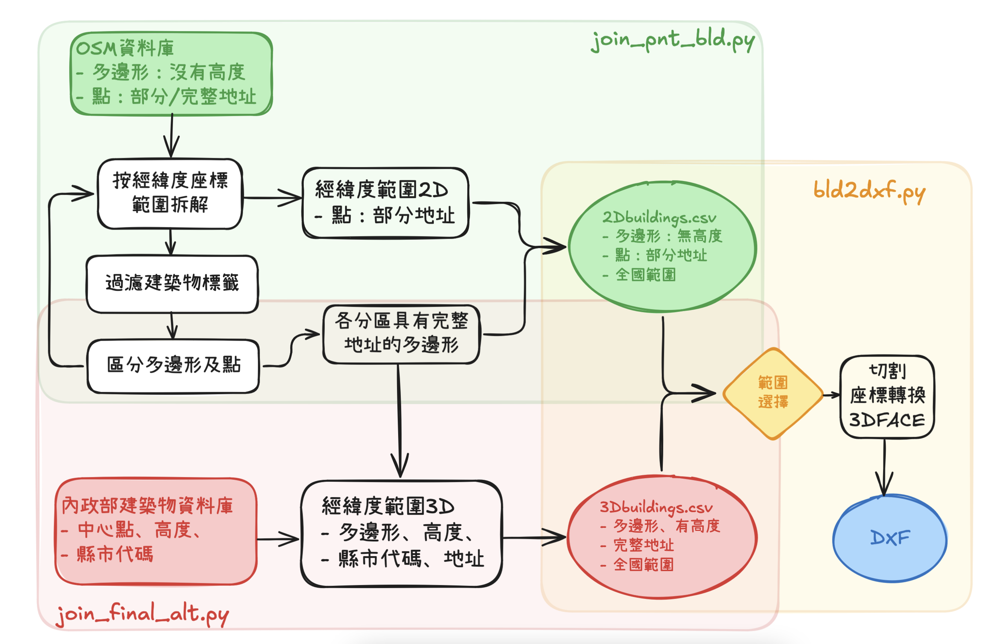

# 建築物DXF檔之讀寫

{: .no_toc }

<details open markdown="block">
  <summary>
    Table of contents
  </summary>
  {: .text-delta }
- TOC
{:toc}
</details>

---

## 背景

- 整體工作流程如圖所示，區分為3大區塊。本文處理最後的整併、切割、座標轉換與DXF輸出。

  

- 大多數策略討論分散在各章節段落下處理

### 多邊形是否重新排序

- 這個議題源自於發展過程中多邊形3維面始終無法閉合之嘗試方案。
- 重新排序會造成災難。
- 不能閉合的對策
  - 對多點的多邊形增加迴圈數
  - 增加polyline2d，強加描繪閉合。

### viewer

- viewer不影響我們提供的服務。但是好的viewer會左右我們更新、技術提升的速度。
- 詳情請見[DXF檔案之預覽](../../DXF/previewDXF.md)

## 納入沒有高度的建築物

- 內政部建築物高度的資訊並不是普遍在每個縣市，有很多地區不是以建築物為標籤，或者沒有高度，造成整併困難，有必要在無法順利進行篩選切割時，適時導入這類品質不佳的資訊。
- 此處設定啟動門檻是範圍之內，如果整併內政部高度的建築物小於4座，此時才讀取點狀的建築物座標。

```python
 #read the 3d buildings
  roots='/nas2/kuang/MyPrograms/CADNA-A/OSM'
  dim=['3D','2D']
  for d in dim[:]:
    fname=f"{roots}/building{d}.csv"
    polygons_gdf = pd.read_csv(fname)
    polygons_gdf['geometry'] = polygons_gdf['geometry'].apply(loads)
    polygons_gdf = gpd.GeoDataFrame(polygons_gdf, geometry='geometry', crs="EPSG:3857")
    p = []
    for i, geom in enumerate(['Point', 'Polygon', 'MultiPolygon']):
      gdf_tmp = polygons_gdf.loc[polygons_gdf.geometry.map(lambda x: x.geom_type == geom)]
      p.append(gpd.overlay(gdf_tmp, bounds_gdf, how='intersection'))
    sliced_gdf = pd.concat(p, ignore_index=True)
    if len(sliced_gdf)>=4:
      break
  if len(sliced_gdf)==0:
    return 'no buildings'
  sliced_gdf = gpd.GeoDataFrame(sliced_gdf, geometry='geometry', crs=polygons_gdf.crs)
```

## 範圍切割

- 多邊形經`overlay`切割，在邊界上會出現線性切割且保持閉合的結果。如圖所示：


## 高程數據的應用與程式說明

### 地形高程的策略考量

- 因為是三維的模型，建築物的基地高程就變得很重要。還好已經有準備好的地形檔案可以快速引用。
- 策略面要考慮的是
  - 高程需不需要內插到多邊形的每一個點？這樣建築物會不會歪斜？這也會牽動到執行量與執行速率。（代表點就足夠）
  - 如果不需要每一點，那建築物該取哪一點來代表它的位置？最低、最高、中心？平均高程？（中心點最近的格點高程）
  - 內插機制怎麼樣做到很快速又正確？(經測試2維內插還不如[KDtree](https://docs.scipy.org/doc/scipy/reference/generated/scipy.spatial.cKDTree.html)又快又正確)

### IO摘要

函式|輸入|輸出|邏輯
-|-|-|-
**`rd_mem(shape)`**|從 `params.txt` 文件讀取參數，並提取出網格的起始點、尺寸以及網格的分辨率。|讀取三個不同的內存映射數據文件（lat, lon, data）||
**`cut_data(swLL, neLL)`**|裁切的地形數據範圍。西南及東北(緯度, 經度)|地形數據框 `grid_df`|
**`grid_prep (grid_df)`**|格點與高程|pnts_tw,pnts_ll,data_arr,ll_tree，TWD97與經緯度格點陣列、高程陣列、KD樹操作元|
**`query_e(points, data_arr, ll_tree)`**|位置、高程陣列、經緯度查詢KD樹|高程|按最近的經緯度回應

### 較艱澀語法的解釋

- **`np.memmap`**: 
  - 這是一個 numpy 的函數，用於創建一個內存映射的數組，允許從磁碟中部分讀取數據，這樣可以處理比內存大得多的數據集。  
- **`ll_tree.query(coords, k=1)`**:
  - 利用空間數據結構（如 [KD 樹](https://docs.scipy.org/doc/scipy/reference/generated/scipy.spatial.cKDTree.html)）來快速查找最近的點。`k=1` 表示只查找最近的一個點。

### 改進建議

- **錯誤處理**: 在讀取文件和處理數據時，應加入錯誤處理機制，防止因文件不存在或格式錯誤導致的崩潰。
- **彈性設定**: 參數如 `dx` 和 `dy` 可以讓使用者自定義，以便在不同的數據集上進行適應性裁切。
- **性能優化**: 如果數據集非常大，可以考慮使用更高效的數據讀取和處理方法，例如分批讀取或使用更高效的數據庫進行查詢。
- **文檔註解**: 增加對每個函數的詳細文檔註解，解釋其參數、返回值和功能，讓未來的維護和使用更加方便。

### 相關程式碼

```python
def rd_mem(shape):
  fnames=['lat','lon','data']
  d = []
  for f in fnames:
    filename = f+'.dat'
    d.append(np.memmap(filename, dtype='float32', mode='r', shape=shape))
  return d

def cut_data (swLL,neLL):
  #load terrain data
  with open('params.txt','r') as f:
    line=[i.strip('\n') for i in f][0]
  x0,y0,nx,ny,dx,dy=(float(i) for i in line.split())
  nx,ny=int(nx),int(ny)
  shape=(ny, nx)
  lat,lon,data=rd_mem(shape)
  data = np.where(data < 0, 0, data)
  x=[x0+dx*i for i in range(nx)]
  y=[y0+dy*i for i in range(ny)]
  xg, yg = np.meshgrid(x, y)

  idx=np.where((lat>=swLL[0])&(lat<=neLL[0])&(lon>=swLL[1])&(lon<=neLL[1]))
  if len(idx[0])==0:
    return 'LL not right!',list(swLL)+list(neLL)
  bounds=[np.min(xg[idx[0],idx[1]]),np.max(xg[idx[0],idx[1]]),np.min(yg[idx[0],idx[1]]),np.max(yg[idx[0],idx[1]])]
  dd={'twd97X':xg[idx[0],idx[1]],'twd97Y':yg[idx[0],idx[1]],'lat':lat[idx[0],idx[1]],'lon':lon[idx[0],idx[1]],'data':data[idx[0],idx[1]]}
  grid_df=pd.DataFrame(dd)
  ib=[x.index(bounds[0]),x.index(bounds[1]),y.index(bounds[2]),y.index(bounds[3])]
  return grid_df

def grid_prep (grid_df):
  lon_arr = grid_df['lon'].values
  lat_arr = grid_df['lat'].values
  twd97X_arr = grid_df['twd97X'].values
  twd97Y_arr = grid_df['twd97Y'].values
  pnts_tw=[Point([i,j]) for i,j in zip(twd97X_arr,twd97Y_arr)]
  pnts_ll=[Point([i,j]) for i,j in zip(lon_arr,lat_arr)]
  data_arr = grid_df['data'].values
  ll_coords = np.column_stack((lon_arr, lat_arr))
  ll_tree = cKDTree(ll_coords)
  return pnts_tw,pnts_ll,data_arr,ll_tree

def query_e(points,data_arr,ll_tree):
  coords = np.array([list(p.coords) for p in points])
  _, indices = ll_tree.query(coords, k=1)
  return [data_arr[indices[i]][0] for i in range(len(points))]

...
  grid_df=cut_data (swLL,neLL)
  pnts_tw,pnts_ll,data_arr,ll_tree=grid_prep (grid_df)
...
  sliced_gdf['elevation']=[float(i) for i in query_e(sliced_gdf.mean_ll,data_arr,ll_tree)]
...
    bot=float(sliced_gdf.loc[i,'elevation'])
...
```

## 幾何物件頂點的座標轉換程式說明

### 策略考量

- 雖然投影系統已經使用`crs="EPSG:3857"`，但使用者還是習慣`TWD97`座標系統，因此所有的經緯度都必須進行轉換。
- 內政部DTM image檔案中已經有格點的`TWD97`座標值，是否可以取最近值？或取2維內插？結果證實雖然是很快速，但解析度不足，效果很差。
- 最後還是以`Proj4`座標轉換效果最好，重要設定如下：
  - 中心點：取切割範圍的中心點經緯度、及其最近格點的`TWD97`座標值，即使會有網格解析度的誤差(此處為20m)，但全區只有一個原點，是不會產生相對誤差的。與其他物件(如DTM、自測高程、其他CAD設計圖檔)整併時，可能還需要進一步校準。
  - lat0/lat1: 10~40

### 1. 程式的輸入

- **`query_g(polygon_ll, pnyc)`**:
  - `polygon_ll`: 一個多邊形物件，通常來自於 Shapely 库，包含了多邊形的外部坐標。
  - `pnyc`: 一個函數，負責將經緯度轉換為特定的坐標系（本例中為 TWD97）。

- **`query_g2(point, pnyc)`**:
  - `point`: 一個點物件，包含其經度和緯度。
  - `pnyc`: 同上，為坐標轉換函數。

- **`query_mp(polygon_ll, pnyc)`**:
  - `polygon_ll`: 一個 MultiPolygon 物件，包含多個多邊形的集合。
  - `pnyc`: 同上，為坐標轉換函數。

- **`bld(swLL, neLL)`**:
  - `swLL`: 包含西南角坐標的列表或元組，格式為 (緯度, 經度)。
  - `neLL`: 包含東北角坐標的列表或元組，格式為 (緯度, 經度)。

### 2. 程式的輸出

- **`query_g`**: 返回轉換後的多邊形物件（Polygon）。
- **`query_g2`**: 返回一個包含四個頂點的正方形多邊形物件（Polygon）。
- **`query_mp`**: 返回轉換後的 MultiPolygon 物件。
- **`bld`**: 更新 `sliced_gdf` 中的 `geometry_twd97` 欄位，包含轉換後的幾何形狀。

### 3. 重要的邏輯

- 使用 `pnyc` 函數將經緯度轉換為特定坐標系，這是地理資訊系統（GIS）中常見的操作。
- `query_g`、 `query_g2`和`query_mp` 透過將經緯度轉換為新的坐標系來處理多邊形和點，分別處理不同的幾何類型。
- `bld` 函數負責整合所有的轉換邏輯，並將結果存回到 `sliced_gdf`，這是一個 GeoDataFrame。

### 4. 較艱澀語法的解釋

- **`np.array(...)`**: 使用 NumPy 陣列來處理坐標資料，這樣可以進行更高效的數據操作。
- **`zip(...)`**: 這個函數將多個可迭代對象打包在一起，常用於組合不同的列表或數組。
- **`sliced_gdf.geometry.map(...)`**: 在 GeoDataFrame 中使用 `map` 方法來過濾資料，這是一種方便的方式來處理大型地理資料集。

### 5. 改進建議

- **錯誤處理**: 增加對輸入資料的驗證和錯誤處理，確保坐標範圍有效。
- **性能優化**: 在處理大型資料集時，考慮使用並行處理或批次處理來提高效率。
- **文檔註解**: 增加詳細的註解和文檔，解釋每個函數的用途和參數，提升可讀性和可維護性。

### 座標轉換相關程式碼

```python
def query_g(polygon_ll,pnyc):
  lon_new=np.array([coord[0] for coord in polygon_ll.exterior.coords])
  lat_new=np.array([coord[1] for coord in polygon_ll.exterior.coords])
  twd97X,twd97Y=pnyc(lon_new, lat_new, inverse=False)
  return Polygon([(x, y) for x, y in zip(twd97X, twd97Y)])

def query_g2(point,pnyc):
  f=6/2
  x,y=pnyc(point.x, point.y, inverse=False)
  return Polygon([(x-f, y-f),(x+f, y-f),(x+f, y+f),(x-f, y+f),])

def query_mp(polygon_ll,pnyc):
  polygon_twd=[]
  for polygon in polygon_ll.geoms:
    polygon_twd.append(query_g(polygon,pnyc))
  return MultiPolygon(polygon_twd)

def bld(swLL,neLL):
...
  south,west=swLL[0],swLL[1]
  north,east=neLL[0],neLL[1]
  bbox_center = Point((west + east) / 2, (south + north) / 2)
  point_tw=query_p(bbox_center,pnts_tw,pnts_ll,ll_tree)
  Xcent, Ycent = point_tw.x, point_tw.y
  pnyc = Proj(proj='lcc', datum='NAD83', lat_1=10, lat_2=40,
    lat_0=bbox_center.y, lon_0=bbox_center.x, x_0=Xcent, y_0=Ycent)
...
  p=sliced_gdf.loc[sliced_gdf.geometry.map(lambda x: x.geom_type=='Polygon')]
  if len(p)>0:
    plg=list(p.geometry)
    sliced_gdf.loc[p.index,'geometry_twd97']=[query_g(i,pnyc) for i in plg]
  m=sliced_gdf.loc[sliced_gdf.geometry.map(lambda x: x.geom_type=='MultiPolygon')]
  if len(m)>0:
    mplg=list(m.geometry)
    sliced_gdf.loc[m.index,'geometry_twd97']=[query_mp(i,pnyc) for i in mplg]
  s=sliced_gdf.loc[sliced_gdf.geometry.map(lambda x: x.geom_type=='Point')]
  if len(s)>0:
    points=list(s.geometry)
    sliced_gdf.loc[s.index,'geometry_twd97']=[query_g2(i,pnyc) for i in points]
```

## ezdxf輸出函式的應用及程式說明

- `Vec3`物件
  - 一如在數值地形資料的輸出，如果只是輸出線形物件，後續程式仍然不能正確讀取DXF檔案，因為DXF的點都必須是3度空間完整定義([Vec3](https://ezdxf.readthedocs.io/en/stable/math/core.html#ezdxf.math.Vec3)物件)
- `3dface`
  - 使用`3dface`的必要性似乎是很直覺的，畢竟要輸出的是建築物的立方體，會需要上層、底層、各個立面的平面。
  - layer的高程設定卡了一陣子無法決定，如果建築物在山坡上，layer的高程究竟該取上、下層的高程？平均？答案是：都沒差別、在`polyliine3d`的個案中，直接把layer的高程設為0，徹底解決斷層的問題。
- `polyliine2d`物件
  - 會想重複提供多邊形邊框的描繪是查看範例檔案中有很多`LineString`物件，並沒有測試其必要性。
  - 在繪圖預覽過程中，有`polyliine2d`物件對不夠完整的`3dface`集合會有很大的幫助，建築物看起來會比較平整。
- 參考
  - [ezdxf官網說明](https://ezdxf.readthedocs.io/en/stable/index.html)
  - [等高線DXF輸出的經驗](../../DTM/mem2dxf.md)
  - [範例DXF檔案轉python碼](../roads/pys/w_source.py)
  
### 輸入

- **sliced_gdf**: 一個 GeoDataFrame，包含多邊形的幾何資訊及其相關屬性（如 `elevation` 和 `maxAltitude`）。
- **p, s, m**: 這些變數代表不同的索引集合，用於確定當前處理的幾何形狀類型。分別是多邊形、點狀、與多個多邊形。

### 輸出

- **fname**: 生成的 DXF 檔案名稱。
- **output**: 包含生成的 DXF 檔案的二進位資料，方便後續操作或直接返回給使用者。

### 重要邏輯

1. **DXF 檔案創建**: 使用 `ezdxf` 庫創建新的 DXF 檔案，並設置模型空間。
2. **分層管理**: 根據每個多邊形的索引創建不同的圖層，並將多邊形的底部和頂部高度計算出來。
3. **多邊形處理**: 根據 `sliced_gdf` 中的幾何資料，將多邊形的外部點提取出來，並為每個多邊形生成上下平面及其立面。
   - 使用 `add_polyline2d` 和 `add_3dface` 方法將生成的點添加到模型空間中。
4. **立面生成**: 對於每個多邊形的邊，生成對應的立面，並將其添加到 DXF 檔案中。

### 較艱澀語法的解釋

- **Vec3**: 用於表示三維空間中的點，通常包含 x, y, z 三個座標。
- **add_polyline2d**: 用於將二維折線添加到模型空間中。
- **add_3dface**
  - 用於將**三維面**添加到模型空間中，通常用於構建立體幾何。
  - **三維面**的限制是一次只能有3點、至多4點、同一平面的點。因此當點數多於4點的建築物，就必須執行迴圈，同時也要注意每一點都必須有前後點作為**三維面**，否則會出現多邊形無法閉合的情況。
- MultiPolygon的處理：其函式`.geoms`的形態為個別多邊形所形成的序列，依序執行原來多邊形的任務即可。

### 改進建議

1. **錯誤處理**: 增加對於輸入資料有效性的檢查，避免因資料格式不正確而導致的執行錯誤。
2. **性能優化**: 對於大規模的多邊形數據，可以考慮使用多執行緒或異步處理來加速生成過程。
3. **功能擴展**: 可以考慮添加選項來支持不同的 DXF 版本，以滿足不同用戶的需求。

這段程式碼的主要目的是將地理數據轉換為 DXF 格式的三維模型，並能夠根據多邊形的特性生成相應的結構。

### 程式碼

```python
...
  doc = ezdxf.new(dxfversion="R2010")
  msp = doc.modelspace()
  align=TextEntityAlignment.CENTER
  ii=0
  for i in sliced_gdf.index:
    layer_name = f"Polygon_{ii}"
    layer = doc.layers.add(layer_name)
    bot=float(sliced_gdf.loc[i,'elevation'])
    Vbot=Vec3(0, 0, bot)
    top=bot+sliced_gdf.loc[i,'maxAltitude']
    if i in p.index or i in s.index:
      polygons=[sliced_gdf.loc[i,'geometry_twd97']]
    if i in m.index:
      polygons=[polygon for polygon in sliced_gdf.loc[i,'geometry_twd97'].geoms]
    for polygon in polygons:
      points=[j for j in polygon.exterior.coords] #reorder_polygon_points(polygon)
      #上下平面
      for hgt in [bot,top]:
        pnts=[Vec3(p[0],p[1],hgt) for p in points]
        npnts=len(pnts)
        msp.add_polyline2d(pnts, dxfattribs={ "layer": layer_name, 'elevation':Vbot  })
        if npnts <=4 and npnts in [3,4]:
          msp.add_3dface(pnts, dxfattribs={'layer': layer_name})
        else:
          rep=npnts//4
          for k in range(rep):
            for n in range(2*k, npnts, 4):
              nnd=min(n+4,npnts)
              if nnd-n not in [3,4]:continue
              msp.add_3dface(pnts[n:nnd], dxfattribs={'layer': layer_name})
      #立面
      for j in range(len(points)):
        pj = points[j]
        p1 = Vec3(pj[0],pj[1],bot)
        pn = points[(j + 1) % len(points)]
        p2 = Vec3(pn[0],pn[1],bot)
        p3 = Vec3(p2[0], p2[1], top)
        p4 = Vec3(p1[0], p1[1], top)
        pnts=[p1, p2, p3, p4]
        msp.add_polyline2d(pnts, dxfattribs={ "layer": layer_name, 'elevation': Vbot })
        msp.add_3dface(pnts, dxfattribs={'layer': layer_name})
    ii+=1

  ran=tf.NamedTemporaryFile().name.replace('/','').replace('tmp','')
  fname='bldn_'+ran+'.dxf'
  output=BytesIO()
  doc.write(output, fmt='bin')
  output.seek(0)  # 重置指针位置
  doc.saveas('./dxfs/'+fname)
  return fname,output
...
```

## 切割套件與應用

### app.py

- 這個程式繼承自[API伺服器的設計](../../DTM/app.md)，新增建築物資料庫的切割功能。
- 輸入bld2dxf模組
- 新增`bld(swLL, neLL)`之呼叫

### index.html

- 新增`SaveButtom_b` javascriple函式

### 檢查執行進度

- 因每次程式執行都會重新讀取資料庫、切割及座標轉換，因此會需要一些時間，可以進入瀏覽器`檢查`介面了解實際情況，是否正確運作。
- 可能無法正確執行的原因
  - 切割範圍的資訊位正確傳遞(檢視`saved bounds`)
  - 背景數據品質問題(訊息為`Network Response not OK`，請將**經緯度**範圍複製給研資部進一步追蹤除錯，TWD97值還需轉換。)
- 空白處按右鍵進入`檢查`


- 點選`console`(或紅色停止標誌-帶數字) 


- `The file at blob ... is loaded`：是正確信息
  - 請檢視瀏覽器的`下載`介面。
  - 因為結果檔案是隨機碼，瀏覽器會認為是病毒拒絕直接下載，需進一步確認。

## 結果

- 中研院附近山坡與平地
- 範圍


- 地形


- 建築物群


- 進入CADNA模式系統檢視


## 完整程式碼[bld2dxf.py](./pys/bld2dxf.py)

  