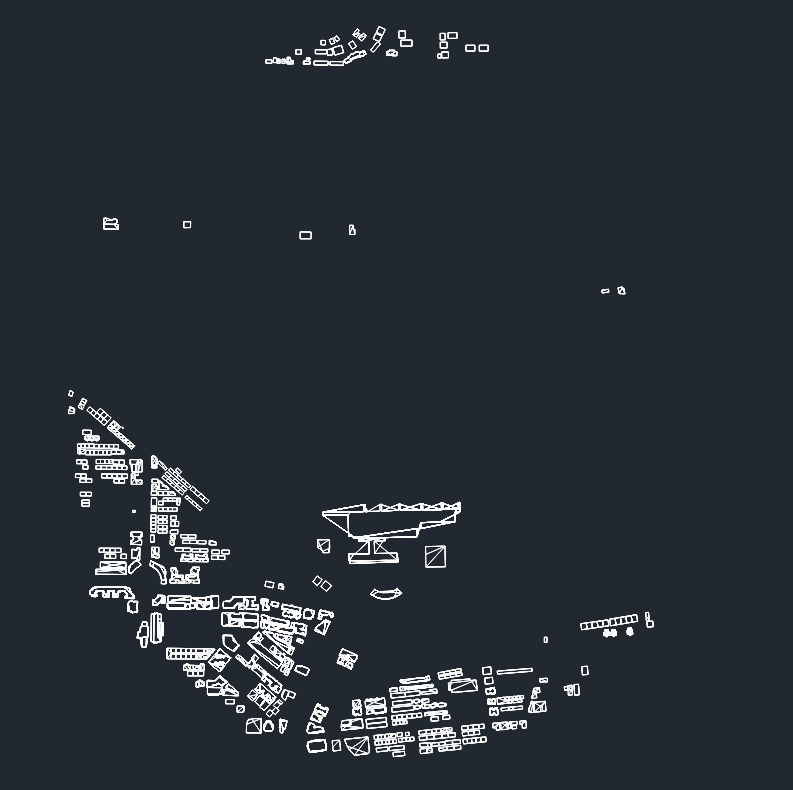

# 建築物DXF檔之讀寫

{: .no_toc }

  

    Table of contents
  

  {: .text-delta }
- TOC
{:toc}

---

## 背景

- 整體工作流程如圖所示，區分為3大區塊

  

### 檢視

- 利用ezdxf模組解讀、輸出建築物的3維平面
- 座標轉換
- 松山機場周邊建築物

- by [autodesk viewer ](https://viewer.autodesk.com/)

### 多邊形是否重新排序

### 如何快速轉換多邊形的座標

### 是否納入沒有高度的建築物

### ezdxf輸出函式的應用

## OSM數據的整理

- OSM整理的困難與對策
- 數據檔龐大
  - 不區分直接切割：必須將節點全部載入記憶體，才會讀取道路，這超過記憶體容量、且無法同步運作。
  - 按照縣市區分：並不是所有的元件都有完整的地址，道路、relation就沒有太多的屬性信息
  - 按照經緯度（解析度0.5/0.1度）區分：對節點與多邊形有其可行性。
- 道路含多邊形、如何區分
  - 讀取套件不會自行判定是否為封閉曲線

### OSM幾何物件的拆解

- 切割OSM檔案：使用`ogr2ogr -b=指令
- 切割後的物件區分：`rd_pnt.py`、`rd_bld.py`，
- 節點會有較完整的訊息，分別按照經緯度順序編號儲存、只儲存具有`buuilding`屬性內容的節點。
- 整併節點座標後的道路（含建物），

### 節點與多邊形屬性資料的整併

- `join_pnt_bld.py`，
- 分各個經緯度範圍儲存在`final*.csv`。
- 這類的多邊形可以連結完整的地址可供辨識，將進一步結合內政部建築物的高度。

## 內政部建築物資料的整理與合併

- 為非典型的`kml`格式

### 資料項目

## 範圍切割與DXF製作

### building.csv切割

### 2D數據的應用

- 點Point如何轉成Polygon
- 高度設定的考量

### 高程數據的應用

### 幾何物件頂點的座標轉換

### 多邊形立體物件的輸出

### 串連道路資料庫

## 切割套件

### app.py

- 輸入bld2dxf模組
- 新增`bld(swLL, neLL)`之呼叫

### index.html

- 新增`SaveButtom_b` javascriple函式

### 檢查執行進度

- 因每次程式執行都會重新讀取資料庫、切割及座標轉換，因此會需要一些時間，可以進入瀏覽器`檢查`介面了解實際情況，是否正確運作。
- 可能無法正確執行的原因
  - 切割範圍的資訊位正確傳遞(檢視`saved bounds`)
  - 背景數據品質問題(訊息為`Network Response not OK`，請將**經緯度**範圍複製給研資部進一步追蹤除錯，TWD97值還需轉換。)
- 空白處按右鍵進入`檢查`

- 點選`console`(或紅色停止標誌-帶數字) 

- `The file at blob ... is loaded`：是正確信息
  - 請檢視瀏覽器的`下載`介面。
  - 因為結果檔案是隨機碼，瀏覽器會認為是病毒拒絕直接下載，需進一步確認。

## 結果

- 中研院附近山坡與平地
- 範圍

- 地形

- 建築物群

- 進入CADNA模式系統檢視

## 程式碼[bld2dxf.py](./pys/bld2dxf.py)

  