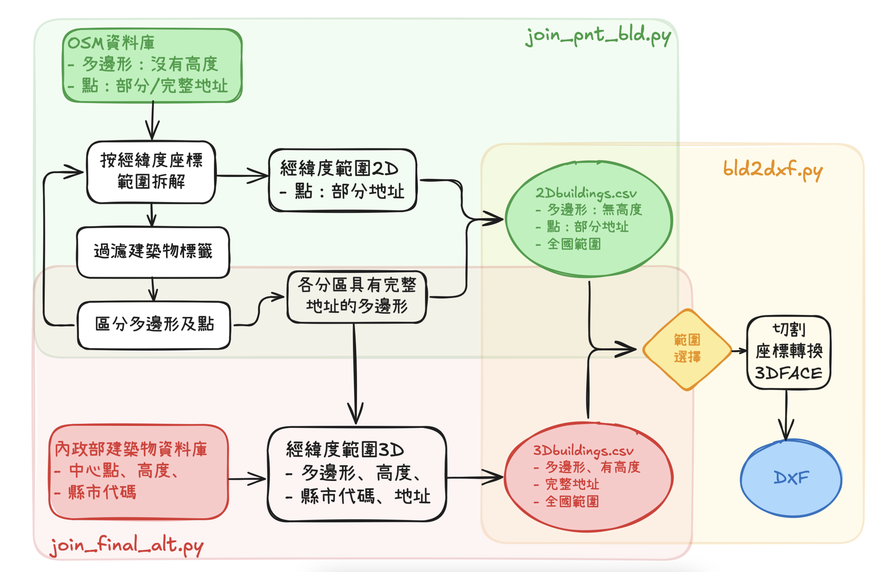

# OSM建築物與內政部資訊的整併（join_final_alt.py）

{: .no_toc }

  

    Table of contents
  

  {: .text-delta }
- TOC
{:toc}

---

## 背景

- 建築物資料庫的整理、整併、與切割應用的工作流程如圖所示。
- 大致上整體工作區分為3大區塊，`join_pnt_bld.py`的範圍與功能，為最終整併成`3Dbuildings.csv`的重要程序。

  

### 程式說明

程式使用