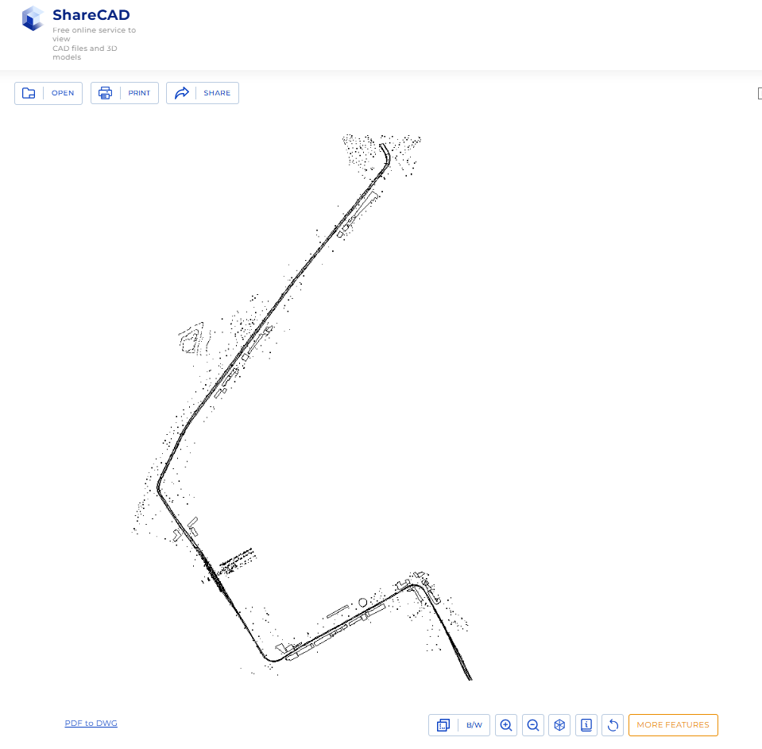
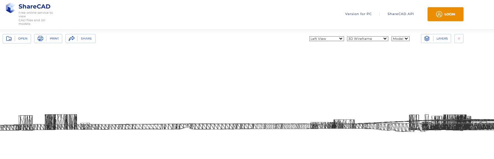

# DXF檔之預覽

{: .no_toc }

  

    Table of contents
  

  {: .text-delta }
- TOC
{:toc}

---

## 背景

- [sharecad](https://sharecad.org/)可接受50MB以下DXF檔案的預覽

- 2d nmodel (上視圖)

- 3d wireframe model (左視圖)
  - 注意高程及建築物高度

- 前視圖
  - 注意高架軌道

