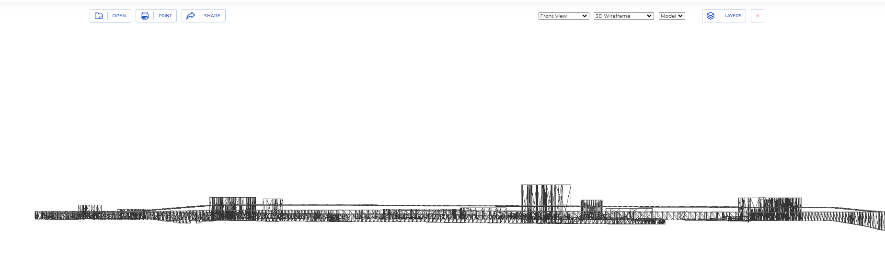
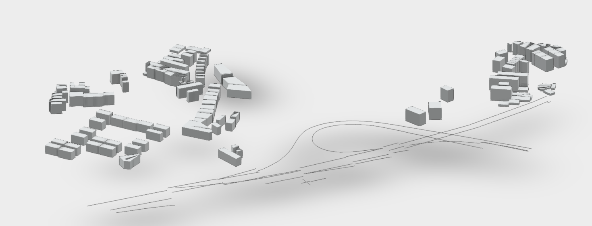

# DXF檔之預覽

{: .no_toc }

  

    Table of contents
  

  {: .text-delta }
- TOC
{:toc}

---

## 背景

### sharecad

- [sharecad](https://sharecad.org/)可接受50MB以下DXF檔案的預覽。

- 2d nmodel (上視圖)

- 3d wireframe model (左視圖)
  - 注意高程及建築物高度

- 前視圖
  - 注意高架軌道

- 需要完整、正確的DXF檔案，對檔案的容錯程度較低。
- 速度也較慢

### ezdxf viewer

- 只有上視圖、沒有3d model
- 松山機場周邊建築物

### [autodesk viewer ](https://viewer.autodesk.com/)

- 需登記會員
- 容錯率高、3維界面方便快速

