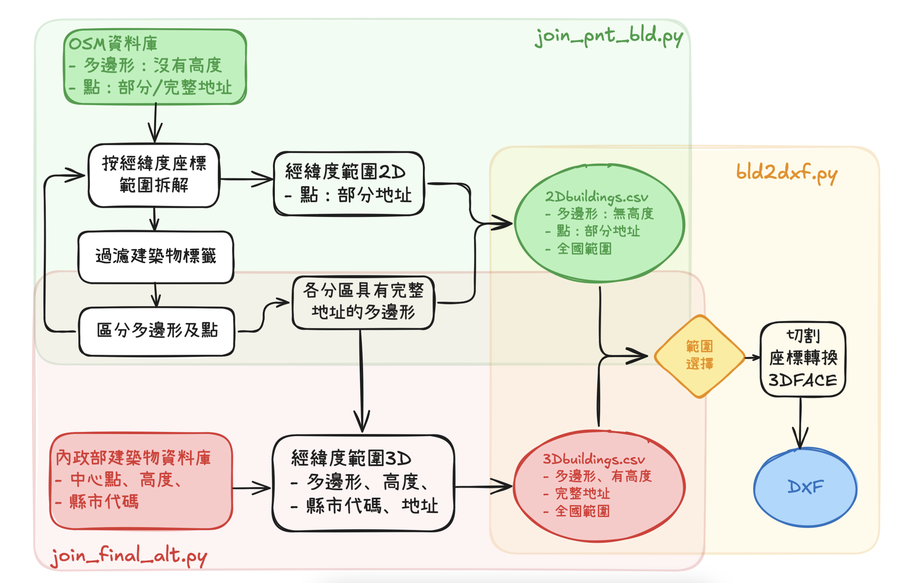

# building working structure
{: .no_toc }

  

    Table of contents
  

  {: .text-delta }
- TOC
{:toc}

---
## 背景

- 整體工作流程如圖所示，區分為3大區塊

  

## OSM數據的整理

- OSM整理的困難與對策
- 數據檔龐大
  - 不區分直接切割：必須將節點全部載入記憶體，才會讀取道路，這超過記憶體容量、且無法同步運作。
  - 按照縣市區分：並不是所有的元件都有完整的地址，道路、relation就沒有太多的屬性信息
  - 按照經緯度（解析度0.5/0.1度）區分：對節點與多邊形有其可行性。

### OSM幾何物件的拆解

- 切割OSM檔案：使用`ogr2ogr -b=指令
- 切割後的物件區分：`rd_pnt.py`、`rd_bld.py`，
- 節點會有較完整的訊息，分別按照經緯度順序編號儲存、只儲存具有`buuilding`屬性內容的節點。
- 整併節點座標後的道路（含建物），

### 節點與多邊形屬性資料的整併

- `join_pnt_bld.py`，
- 分各個經緯度範圍儲存在`final*.csv`。
- 這類的多邊形可以連結完整的地址可供辨識，將進一步結合內政部建築物的高度。

## 內政部建築物資料的整理與合併

- 為非典型的`kml`格式

### 資料項目

## 範圍切割與DXF製作

### building.csv切割

### 2D數據的應用

- 點Point如何轉成Polygon
- 高度設定的考量

### 高程數據的應用

### 幾何物件頂點的座標轉換

### 多邊形立體物件的輸出

## 切割套件
