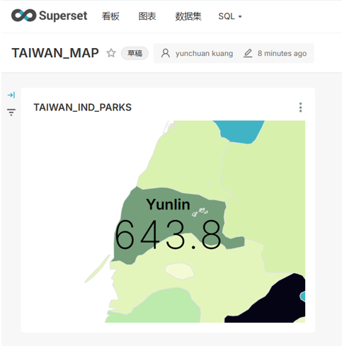
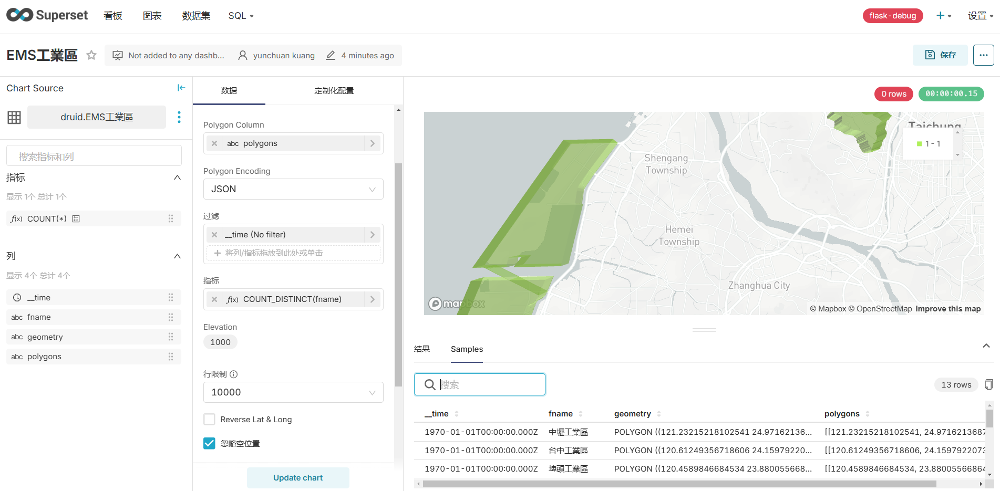

# superset縣市範圍之choropleth

{: .no_toc }

<details open markdown="block">
  <summary>
    Table of contents
  </summary>
  {: .text-delta }
- TOC
{:toc}
</details>
---

## 背景

- [The Country Map Visualization](https://superset.apache.org/docs/configuration/country-map-tools/)
- [Generic Map Plugin](https://github.com/apache/superset/discussions/21758)
- [Add tile layer (XYZ) support in deck.gl maps](https://github.com/apache/superset/discussions/27475)
- [superset-frontend/plugins/legacy-plugin-chart-country-map/scripts/Country Map GeoJSON Generator.ipynb](https://github.com/apache/superset/blob/master/superset-frontend/plugins/legacy-plugin-chart-country-map/scripts/Country%20Map%20GeoJSON%20Generator.ipynb)

## 準備

- 需先重新編譯以啟動plugins

```bash
cd superset-frontend/
nvm use v20.11.1
npm install && npm run plugins:build
cd ../venv/[[2024-12-08]]
rm -fr *
cp -r ~/MyPrograms/superset/superset/static/assets/* .
```

- 進入superset選取國家地圖檢視台灣地區成果

## 添加工業區邊界線

```python
import pandas as pd
import json

# 讀取superset plugins的縣市分界線geojson檔案

fname='/home/kuang/MyPrograms/superset/superset-frontend/plugins/legacy-plugin-chart-country-map/src/countries/taiwan.geojson'
with open(fname) as f:
    taiwan=json.load(f)

# 讀取工業區邊界線geojson檔案
with open('EMS工業區.json') as f:
    gjson=json.load(f)

# gjson併到taiwan縣市界線的後面
taiwan['features']+=gjson['features']

# 存檔
with open(fname,'w') as f:
    json.dump(taiwan,f)

```

- 重新檢視台灣地區縣市分界圖

## 製作choropleth

- 以下範例以TEDS資料庫為對象，需增加一欄縣市名稱的[ISO編碼](https://www.ip2location.com/free/iso3166-2)。以下由前述`taiwan.geojson`檔案中讀取，套用台灣的4碼縣市代碼，將ISO編碼寫入TEDS表中。

### 準備ISO簡碼對照表

```python
# 讀取縣市邊界geojson檔案中的ISO編碼與名稱，做成資料表備用
iso=pd.DataFrame(
  {
    'ISO':[
      f['properties']['ISO'] for f in taiwan['features'] if 'ISO' in f['properties']
      ],
    'NAME_1':[
      f['properties']['NAME_1'] for f in taiwan['features'] if 'NAME_1' in f['properties']
      ]
    }
  )

# 讀取4碼的縣市代碼並製作對照表備用
fname='/nas1/TEDS/./teds10_camx/HourlyWeighted/area/cnty.csv'
cnty=pd.read_csv(fname,encoding='big5')
cnt_name={i:j for i,j in zip(cnty.no,cnty.cnty)}

# 在iso資料表中逐一加入縣市代碼(手動)
iso['CNTY']=[32,33,12,35,36,37,39,40,41,42,43,46,45,34,31,11,50,44,38,1,22]

# 中文名稱填入ISO資料表
iso['cnty_name']=[cnt_name[i] for i in iso['CNTY']]

# 六都中有縣市合併的台中、台南、與高雄
iso['CNTYs']=''
iso.loc[4,'CNTYs']=17
iso.loc[8,'CNTYs']=21
iso.loc[9,'CNTYs']=2

# 縣市2碼 vs ISO簡碼之對照表備用
cnty_iso={i:j for i,j in zip(iso.CNTY,iso.ISO)}
cnty_iso.update({i:j for i,j in zip(iso.CNTYs,iso.ISO)})

```

### 在TEDS資料表中填入ISO簡碼

```python
# 讀取TEDS資料表
fname='/nas1/TEDS/teds12/TEDS12.0_csv/TEDS12_POINT_WGS84v.csv'
teds=pd.read_csv(fname)

# 縣市代碼由4碼中取2碼
teds['DICT_NO1']=[i//100 for i in teds.DICT_NO]

# 去掉連江縣，在iso資料表中沒有這個項目，會對照不到。
teds2=teds.loc[teds.DICT_NO1!=51].reset_index(drop=True)

# 新增ISO欄位
teds2['ISO']=[cnty_iso[i] for i in teds2.DICT_NO1]

# 寫出檔案
fname='/nas1/TEDS/teds12/TEDS12.0_csv/TEDS12_POINT_WGS84_iso.csv'
del teds2['DICT_NO1']
teds2.to_csv(fname,index=False)
```

## upload to superset

### druid 資料庫之修改與上載

- 進入druid之query介面，
- 新增`"ISO" VARCHAR`、以及`SELECT`對象
- 修改資料表名稱
- 執行上載

```sql
REPLACE INTO "TEDS12_POINT_WGS84_iso" OVERWRITE ALL
WITH "ext" AS (
  SELECT *
  FROM TABLE(
    EXTERN(
      '{"type":"local","baseDir":"/nas1/TEDS/teds12/TEDS12.0_csv/","filter":"TEDS12_POINT_WGS84_iso.csv"}',
      '{"type":"csv","findColumnsFromHeader":true}'
    )
  ) EXTEND ("DICT_NO" BIGINT, "C_NO" VARCHAR, "SCC" BIGINT, "NO_P" VARCHAR, 
    "TSP_EMI" DOUBLE, "PM_EMI" DOUBLE, "PM25_EMI" DOUBLE, "SOX_EMI" BIGINT, "NOX_EMI" DOUBLE, "THC_EMI" DOUBLE, "NMHC_EMI" DOUBLE, "CO_EMI" BIGINT, "PB_EMI" BIGINT, 
    "WGS84_E" DOUBLE, "WGS84_N" DOUBLE, 
    "ORI_QU1" DOUBLE, "DIA" DOUBLE, "HEI" DOUBLE, "TEMP" BIGINT, "VEL" DOUBLE, 
    "NO_S" VARCHAR, "COMP_NAM" VARCHAR, "ISO" VARCHAR)
)
SELECT
  "DICT_NO", "C_NO", "SCC", "NO_P",
  "TSP_EMI",  "PM_EMI",  "PM25_EMI",  "SOX_EMI",  "NOX_EMI",  "THC_EMI",  "NMHC_EMI", "CO_EMI",  "PB_EMI",
  "WGS84_E",  "WGS84_N",
  "ORI_QU1",  "DIA",  "HEI",  "TEMP",  "VEL",
  "NO_S",  "COMP_NAM",  "ISO"
FROM "ext"
PARTITIONED BY ALL
```

### superset 製圖

- 連線druid並新增數據集(`TEDS12_POINT_WGS84_iso`)
- 新增圖表，選取國家地圖，
- 在查詢處，國家下拉選單選擇Taiwan，ISO 3166-2 代碼選擇前述數據表中的`ISO`，
- 指標：即為choropleth的顏色數量，選擇排放量-sum。



## polygon

### ref

- 必須是座標序列的長字串
- Spatial analytics on Apache Superset by [Sai Krishna Dammalapati(2024)@medium](https://medium.com/@saikrishna_17904/spatial-analytics-on-apache-superset-fdbfb1ebdeb1)

### 程式

- 原作在MultiPolygon時會出錯，修改如下:

```python
import geopandas as gpd
gdf = gpd.read_file("polygons.geojson")

# Function to convert geometry to text
def geometry_to_text(geom):
    if geom.geom_type == 'Polygon':
        coords = list(geom.exterior.coords)
    else:
        coords=[]
        for polygon in geom.geoms:
            # Access the coordinates of each polygon
            coords+= list(polygon.exterior.coords)
    return str([[lon, lat] for lon, lat in coords])

# Apply the function to create a new column
gdf['polygons'] = gdf['geometry'].apply(geometry_to_text)

gdf.drop('geometry', axis=1).to_csv('polygons.csv')
```

### superset作圖

- 雖然沒有dict的型態，仍然必須選JSON
- 有搭配數量就可以著色與高度之區別(`指標`)

