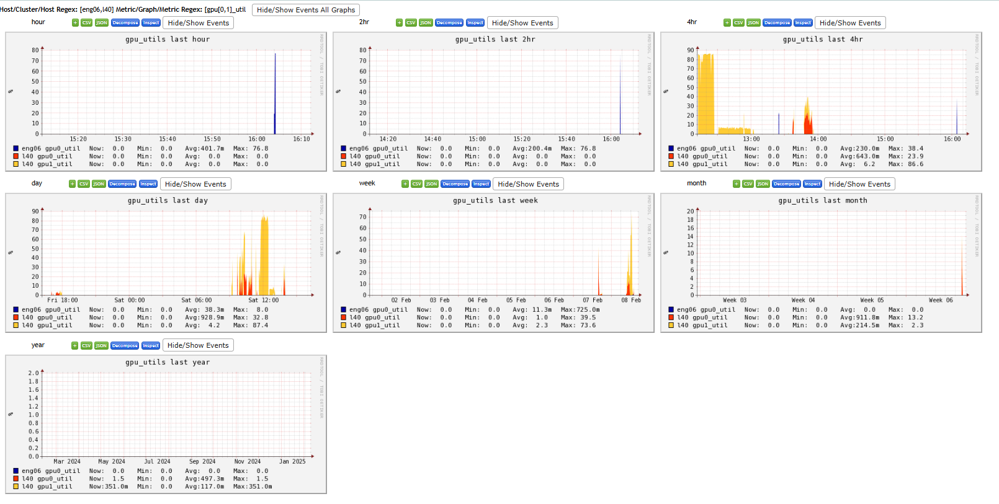

# GPU插件

## 背景

- 官方程式碼與相關設定的說明，可以詳見[github](https://github.com/ganglia/gmond_python_modules/tree/master/gpu/nvidia)。

## python一般性模組(`modpython.so`)

### python版本與準備

- ganglia的python是2.6~2.7版，一般的python3是不能作用的。
- 編譯必須先安裝py27環境，`gmond`執行時無法啟動conda環境，因此必須將其程式庫放在公用區一份。

  ```bash
  2364  conda create -n py27 python=2.7
  2371  conda activate py27
  2380  sudo ln -s  /opt/anaconda3/envs/py27/lib/libpython2.7.so.1.0 /usr/lib/x86_64-linux-gnu/
  ```

### 重新編譯.so檔案

- 因為模組使用到底層的gcc objects，**必須**重新編譯，不能使用其他機器上的既有modpython.so檔案，會出現連結的錯誤。
- 原始碼：**不能**使用github上公開的[repo](https://github.com/ganglia/monitor-core)，可能是因為autoconf/automake版本更新，很多舊的設定無法應付。**必須**使用舊的tar檔案(在` /cluster/bld/ganglia-3.7.2/`有一份原始碼)，分別複製一分到GPU的主機上，二者不能公用，必須自行編譯一份。

### 依賴之程式庫

  ```bash
  2642  sudo apt-get install libtool
  2662  sudo apt-get install libapr1-dev
  2665  sudo apt-get install libconfuse-dev
  2668  sudo apt-get install libpcre3-dev
  2672  sudo apt-get install libtirpc-dev
  2674  sudo apt-get install libc-dev
  2738  sudo apt-get install libsunrpc-dev
  2739  sudo apt-get install libsunrpc
  2743  sudo apt-get install libc6-dev
  2744  sudo apt-get install glibc-dev
  ```

### 本機程式庫之搜索

- `./configure`之設定
  - `./configure LDFLAGS="-ltirpc" CPPFLAGS="-I/usr/include/tirpc"`

### make 注意事項

- 新版的gcc是比較嚴謹的，舊版會自動連結數學程式庫(`/usr/lib/x86_64-linux-gnu/libm.a`)，新版必須手動連結。

  ```bash
  cd ./gmond/modules/python
  gcc -shared  -fPIC -DPIC  .libs/mod_python.o   -lpython2.7 -ltirpc /usr/lib/x86_64-linux-gnu/libapr-1.so -ldl -lnsl -lz -lpcre -lexpat -lconfuse -lpthread -lm  -O2   -Wl,-soname -Wl,modpython.so -o .libs/modpython.so
  ```

- 編譯結束後就可以將`./gmond/modules/python/.libs/modpython.so`複製到指定位置去。

### nvidia-ml-p模組

- 需要安裝 [nvidia-ml-py](https://pypi.org/project/nvidia-ml-py/)模組。
- 這各模組沒有python版本的限制。

```bash
pip install nvidia-ml-py
```

- 將nvidia-ml-py的主程式(`pynvml.py`)複製到`nvidia.py`同一目錄下，這樣`nvidia.py`就可以順利載入，而不必設定環境。

### 測試

- 使用python2.7執行nvidia.py，要能夠列印出下列資訊：

```bash
kuang@l40 /usr/lib/x86_64-linux-gnu/ganglia/python_modules
$ python nvidia.py
0
0
value for gpu_num is 2 GPUs
value for gpu_use_num is 2 GPUs
value for gpu_driver is 535.183.01
value for gpu0_type is NVIDIA L40
value for gpu0_graphics_clock_report is 2490 MHz
value for gpu0_sm_clock_report is 2490 MHz
value for gpu0_mem_clock_report is 9000 MHz
value for gpu0_uuid is GPU-f4aaeb19-c676-61be-0e3f-6a073fc5b447
value for gpu0_pci_id is 649400542
value for gpu0_temp is 54 C
value for gpu0_mem_total is 46068 MB
...
value for gpu1_power_violation_report is 0
value for gpu1_bar1_memory is 2 MB
value for gpu1_bar1_max_memory is 68719 MB
value for gpu1_shutdown_temp is 98 C
value for gpu1_slowdown_temp is 95 C
value for gpu1_encoder_util is 0 %
value for gpu1_decoder_util is 0 %
```
## gmond相關設定

### conf設定

- 這個檔案主要設定python模組的位置、以及gmond執行其他python程式的位置。
- `modpython.so`沒有設計在`gmond.conf`內固定加載，可能是因為記憶體的考量，如果沒有必要，還是輕省一點比較好。算是optional的功能。
- `name = "python_module"`是指定名稱
- `path = "...modpython.so"`：可以不必和其他的`so`放在一起，只要gmond讀得到就可以了。
- `params = ".../python_modules"`這個是python模組特有的設定，指定到要執行的python程式所在位置。python程式名稱會在後面的metric設定(`*.pyconf`)內指定，路徑則在此一次設定。模組與程式也可以不必放在同一個路徑，此處為了方便管理，就讓他們放在一起。

```bash
$ cat /etc/ganglia/conf.d/modpython.conf
/*
  params - path to the directory where mod_python
           should look for python metric modules

  the "pyconf" files in the include directory below
  will be scanned for configurations for those modules
    path = "/usr/lib/x86_64-linux-gnu/libpython3.10.so"
*/
modules {
  module {
    name = "python_module"
    path = "/var/lib/ganglia/python_modules/modpython.so"
    params = "/var/lib/ganglia/python_modules"
  }
}

include ("/etc/ganglia/conf.d/*.pyconf")
```

### pyconf設定

- 這各檔案主要設定要執行的python主程式名稱、以及相應傳送的metrics名稱、取樣頻率等等設定。
- 同樣的，因為不是每一個主機都需要執行，作者們認為還是獨立出來比較單純。
- `    name = "nvidia" \n language = "python"`這各設定會讓`gmond`去執行`${params}/nvidia.py`
- 其他的metrics設定，項目是配合`nvidia.py`，頻率可以自行調整。

```bash
$ head /etc/ganglia/conf.d/nvidia.pyconf
modules {
  module {
    name = "nvidia"
    language = "python"
  }
}

collection_group {
  collect_every = 10
  time_threshold = 50
...
    name_match = "([\\S]+)_slowdown_temp"
    title = "\\1 Slowdown Temperature"
  }

   metric {
    name_match = "([\\S]+)_power_man_limit"
    title= "\\1 Power Management Limit"
  }
}
```

## gmond測試與執行

### gmond測試

- `# /usr/sbin/gmond -c /etc/ganglia/gmond.conf --debug 2 >& /home/kuang/debug.txt`
- 要出現`loaded module: python_module`，並且在`${params}`目錄下出現`*.pyc`是gmond執行的痕跡。

```bash
kuang@eng06 ~
$ more debug.txt
loaded module: core_metrics
...
loaded module: python_module
...
```

### 訊息傳送與接收

- 在ganglia gmetd主機(`master`)的相應目錄(如`/var/lib/ganglia/rrds/SinoTech/eng06`)會出現從gmond傳來的rrd檔案
```bash
kuang@master /var/lib/ganglia/rrds/SinoTech/eng06
$ ls gpu*|wc -l
23
kuang@master /var/lib/ganglia/rrds/SinoTech/l40
$ ls gpu*|wc -l
48
```

## ganglia集成

- 點選`Aggregate Graphs`進入集成畫面
- `Title`：指定一個可供辨識的標題即可(如GPU_UTILS)
- `Vertical (Y-Axis) label:`ganglia不會自動加，需要特別指定。(如%)
- `Limits`：可以不設，保持浮動。
- `Host Regular expression e.g. web-[0,4], web or (web|db):`序列須以中括弧包起來，如`[eng06, l40]`
- `Metric Regular expression (not a report e.g. load_one, bytes_(in|out)):	`可以接受正則表示(`gpu[0,1]_util`)彙整併所有符合的metrics。
- `Graph Type`：選擇線型(不累加)、或是堆疊(stacked)
- 最終[成果](http://master.sinotech-eng.com/graph_all_periods.php?title=gpu_utils&vl=%25&x=&n=&hreg%5B%5D=%5Beng06%2Cl40%5D&mreg%5B%5D=%5Bgpu%5B0%2C1%5D_util&gtype=stack&glegend=show&aggregate=1)

