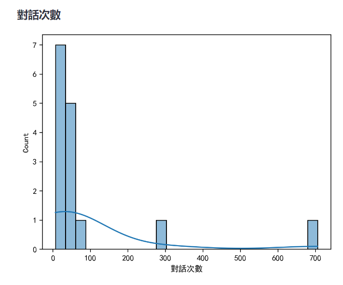

# matplotlib輸出中文字形
{: .no_toc }

<details open markdown="block">
  <summary>
    Table of contents
  </summary>
  {: .text-delta }
- TOC
{:toc}
</details>
---

## 背景

- 這方面的參考還頗多的(如[腳本之家](https://www.jb51.net/article/277179.htm))。但是每換一個環境、機器就必須再重作一次，還蠻困擾的，此處將其寫成SOP步驟

## 準備工作

### 尋找本機是否有中文字形

- 任何黑體：`locate *.ttf|grep -i hei`
- 如果有、不必下載直接跳下一步驟

### 下載中文字形

- 如[StellarCN/scp_zh@github](https://github.com/StellarCN/scp_zh/blob/master/fonts/SimHei.ttf)，點選raw，則會下載到本機的Download目錄

### 複製ttf檔案

- 目標目錄：`/opt/anaconda3/envs/???/lib/python3.9/site-packages/matplotlib/mpl-data/fonts/ttf`
  - `/opt/anaconda3`視主機存放`conda`位置而異
  - `???`為環境名稱
  - `3.9`：視該環境使用版本而異
  - 設成環境變數：`export MPL=opt/anaconda3/envs/???/lib/python3.9/site-packages/matplotlib/mpl-data`

## 修改matplotlibrc

### 位置

- `$MPL/matplotlibrc`

### 修改重點

1. 打開`font.sans-serif`(刪除句首的`#`)
2. 增加`SimHei`、`Microsoft JhengHei` (不需要加上引號`"..."`)
3. `axes.unicode_minus: False`，`True`會使負號是個方框
4. 新增字形的名稱，需為` ~/.cache/matplotlib/fontlist*.json`中的`name`，需確認。

## 應用

### 程式引用

```python
import matplotlib.pyplot as plt
plt.rcParams['font.sans-serif'] = ['SimHei']  # 設置中文字體為SimHei
plt.rcParams['axes.unicode_minus'] = False  # 解決負數標籤顯示為方塊的問題
```

### 刪除暫存區

- `rm -fr ~/.cache/matplotlib/*`

### 重啟python程式

- 會在暫存區形成新的`json`檔案，可以進行確認`grep -i hei ~/.cache/matplotlib/fontlist*.json`
- 檢視繪圖結果

