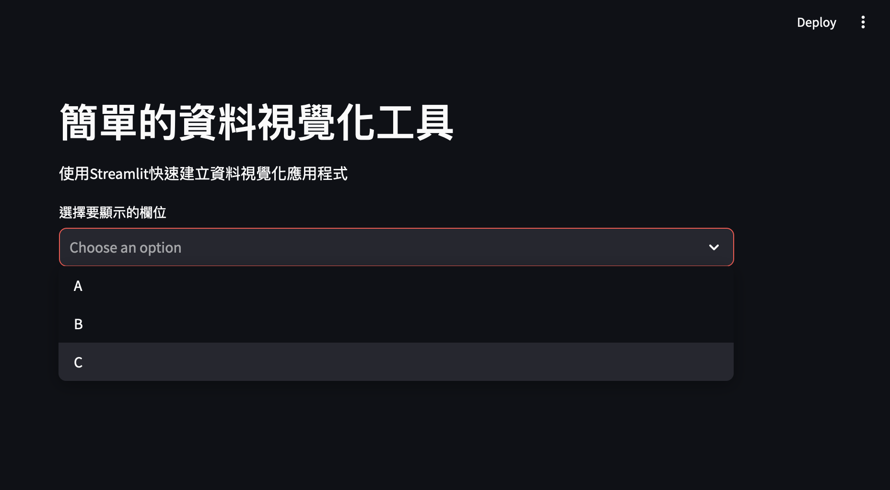

# streamlit簡介
{: .no_toc }

<details open markdown="block">
  <summary>
    Table of contents
  </summary>
  {: .text-delta }
- TOC
{:toc}
</details>
---

## 背景

Streamlit 是一個用於快速建立資料應用的開源Python函式庫。它的核心原理是透過簡單的Python腳本，開發者可以直接創建互動式的Web應用，無需前端開發技能。 Streamlit在背後處理了很多複雜的事情，例如頁面佈局、狀態管理和Web伺服器的配置，因此開發者可以專注於資料處理和應用邏輯。

## 特色與優點

## 特色

1. **聲明式程式設計**：Streamlit採用聲明式程式設計風格，開發者只需編寫Python程式碼，Streamlit會自動解析程式碼並產生Web應用程式介面。
2. **熱重載**：當腳本變更時，Streamlit會自動重載頁面，方便開發者即時查看修改效果。
3. **狀態管理**：透過`st.session_state`，Streamlit管理應用程式的狀態，允許在多次使用者互動間保持資料。
4. **元件互動**：Streamlit提供了一系列內建元件（如按鈕、滑桿、檔案上傳器等），並允許自訂元件，這些元件與Python程式碼直接互動。
5. **分散式運算**：可以透過Streamlit與分散式運算框架（如Dask、Ray等）結合，處理大型資料集和複雜計算任務。

### 應用可能性

1. **資料分析與視覺化**：Streamlit特別適合創建資料分析工具和視覺化應用，如儀表板、報告產生工具等。透過與Pandas、Matplotlib、Plotly等函式庫結合，可以快速建立複雜的圖表和資料展示頁面。
2. **機器學習模型展示**：研究人員和資料科學家可以使用Streamlit來展示機器學習模型的效能，互動式地調整模型參數，並查看預測結果。
3. **快速原型開發**：Streamlit能夠幫助開發者快速創建和測試資料驅動的應用原型，驗證想法和功能。
4. **內部工具**：企業內部可以使用Streamlit開發自訂工具，處理資料分析、報告產生、監控等任務，提高工作效率。
5. **教育和演示**：Streamlit是教學和演示數據科學概念和技術的理想工具，能夠創建互動式課程和展示內容，幫助學生更好地理解複雜的主題。

### 優點

- **易用性**：無需前端開發經驗，只需編寫Python程式碼即可建立Web應用。
- **快速開發**：減少開發時間，快速產生互動式應用。
- **即時回饋**：熱重載功能可即時查看修改效果，加快開發迭代。
- **豐富的元件**：提供大量內建元件，支援自訂，滿足多樣化需求。

## 範例程式碼

-  這個範例呈現隨機數據的折線圖。`streamlit.multiselect`用以選擇要顯示的欄位名稱。

### 程式碼

以下是一個簡單的Streamlit應用程式範例，展示如何建立一個互動式資料視覺化工具：

```python
import streamlit as st
import pandas as pd
import numpy as np
import matplotlib.pyplot as plt

# 標題和描述
st.title('簡單的資料視覺化工具')
st.write('使用Streamlit快速建立資料視覺化應用程式')

# 產生隨機數據
data = pd.DataFrame({
 'A': np.random.randn(100),
 'B': np.random.randn(100),
 'C': np.random.randn(100)
})

# 選擇要顯示的列
columns = st.multiselect('選擇要顯示的欄位', data.columns)

# 顯示選定的列
if columns:
 st.dataframe(data[columns])

 # 繪製選定列的圖表
 fig, ax = plt.subplots()
 data[columns].plot(kind='line', ax=ax)
 st.pyplot(fig)
else:
 st.write('請選擇至少一列資料進行顯示')
```

以上程式碼建立了一個簡單的資料視覺化工具，使用者可以選擇顯示的資料列，並產生對應的圖表。透過這種方式，開發者可以快速建立和分享互動式資料應用，提高工作效率和資料處理能力。

### 標題與內文

- 標題：`st.title(body, anchor=None, *, help=None)`
- 表頭：`st.header(body, anchor=None, *, help=None, divider=False)`

