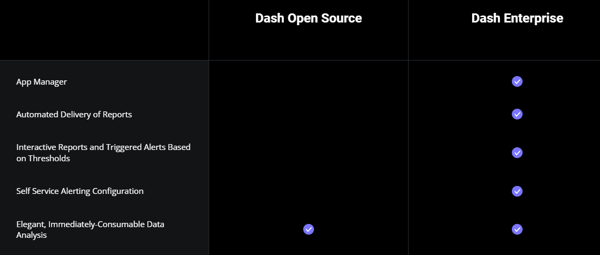

#  C# Library
{: .no_toc }

  

    Table of contents
  

  {: .text-delta }
- TOC
{:toc}

---

## 背景

[Plotly C# Library](https://plotly.com/csharp/)

## Pricing

charged items

- App Manager
- Automated Delivery of Reports
- Interactive Reports and Triggered Alerts Based on Thresholds
- Self Service Alerting Configuration

free item: Elegant, Immediately-Consumable Data Analysis

