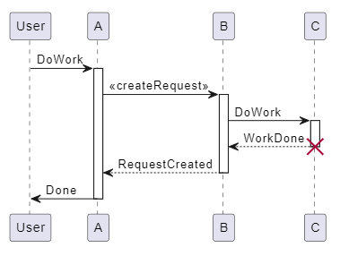

# plantUML之使用

{: .no_toc }

<details open markdown="block">
  <summary>
    Table of contents
  </summary>
  {: .text-delta }
- TOC
{:toc}
</details>

---

## 背景

- [PlantUML 整合 VSCode 插件教學與常見 UML 圖例練習](https://medium.com/@NeroHin//plantuml-整合-vscode-插件教學與常見-uml-圖例練習-1fc2b689e183)
- github [plantuml-stdlib/C4-PlantUML](https://github.com/plantuml-stdlib/C4-PlantUML)

###  Sequence Diagram 序列圖

- request and response


- user sequential work




### State Diagram 狀態圖


### Class Diagram 類別圖


### E-R（Entity Relationship）Diagram 實體關係圖


### User Case Diagram 用例圖


### JSON Diagram


```plantuml
@startjson JSON_DIAGRAM
{
    "personInfo": [
    {
        "firstName": "John",
        "lastName": "Smith",
        "isAlive": true,
        "age": 27,
        "address": {
        "streetAddress": "21\\n2nd\\nStreet",
            "city": "New York",
            "state": "NY",
            "postalCode": "10021-3100"
        }
        ,
        "phoneNumbers": [
        {
            "type": "home",
            "number": "212 555-1234"
        }
        ,
        {
            "type": "office",
            "number": "646 555-4567"
        }
        ],
        "children": [],
        "spouse": null
    }
    ,
    {
        "firstName": "Jack",
        "lastName": "Smith",
        "...": "..."
    }
]
}

@endjson
```

### 樣式


## C4 models

### System Context & System Landscape diagrams

### Container diagram

### Component diagram

### Dynamic diagram

### Deployment diagram

### C4 styled - Sequence diagram
