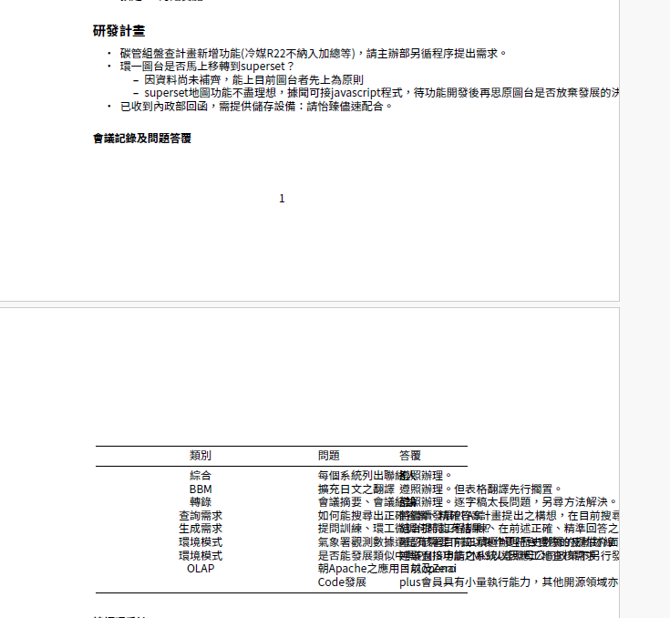

# Markdown to PDF

## Table of contents

{: .no_toc .text-delta }

1. TOC
{:toc}

---

## 背景

### 英文

```bash
sudo apt install   pandoc   texlive-latex-base   texlive-fonts-recommended   texlive-extra-utils   texlive-latex-extra   texlive-xetex
pandoc README.md -o README.pdf --pdf-engine=xelatex
```

### 中文

- 參考[這一篇](https://sam.webspace.tw/2020/01/13/使用%20Pandoc%20將%20Markdown%20轉為%20PDF%20文件/)
- 中文會需要[MikText](https://miktex.org/download)
- 如何引用字形參考[jgm/pandoc](https://github.com/jgm/pandoc/wiki/Pandoc-with-Chinese)，從`fc-list :lang=zh`來選擇。

```bash
JP: Japanese
HK: Hong Kong (Traditional Chinese)
KR: Korean
SC: Simplified Chinese
TC: Traditional Chinese
```

```bash
curl -fsSL https://miktex.org/download/key | sudo tee /usr/share/keyrings/miktex-keyring.asc > /dev/null
echo "deb [signed-by=/usr/share/keyrings/miktex-keyring.asc] https://miktex.org/download/ubuntu jammy universe" | sudo tee /etc/apt/sources.list.d/miktex.list
sudo apt-get update
sudo apt-get install miktex
sudo miktexsetup --shared=yes finish
sudo initexmf --admin --set-config-value [MPM]AutoInstall=1
```

## 應用

- 雖然pandoc/latex的功能非常強大，可以在md文件內部、Fronter、甚至命令列就可以進行文件的設定，但畢竟是opensource程式，尤其是latext，設定及顯示之間的線性關係並不明朗(設定半天改不動顯示結果)，而且寫在文件內部或Fronter也不符合使用者習慣，此處仍然以命令列簡單解決。

### 指令

- 範例如下：

```bash
sudo pandoc a.md -o a.pdf --pdf-engine=xelatex -V mainfont='Noto Sans CJK TC'
```

### 效果

- 正確顯示
  - 各級標題
  - 序號、項目符號、粗體
  - 分頁
  - 表格



- 尚待修改
  - 左右邊幅不對稱
  - 同段內容不會斷句
  - 