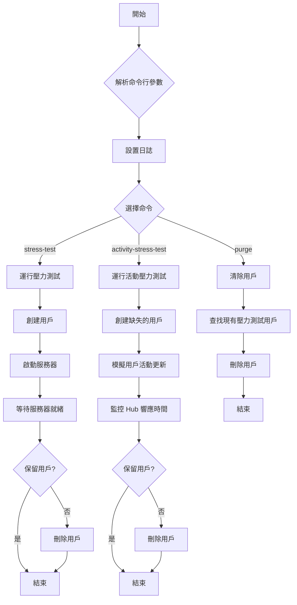
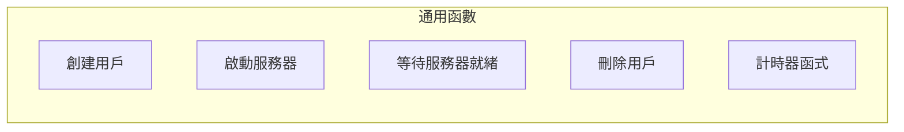

#  程式流程圖

{: .no_toc }

  

    Table of contents
  

  {: .text-delta }
- TOC
{:toc}

---

## 背景

> 我給你完整的程式，你可以整理成meraid流程圖編碼嗎？

## 流程圖

## 說明

由於程式相當長且複雜,我會創建一個高層次的流程圖,專注於主要的邏輯流程和功能。

這個 Mermaid 流程圖展示了 JupyterHub 壓力測試工具的主要邏輯流程。以下是對圖表的簡要說明：

1. 程序從解析命令行參數開始。
2. 然後設置日誌記錄。
3. 根據用戶選擇的命令,程序分為三個主要分支：
   - stress-test：運行壓力測試
   - activity-stress-test：運行活動壓力測試
   - purge：清除用戶

4. stress-test 分支:
   - 創建用戶
   - 啟動服務器
   - 等待服務器就緒
   - 根據選項決定是否保留用戶

5. activity-stress-test 分支:
   - 創建缺失的用戶
   - 模擬用戶活動更新
   - 監控 Hub 響應時間
   - 根據選項決定是否保留用戶

6. purge 分支:
   - 查找現有的壓力測試用戶
   - 刪除這些用戶

7. 圖表底部還包括了一些通用函數,這些函數在不同的命令中都會被使用。

這個流程圖提供了程序的高層次概覽,幫助理解其主要功能和邏輯流程。如果您需要更詳細的圖表或者針對特定部分的流程圖,請告訴我,我會很樂意為您製作。