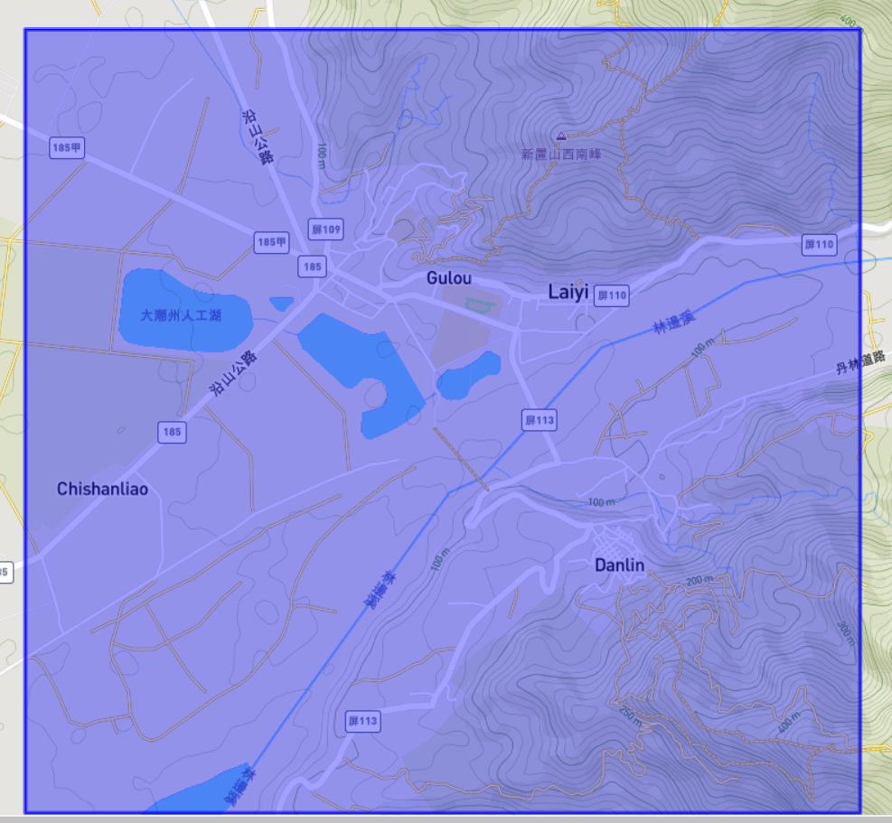
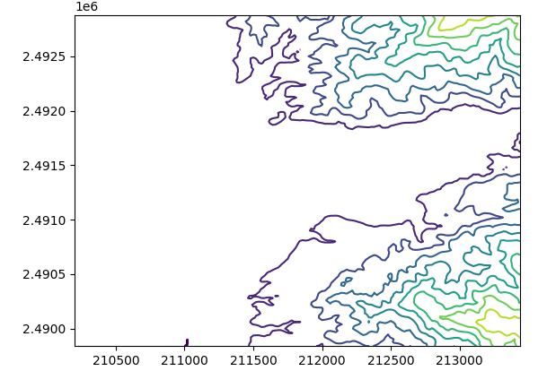
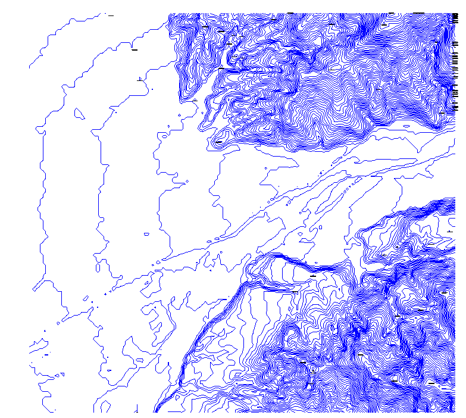

# 2024-06-06

## CADNA-A Manual

### DXF

使用 DXF 格式匯入幾何資料是一種經常選擇的選項用於。許多 CAD 程式都能夠匯出 DXF 文件，這意味著幾乎所有使用 CAD 系統產生的地圖都可以匯入透過卡德納A.然而，此功能僅限於幾何資料 –其他功能和參數不導入。如果有必要的話，這必須是第二步使用資料庫介面完成（請參閱第 6.5 章「導入透過 ODBC 介面」）。

CAD 系統的使用方式非常靈活。設計師可以自由地他們對對象的定義。建築物不一定需要繪製為閉合多邊形。最簡單的表示由四個單獨的牆（線）。通常，對於許多二維地圖而言，不會給出高度陳述就足夠了。

為了確保 CadnaA 正確解釋 DXF 數據，請觀察以下提示：

- 指派屬於一種聲學物件類型的所有繪圖元素在 CadnaA 中一層。
- 在儲存 DXF 檔案之前，應刪除所有這些元素從圖紙中（例如字母、結構元素等），它們是CadnaA 中的物件表示不需要。 （一個刻字，e.例如，在許多小部分中作為一組向量匯入。這導致使用的內存多於實際需要的內存，這轉動，減慢文件處理速度。
- 點（例如點源和接收點）以 x 導出，y 和 z 座標。當 CadnaA 導入它們時，z 座標為解釋為絕對高度。
- 所有線必須儲存為折線。
- CadnaA 中表示為閉合多邊形的任何物件（建築物、區域源、建成區、樹葉等）將由一個封閉的表示多邊形線。對於三維物體，例如建築物，z每個點的座標表示屋頂的絕對高度。因此，多邊形定義了屋頂區域的輪廓。
- 將公路、鐵路、線源等開放線保存為開放多邊形線。
- 對於道路，只有軸線（中心線）可以用作DXF元素。如果多個軌蹟的軸保存為線，CadnaA 將相應地顯示幾條平行的道路。在這種情況下，你會有為每條道路分配其中一條軌道的寬度以及交通密度適用於該軌道。因此，只需導入就簡單得多道路的主軸，然後將道路橫斷面指定為範圍。

我們的 DXF 格式將攔截由以下人員進行的一些單獨輸入CAD 使用者。能夠將多邊形解釋為，e。例如，一棟建築物，CadnaA要求多邊形是封閉的。因此，CadnaA 將假設一棟建築物是一個封閉的多邊形，儘管它的壁在 CAD 系統中被表示。但是，由具有相同第一個點和最後一個點的單獨線組成（先驗地，它不是閉合多邊形）。如果給了相關層名稱，然後將多邊形匯入為建築物。
CadnaA DXF 格式也支援區塊保存，且物件進行相應處理。
另請參閱第 11.6.5 章關閉建築物
- 檔案副檔名：DXF 格式的檔案名稱具有 DXF 副檔名。
- 匯入選項
  - 物件圖層（請參閱第 6.3.1 章）
  - 僅在部分中匯入（請參閱第 6.3.2 章）
  - 轉換（請參閱第 6.3.4 章）
  - 使用多段線的物件高度
  - 將區塊導入為點
  - 匯入 DXF 句柄作為名稱
- 使用多段線的物件高度
  - 啟動選項後，CadnaA 會新增 DXF 檔案中的 z 高度和物件高度，並將該高度定義為 CadnaA 中的物件高度。
- 例子：在 CAD 程式中，物件的圖層例如定義為 15 m，物件高度定義為 20 m。在 CadnaA 中，物體的絕對高度為 35 m。
- 將區塊導入為點
  - 只有在啟動 DXF 導入選項時，才會導入區塊的「插入點」。
- 例子：在 CAD 程式中，如果高度點繪製為交叉線並定義為區塊，如果停用該選項，CadnaA 將匯入交叉點而不是交叉點。
- 導入 DXF 句柄作為名稱：
  - 有時 DXF 檔案包含所謂的「句柄」的識別碼 (ID)。只有當您還想匯入位於單獨資料庫中的互連參數時，將這些匯入 CadnaA 才有用。 ID 是 DXF 檔案中的圖形物件和資料庫中的參數之間的連接元素（請參閱第 6.5 章「透過 ODBC 介面匯入」）。
  - 因此，如果要滿足上述條件，請啟動此選項。
  - 匯入 DXF 檔案後，句柄會自動輸入到物件對話方塊的名稱方塊中。在透過 ODBC 介面合併資料庫中的資料之前，您必須將名稱中的句柄「移交」到 CadnaA 的 ID 框中。
- 