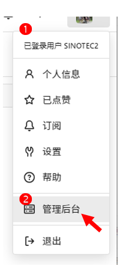
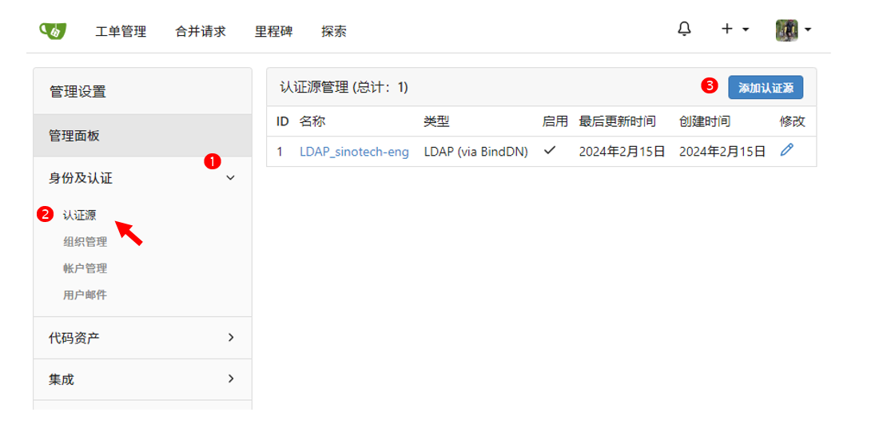
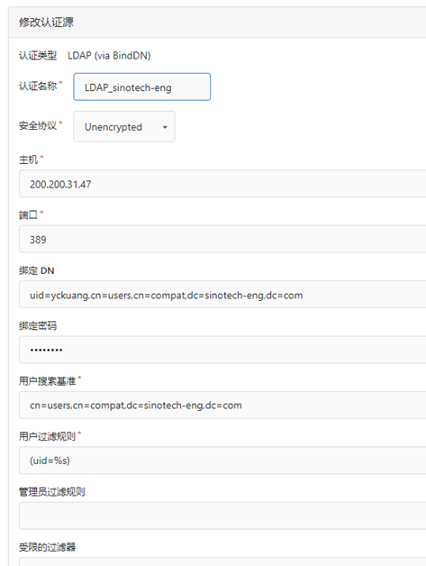
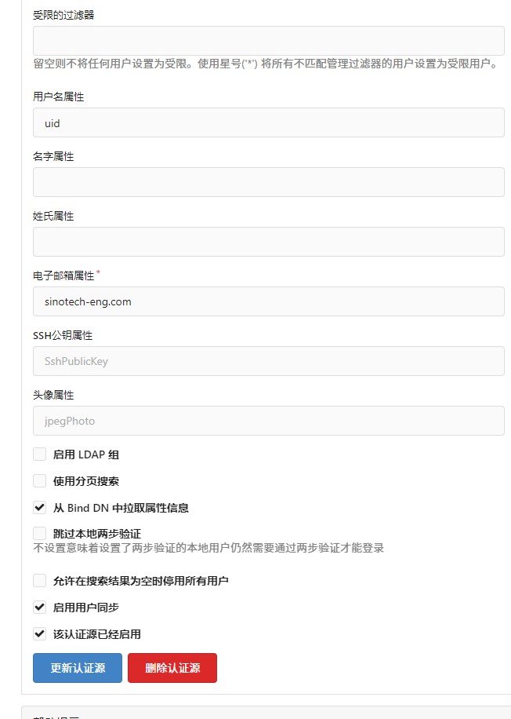

#  LDAP 登入 Gitea
{: .no_toc }

<details open markdown="block">
  <summary>
    Table of contents
  </summary>
  {: .text-delta }
- TOC
{:toc}
</details>
---

## 背景

### 修改設定檔內容

```bash
[auth.ldap]
ENABLED = true
DISABLE_REGISTRATION = false
HOST = 200.200.31.47
PORT = 389
BIND_DN = "uid=admin,cn=users,cn=compat,dc=sinotech-eng,dc=com"
BIND_PASSWORD = "***"
USER_BASE = "cn=users,cn=compat,dc=sinotech-eng,dc=com"
USER_FILTER = (uid=%s)
USERNAME_ATTRIBUTE = uid
```

- 修改後重啟伺服器。

### 登入「管理者」

- gitea 內設第一個產生的使用者為「管理者」。雖然嘗試了很多默認的方式。
- 很顯然的，gitea管理者不能是LDAP用戶，因為還沒有登入LDAP就必須先將Gitea設好。

### 登入管理後台



### 添加認證源



### 設定LDAP的連線方式

- 內容與app.ini一樣。為什麼需要設2遍，原因不明。
- 認證名稱：為gitea內部檢視用。app.ini內沒有這項



- 用戶屬性：通過LDAP認證後，會在gitea產生一個一樣名稱的用戶。
- 電子郵件屬性：因為gitea管制電子郵件，因此這個項目是必要的。
- 分組：gitea可以使用LDAP的分組方式，但實際情形是否等同其"組織"還需要測試。



## 登入訊息

- LDAP伺服器之紀錄：`/var/log/dirsrv/slapd-SINOTECH-ENG-COM/access`
- 本地端gitea伺服器畫面(成功登入不會有訊息)