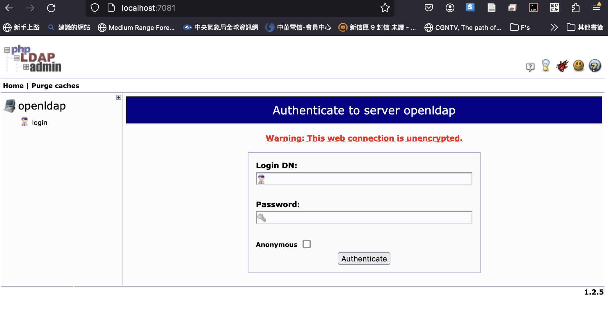

# 使用 Docker 建置 LDAP 系統
{: .no_toc }

<details open markdown="block">
  <summary>
    Table of contents
  </summary>
  {: .text-delta }
- TOC
{:toc}
</details>
---

## 背景

- source: [使用 Docker 建置 LDAP 系統](https://chrislee0728.medium.com/使用-docker-建置-ldap-系統-82370c53bc9f)
- 步驟

```bash
mkdir ldap
cd ldap
vim docker-compose.yml
# 建立compose內容
# 先啟動docker的 daemon
docker-compose up  
# 第一次會下載docker image:osixia/phpldapadmin and osixia/openldap
```

- host UI:http://localhost:7081/

  ```bash
   20     ports:
   21       - "7081:80"
  ```

- README：osixia/docker-phpLDAPadmin@[github](https://github.com/osixia/docker-phpLDAPadmin)
- UN=`cn=admin,dc=example,dc=org`
- PW=`admin`

## 設定

- [IBM 官網](https://www.ibm.com/docs/zh-tw/rpa/21.0?topic=ldap-installing-configuring-openldap)
- 