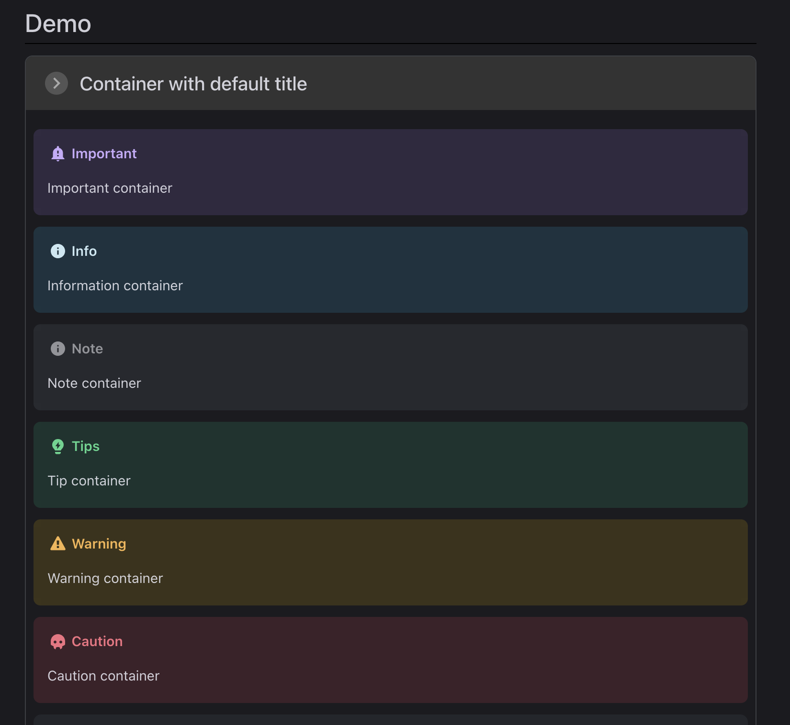

# 新增問題文字框
{: .no_toc }

<details open markdown="block">
  <summary>
    Table of contents
  </summary>
  {: .text-delta }
- TOC
{:toc}
</details>
---

## 需求

- VPH的文字框只有`"tip" | "warning" | "danger" | "important" | "info" | "note"`，並沒有問題(question)，這在FAQ的撰寫過程非常不方便。
- 基本需求
  - 必須要有問號
  - 必須要有標題、內文
  - 有顯著的顏色

## 建議方法

在 `vuepress-theme-hope` 中，您可以透過內建的「提示塊」（Admonitions 或 Tip Blocks）功能來顯示帶有問號圖示的 FAQ 提問文字方塊。雖然預設的提示類型沒有問號圖示，您可以透過自定義樣式或使用內建的 `hint` 提示類型來模仿這種效果。




### 方法 1：使用 `hint` 提示類型（預設樣式）

VuePress 本身提供了各種預設的提示類型，您可以直接使用 `::: hint` 語法來插入提示框。例如：

```markdown
::: hint FAQ
這是一個常見問題的提示框。
:::
```

這樣會顯示一個具有標題的提示框，適合作為 FAQ 題目。

### 方法 2：自定義樣式來加入問號圖示

如果您希望在提示框上顯示一個問號圖示，可以透過 CSS 來進行樣式自定義。

#### 步驟：
1. 在您的 `.vuepress/styles/index.styl` 或 `.vuepress/styles/palette.styl` 文件中，加入自定義樣式來定義一個新的 FAQ 方塊樣式，帶有問號圖示。

```styl
.custom-faq-box {
  background-color: #f0f8ff;
  border-left: 4px solid #007acc;
  padding: 1em;
  border-radius: 4px;
  display: flex;
  align-items: center;
}

.custom-faq-box::before {
  content: '❓';
  font-size: 24px;
  margin-right: 10px;
}
```

2. 在您的 Markdown 文件中使用這個自定義樣式：

```markdown
<div class="custom-faq-box">
  這是一個常見問題的提示框，帶有問號圖示。
</div>
```

這樣會在網頁中顯示一個帶有問號圖示的 FAQ 提示框。

### 方法 3：使用 Font Awesome 問號圖示

如果您已經在 VuePress 項目中安裝了 Font Awesome，可以用 Font Awesome 的問號圖示來展示 FAQ 提示框。

1. 確保在 VuePress 配置中正確引入了 Font Awesome：
```javascript
// .vuepress/config.js
module.exports = {
  head: [
    ['link', { rel: 'stylesheet', href: 'https://cdnjs.cloudflare.com/ajax/libs/font-awesome/5.15.3/css/all.min.css' }]
  ]
};
```

2. 在 Markdown 中使用 Font Awesome 問號圖示：

```markdown
<div class="custom-faq-box">
  <i class="fas fa-question-circle"></i> 這是一個常見問題的提示框。
</div>
```

這樣會顯示一個帶有 Font Awesome 問號圖示的 FAQ 方塊。

透過這些方法，您可以輕鬆在 `vuepress-theme-hope` 中加入 FAQ 的提示框，並以問號圖示來呈現。