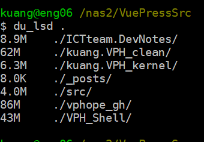

#  VPH模板的組成及應用
{: .no_toc }

<details open markdown="block">
  <summary>
    Table of contents
  </summary>
  {: .text-delta }
- TOC
{:toc}
</details>
---

## 背景

- VuePress Hope v2 雖然功能完整，但因為範例軟件包檔案龐雜、相依性綿密，經整理縮減到60mb還是太大，無法作為推廣模板。
- 此處提出殼層、核心切割處理構想，只需推廣核心模板，大小約6mb，採減法原則。
- 模板的架構、維護、應用等等細節，在此處說明。
- VPH程式銜接、Gitea [act_runner](./act_runner.md)的設定，則見於其他筆記。



- kernel、ICTteam.DevNotes：未來實際的應用，REPO大小可以控制在10MB以下。
- `vphope_gh`是VPH原來版本的樣板，有86MB之多，即使經過縮減(`VPH_clean`)，也有60MB之多。
- `VPH_Shell`是公用的殼層軟件包，壓縮前43MB，壓縮後為26MB，每次執行CI/CD時會複製到[act_runner](./act_runner.md)並將其解壓縮，將kernel筆記內容覆蓋原來`docs/theme/src`以下內容，則為原來完整的REPO。

## 工作架構與流程

### 架構

- 架構上，模板區分為**固定的殼層**與**變動的核心**2部分。
- 筆記會放在kernel repo的中文目錄/zh下，
  - 模板容量約為6mb、採減法、替換原則
  - 可以自行發展分支（sidebar）、
  - 切換其他Repo(navibar)
  - 如果要寫英文系統，直接在根目錄發展
- 核心模板的根目錄有工作區
  - .github/workflows/main.yml
    - CI/CD 的程序
    - 不需要維護
    - (ssh -t "mkdir -p ..."尚未解決)
  - .vuepress
    - 控制上欄與左側邊欄
    - 其他樣式控制
  - .git:要記得定期清空歷史紀錄
- 殼層共用的軟件包約有43mb、壓縮後(`Shell.tgz`)約有26mb
  - 因為不會需要常常修改，不要存在個人倉儲
  - 日常是以壓縮檔輸入到[act_runner](./act_runner.md)，如果修改要記得覆蓋舊的壓縮檔
  - 殼層其他週邊軟件包經檢討，即使清除也不會大幅減少編譯時間，約略減少10-20秒

### yml工作流程

- 先將repo的內容checkout到[act_runner](./act_runner.md)，以形成必要的目錄架構
- 從後台拉來Shell.tgz檔案、解壓縮、將repo內容覆蓋Shell相對應內容。
- 安裝node、pnpm、執行編譯(build)
- 將dist結果發布到指定地點。

```yml
#kuang@eng06 /nas2/VuePressSrc/kuang.VPH_kernel/.github/workflows
#$ cat main.yml |grep -v js|grep -E 'name|uses'
name: CI
    name: Build
      - uses: actions/checkout@v4
      - name: scp tgz
      - uses: actions/setup-node@v2
      - uses: pnpm/action-setup@v3
      - name: build vuepress
      - name: list of dist results
      - name: scp dist
```

## kernel

- 網頁移動機制與功能規劃

移動機制|功能規劃|說明
:-:|-|-
導航列NavBar|跨目錄、跨repo|可能需要特別連結
左側欄SideBar|同目錄的其他檔案|order控制順序
右目錄Category|同檔案內的hashtag|已經有完整的內設功能

### md tree

- 其架構如下所示，範例共有3層結構

```bash
kuang@eng06 /nas2/VuePressSrc/kuang.VPH_kernel
$ tree|grep -v png|grep -v jpg
.
├── README.md
└── zh
    ├── config
    │   ├── frontmatter
    │   │   └── README.md
    │   ├── plugins
    │   │   └── README.md
    │   ├── README.md
    │   └── theme
    │       └── README.md
    ├── cookbook
    │   ├── markdown
    │   │   ├── emoji
    │   │   │   └── README.md
    │   │   └── README.md
    │   ├── README.md
    │   └── vuepress
    │       └── README.md
    ├── demo
    │   └── README.md
    ├── faq
    │   └── README.md
    ├── get-started
    │   ├── assets
    │   └── README.md
    ├── guide
    │   ├── advanced
    │   │   └── README.md
    │   ├── blog
    │   │   ├── assets
    │   │   └── README.md
    │   ├── component
    │   │   └── README.md
    │   ├── customize
    │   │   └── README.md
    │   ├── feature
    │   │   └── README.md
    │   ├── interface
    │   │   ├── assets
    │   │   └── README.md
    │   ├── intro
    │   │   └── README.md
    │   ├── layout
    │   │   ├── assets
    │   │   └── README.md
    │   ├── markdown
    │   │   ├── chart
    │   │   │   └── README.md
    │   │   ├── code
    │   │   │   └── README.md
    │   │   ├── content
    │   │   │   └── README.md
    │   │   ├── grammar
    │   │   │   └── README.md
    │   │   ├── README.md
    │   │   └── stylize
    │   │       └── README.md
    │   └── README.md
    ├── locales.js
    ├── README.md
    └── test.md
```

1. 每層都必須有一個`README.md`，其title將呈現在sidebar上。
2. 其他可以按照檔案主題自由命名，按照`oder`來編排順序，其title也會顯示在側欄。
3. 圖檔可以分散在各個目錄，以方便管理及連結。
4. 其餘程式碼、其他檔案也可以有自己的目錄。

### ts tree


- VP會把程式碼分開儲存在.vuepress目錄下。
- 主要設定不會改變，但是側欄及上欄需要設定。討論如下。

### home `README.md`

- 這個檔案是整個repo的首頁。可能會需要較多的修改。目前版本的好處
  - 有快速連結可以點選
  - 各個內容以桌面標示的方式展現，隨看隨點，符合直覺。
- 如果不需要太多的components，可以刪除fronter的內容，用一般的README網頁來替換。


1. heroText：主頁標題
2. tagline：次標題
3. actions -text:快速連結標題、連結位址(目錄或檔案)、小標示等等。

### 導航列NavBar

1. 引到特定的目錄。名稱會是該目錄`README.md`的title。
2. 也可以是下拉選單，引道特定的md檔案
3. 每個下拉選單可以有自己的標示，以造成一致性的效果。
4. 中文系統會讀取`zh.ts`，英文則會讀`en.ts`

```ts
import { navbar } from "docs-shared";

// region config
export const zhNavbarConfig = navbar([
  "/zh/get-started/",
  "/zh/guide/",
  "/zh/config/",
  "/zh/faq/",
  "/zh/demo/",
  {
    text: "項目",
    icon: "circle-info",
    prefix: "/zh/",
    children: [
      {
        text: "教程",
        icon: "signs-post",
        prefix: "cookbook/",
        children: ["markdown/", "vuepress/"],
      },
      {
        text: "項目",
        children: ["changelog", "related", "contribution"],
      },
    ],
  },
]);
// #endregion config
```

### 左側欄Sidebar

- VP雖然有自動產生側欄的插件，但無法調整個別的小標示(icon)，並沒有包括在VPH內，是否可以順利配合，還需要測試。
- 側欄需要設定的有:
  - 目錄名稱
  - 是否為結構性目錄、其下還有目錄
  - 給定每個目錄有自己的小標示
- 中文需修改`zh.ts`，如果有英文版需修改`en.ts`。
- 系列文章，側欄會按照順序自動產生。

```ts
kuang@eng06 /nas2/VuePressSrc/kuang.VPH_kernel/.vuepress/sidebar
$ cat zh.ts
import { sidebar } from "docs-shared";

// region config
export const zhSidebarConfig = sidebar({
  "/zh/": [
    "",
    "get-started/",
    {
      text: "指引",
      icon: "lightbulb",
      prefix: "guide/",
      children: [
        "intro/",
        "interface/",
        "layout/",
        "markdown/",
        "feature/",
        "blog/",
        "customize/",
        "advanced/",
      ],
    },
    {
      text: "配置",
      icon: "gears",
      prefix: "config/",
      children: [
        "intro",
        "i18n",
        "theme/",
        "plugins/",
        "frontmatter/",
        "style",
      ],
    },
    {
      text: "教程",
      icon: "signs-post",
      prefix: "cookbook/",
      children: ["markdown/", "vuepress/"],
    },
    "demo/",
    "faq/",
    "changelog",
    "contribution",
  ],
  "/zh/get-started/": "structure",
  "/zh/guide/": "structure",
  "/zh/config/": "structure",
  "/zh/cookbook/": "structure",
  "/zh/demo/": "structure",
  "/zh/faq/": "structure",
});
// #endregion config
```

### Fronter

- 個別檔案的順序，需要在Fronter內給定。
- 如果`oder`其後的數字重複，將會按照檔案名稱安排順序。
- 如果還要加上footer、計數功能、留言功能，也要在fronter內增加。

### Markdowns

- 連結
  - 建議用**相對路徑**來連結，以利搬運、複製利用。
  - VPH的編譯對連結是否成功**非常敏感**，要確認連結是否存在，且可順利連結。
  - 更新時也要特別注意連結的穩定性
- 圖檔：建議有專用的目錄，也用**相對路徑**來連結，方便整理。

## shell

- 這個版本的倉儲([kuang/VPH_Shell](http://eng06.sinotech-eng.com:3000/kuang/VPH_Shell))只是個背景程式檔案的環境殼層，並不實際執行。
- 所有經修改過的程式、必要的(手動)外掛等等，都會放在這個倉儲。
- 程式或設定經修改後，須同時更新壓縮檔內容。
- 重要修改程式列表如下，分節說明。

功能項目|原功能|改成|程式位址
-|-|-|-
包裝config檔|固定`v2`目錄|按照User.Repo浮動|[config-wrapper.ts](http://eng06.sinotech-eng.com:3000/kuang/VPH_Shell/src/branch/main/docs-shared/src/config-wrapper.ts)
包裝theme檔|固定`v2`目錄|按照User.Repo浮動|[theme-wrapper.ts](http://eng06.sinotech-eng.com:3000/kuang/VPH_Shell/src/branch/main/docs-shared/src/theme-wrapper.ts)
右上方小貓標示|回到github|連到地端gitea User/Repo|[RepoLink.ts](http://eng06.sinotech-eng.com:3000/kuang/VPH_Shell/src/branch/main/packages/theme/src/client/modules/navbar/components/RepoLink.ts)
readingTimeLocales|只有簡體|改成繁體|[locales.js](http://eng06.sinotech-eng.com:3000/kuang/VPH_Shell/src/branch/main/docs/shared/src/zh/locales.js)
編輯此頁|指向作者的Github|指向公司地端gitea|[resolveEditLink.ts](http://eng06.sinotech-eng.com:3000/kuang/VPH_Shell/src/branch/main/packages/theme/src/client/modules/info/utils/resolveEditLink.ts)、[index.ts]()
[AI小幫手](https://eng06.sinotech-eng.com/v2/shared/zh/EmbChat.html)|(無)|外加功能|[anythingllm-chat-widget.min.js](http://eng06.sinotech-eng.com:3000/kuang/VPH_Shell/src/branch/main/docs/theme/src/anythingllm-chat-widget.min.js)
[不算子](https://sinotec2.github.io/Utilities/Graphics/HTML/ReadVisitCounts/)|(無)|新增到頁尾|[theme.ts](http://eng06.sinotech-eng.com:3000/kuang/VPH_Shell/src/branch/main/packages/create/template/docs/config/zh/theme.ts)

### 編輯此頁

## ToDo's

